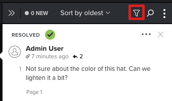

# Search, filter, and sort proof comments

You can search, filter, and sort proof comments to easily navigate feedback on content.

## Access requirements

+++ Expand to view access requirements for the functionality in this article.

You must have the following access to perform the steps in this article:

<table style="table-layout:auto"> 
 <col> 
 <col> 
 <tbody> 
  <tr> 
   <td role="rowheader">Adobe Workfront plan*</td> 
   <td> 
Current plan: Pro or Higher
 
or
 
Legacy plan: Select or Premium
 
For more information about proofing access with the different plans, see <a href="/help/quicksilver/administration-and-setup/manage-workfront/configure-proofing/access-to-proofing-functionality.md" class="MCXref xref">Access to proofing functionality in Workfront</a>.
 </td> 
  </tr> 
  <tr> 
   <td role="rowheader">Adobe Workfront license*</td> 
   <td> 
Current plan: Work or Plan
 
Legacy plan: Any (You must have proofing enabled for the user)
 </td> 
  </tr> 
  <tr> 
   <td role="rowheader">Proof Permission Profile </td> 
   <td>Manager or higher</td> 
  </tr> 
  <tr> 
   <td role="rowheader">Access level configurations*</td> 
   <td> 
Edit access to Documents
 
For information on requesting additional access, see <a href="../../../../workfront-basics/grant-and-request-access-to-objects/request-access.md" class="MCXref xref">Request access to objects </a>.
 </td> 
  </tr> 
 </tbody> 
</table>

&#42;To find out what plan, role, or Proof Permission Profile you have, contact your Workfront or Workfront Proof administrator.

+++

## Search the comment list

You can search the comment list for text contained in the comment itself, comment number, or the use who made the comment.

1. Go to the project, task, or issue that contains the document, then select **Documents**.
1. Find the proof you need, then click **Open proof**.

1. (Conditional) If the comments area is not open, click&nbsp;**View comments**&nbsp;in the upper-right corner.
1. Click the **Search** icon to display the search box.  

1. Begin typing either of the following:

   * The text you want to search for. The comment list filters as you type, beginning with the first character&nbsp;you enter.
   * The number of the comment you want to display.
   * The user who made the comment.

1. (Optional) Click the comment to display a line connecting the comment to the related area on the proof.
1. When you are finished searching and you want to display all the comments, click the X at the end of the search box.

## Filter the comment list

You can filter the comments that display by defining filter parameter such as user, actions, unread status, and more.

1. Open the proof where you want to filter comments.
1. (Conditional) If the comments area is not open, click&nbsp;**View comments**&nbsp;in the upper-right corner.
1. In the comments area, click the **Filter** icon.

   

1. Use the options that appear below the **Filter** icon to filter the comments by any of the following criteria:

   <table style="table-layout:auto"> 
    <col> 
    <col> 
    <tbody> 
     <tr> 
      <td role="rowheader"><strong>Authors</strong> </td> 
      <td>Displays only comments and comment replies made by users you specify. </td> 
     </tr> 
     <tr> 
      <td role="rowheader"><strong>Actions</strong> </td> 
      <td>Displays only comments that match the action you select.n no action. Actions must be enabled in your system. For more information, see .<!--
        &nbsp;
       --></td> 
     </tr> 
     <tr> 
      <td role="rowheader"><strong>General filtering options</strong> </td> 
      <td> 
       <ul> 
        <li><strong>Unresolved</strong>:&nbsp;Displays only comments that are not yet resolved.&nbsp;</li> 
        <li><strong>Unread</strong>:&nbsp;Displays only comments that you have not yet read.&nbsp;</li> 
        <li><strong>With attachments</strong>:&nbsp;Displays only comments that contain an attachment, or comments that include a reply that contain an attachment.</li> 
        <li><strong>Current page only</strong>:Displays only comments from the page you are currently viewing. The comment list refreshes when you change the visible page.&nbsp;Available only for static and interactive proofs.</li> 
       </ul> </td> 
     </tr> 
    </tbody> 
   </table>

1. Click **Apply**&nbsp;or click the **Filter** icon to view the comment list with your filter criteria applied. The Filter icon displays with a blue dot to indicate that a filter is applied.

1. When you are finished filtering and you want to see all the comments, click the **Filter** icon, click **Reset**, then click the **Filter** icon again.

## Sort the comment list

When you sort the comment list, the sort option you choose is remembered the next time you open a proof in the proofing viewer you are using.

1. Open the proof where you want to sort comments.
1. If the comments area is not open, click&nbsp;**View comments**&nbsp;in the upper-right corner.  

1. Click the sorting&nbsp;menu to open it.
1.    

1. Select one of the following sort options:

   <table style="table-layout:auto"> 
    <col> 
    <col> 
    <col> 
    <tbody> 
     <tr> 
      <td role="rowheader">Latest</td> 
      <td>Displays the most recent comments at the top of the comment list.</td> 
      <td>Available for all proofs</td> 
     </tr> 
     <tr> 
      <td role="rowheader">Oldest</td> 
      <td>Displays the oldest comments at the top of the comment list. This is the default. </td> 
      <td>Available for all proofs</td> 
     </tr> 
     <tr> 
      <td role="rowheader">Creator A-Z</td> 
      <td>Displays comments grouped by the user who created the comment, listed in alphabetical order.</td> 
      <td>Available for all proofs</td> 
     </tr> 
     <tr> 
      <td role="rowheader">Creator Z-A</td> 
      <td>Displays comments grouped by the user who created the comment, listed in reverse alphabetical order.</td> 
      <td>Available for all proofs</td> 
     </tr> 
     <tr> 
      <td role="rowheader">Page (down, up)</td> 
      <td>Displays comments in order of when they appear in relation to the page number or video timeline. </td> 
      <td>Available only for static proofs.</td> 
     </tr> 
     <tr> 
      <td role="rowheader">Timestamp (down)</td> 
      <td>Displays comments in order of when they appear in relation to the video timeline. Comments made later in the timeline display&nbsp;first. </td> 
      <td>Available only for video proofs.</td> 
     </tr> 
     <tr> 
      <td role="rowheader">Timestamp (up)</td> 
      <td>Displays comments in order of when they appear in relation to the video timeline.&nbsp;Comments made earlier in the timeline display first. </td> 
      <td>Available only for video proofs.</td> 
     </tr> 
     <tr> 
      <td role="rowheader">Device (up)</td> 
      <td>Displays comments in order according to the device selected when the comment was made. Comments made on lower resolutions display first.</td> 
      <td>Available only for interactive proofs.</td> 
     </tr> 
     <tr> 
      <td role="rowheader">Device (down)</td> 
      <td> 
(Available only for interactive proofs.) Displays comments in order according to the resolution selected when the comment was made. Comments made on higher resolutions display first.
 
For information about changing the resolution in an interactive proof, see&nbsp;<a href="../../../../review-and-approve-work/proofing/reviewing-proofs-within-workfront/review-a-proof/view-interactive-content-as-it-appears-in-device.md" class="MCXref xref">Change interactive proof resolution in the proofing viewer</a>.
 </td> 
      <td>Available only for interactive proofs.</td> 
     </tr> 
    </tbody> 
   </table>
