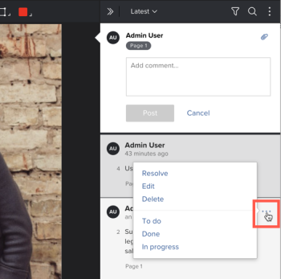

# Use actions on proof comments

You can use actions to keep track of what needs to happen on each comment thread on a proof. An action is a word or phrase such as "To do," "Done," or "In progress" that your Adobe Workfront administrator configures in the system for your organization. Reviewers can add an action to a comment to provide information about what has been done or what still needs to be done in response to the comment.

For information about how your Workfront administrator enables and configures actions, see&nbsp;.

## Access requirements

+++ Expand to view access requirements for the functionality in this article.

You must have the following access to perform the steps in this article:

<table style="table-layout:auto"> 
 <col> 
 <col> 
 <tbody> 
  <tr> 
   <td role="rowheader">Adobe Workfront plan*</td> 
   <td> 
Current plan: Pro or Higher
 
or
 
Legacy plan: Select or Premium
 
For more information about proofing access with the different plans, see <a href="/help/quicksilver/administration-and-setup/manage-workfront/configure-proofing/access-to-proofing-functionality.md" class="MCXref xref">Access to proofing functionality in Workfront</a>.
 </td> 
  </tr> 
  <tr> 
   <td role="rowheader">Adobe Workfront license*</td> 
   <td> 
Current plan: Work or Plan
 
Legacy plan: Any (You must have proofing enabled for the user)
 </td> 
  </tr> 
  <tr> 
   <td role="rowheader">Proof Permission Profile </td> 
   <td>Manager or higher</td> 
  </tr> 
  <tr> 
   <td role="rowheader">Proof Role</td> 
   <td>Author or Moderator</td> 
  </tr> 
  <tr> 
   <td role="rowheader">Access level configurations*</td> 
   <td> 
Edit access to Documents
 
For information on requesting additional access, see <a href="../../../../workfront-basics/grant-and-request-access-to-objects/request-access.md" class="MCXref xref">Request access to objects </a>.
 </td> 
  </tr> 
 </tbody> 
</table>

&#42;To find out what plan, role, or Proof Permission Profile you have, contact your Workfront or Workfront Proof administrator.

+++

## Use actions on comments

To apply an action to an existing comment in the proofing viewer:

1. Go to the project, task, or issue that contains the document, then select **Documents**.
1. Find the proof you need, then click **Open proof**.

1. Do one of the following:

   * Click the flag icon in the lower-right corner of the comment,&nbsp;then click the action you want in the drop-down menu.

     

   * Click the **More** icon (three horizontal dots on the comment),&nbsp;then click the action you want in the lower section of the drop-down menu that appears.

     

1. (Optional) If you change your mind, you can do either of the followinng:

   * Click the flag icon or the **More** icon again,&nbsp;then click **Remove action**.
   
   * Repeat step 1 to apply a different action.

>[!TIP]
>
>You can filter comments by a certain action. For more information, see [Search, filter, and sort proof comments](../../../../review-and-approve-work/proofing/reviewing-proofs-within-workfront/comment-on-a-proof/search-filter-sort-comments.md).
