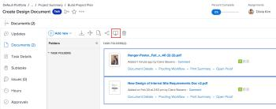

# Compare proofs

You can use the proofing viewer to compare two different proofs or two versions of the same proof.

## Access requirements

+++ Expand to view access requirements for the functionality in this article.

<table style="table-layout:auto"> 
 <col> 
 <col> 
 <tbody> 
  <tr> 
   <td role="rowheader">Adobe Workfront package</td> 
   <td> 
Any
 </td> 
  </tr> 
  <tr> 
   <td role="rowheader">Adobe Workfront license</td> 
   <td> 
Any
 </td> 
  </tr> 
  <tr> 
   <td role="rowheader">Proof role </td> 
   <td>Reviewer, Reviewer & approver, Author, Moderator</td> 
  </tr> 
  <tr> 
   <td role="rowheader">Proof Permission Profile </td> 
   <td>Manager or higher</td> 
  </tr> 
  <tr> 
   <td role="rowheader">Access level configurations</td> 
   <td> 
Edit access to Documents
 </td> 
  </tr> 
 </tbody> 
</table>

For information, see [Access requirements in Workfront documentation](/help/quicksilver/administration-and-setup/add-users/access-levels-and-object-permissions/access-level-requirements-in-documentation.md). 

+++

## Compare two different proofs

You can compare two proofs within any single document list, such as within the Documents tab in a project, task, issue, portfolio, or within the main Documents area.

1. Go to the document list that contains the two proofed documents you want to compare.
1. Select the first document that you want to compare, then press and hold the Command key (on Mac) or the Ctrl key (on Windows) and select the second document that you want to compare.

   >[!NOTE]
   >
   >A proof must already be generated for each document that you select for comparison.

1. Click **Compare Proofs**.

   <!--
   
If this button is not visible, ensure that two proofed documents are selected.

   -->

   

   Both proofs are displayed in the proofing viewer in a side-by-side view. You can review each document while comparing them.

   Separate breadcrumbs above each proof allow you to view and go to the work item associated with the proof:

   

   For information about the tools you can use to compare the two proofs, see&nbsp; [Use the compare tools](../../../../workfront-proof/wp-work-proofsfiles/review-proofs-wpv/compare-proofs.md#using-compare-tools) in [Compare proofs in the proofing viewer](../../../../workfront-proof/wp-work-proofsfiles/review-proofs-wpv/compare-proofs.md).

## Compare two versions of the same proof

For information about comparing two versions of the same proof, see [Compare proof versions](../../../../workfront-proof/wp-work-proofsfiles/review-proofs-wpv/compare-proofs.md#comparing-proof-versions) in [Compare proofs in the proofing viewer](../../../../workfront-proof/wp-work-proofsfiles/review-proofs-wpv/compare-proofs.md).
