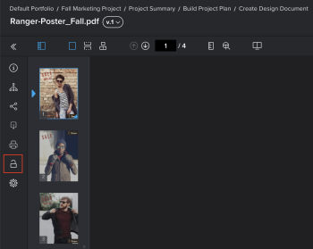

# Lock or unlock a proof

You can manually lock and unlock a proof any time in the review process.

## Access requirements

+++ Expand to view access requirements for the functionality in this article.

<table style="table-layout:auto"> 
 <col> 
 <col> 
 <tbody> 
  <tr> 
   <td role="rowheader">Adobe Workfront package</td> 
   <td> 
Any
 </td> 
  </tr> 
  <tr> 
   <td role="rowheader">Adobe Workfront license</td> 
   <td> 
Any
</td> 
  </tr> 
  <tr> 
   <td role="rowheader">Proof role</td> 
   <td>Owner or Moderator</td> 
  </tr> 
  <tr> 
   <td role="rowheader">Proof Permission Profile </td> 
   <td>Supervisor or Administrator</td> 
  </tr> 
 </tbody> 
</table>

For information, see [Access requirements in Workfront documentation](/help/quicksilver/administration-and-setup/add-users/access-levels-and-object-permissions/access-level-requirements-in-documentation.md). 

+++

## Lock a proof

You can manually lock a proof to prevent or allow commenting by reviewers. This is different from locking a proof stage.

To lock a proof:

1. Go to the document list that contains the proof you want to open.
1. Hover over the document, then click the **Open proof** link that appears.

   Or

   If you want to open a proof for an earlier version of the document, click the More icon  for that version in the Summary, then click **Open proof**.

   For information about the Summary, see [Summary for documents overview](../../../../documents/managing-documents/summary-for-documents.md).

1. In the In the left panel, click the **Lock** icon .

   

## Unlock a proof

Unlocking a proof is useful when you need reviewers to add comments to a previous version of a proof. (A previous version is always locked until the proof owner manually unlocks it.) When the reviewers have finished adding comments to the previous version, you can lock it again. For information about viewing a previous version of a proof, see [View previous proof versions in the Web Proofing Viewer](../../../../workfront-proof/wp-work-proofsfiles/review-proofs-wpv/view-previous-proof-versions.md).

To unlock a proof:

1. Hover over the document, then click the **Open proof** link that appears.

   Or

   If you want to open a proof for an earlier version of the document, click the More icon  for that version in the Summary, then click **Open proof**.

   For information about the Summary, see [Summary for documents overview](../../../../documents/managing-documents/summary-for-documents.md).

1. In the left panel, click the **Unlock** icon , then click **Yes, unlock**.

   
