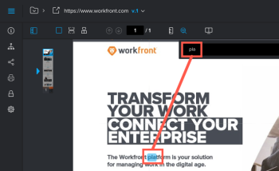

# Search content within a proof

You can quickly locate text in a proof created for the following types of documents:

* PDF
* Office (.doc, .docx, .odt)
* Static web page

>[!NOTE]
>
>Proofs created prior to April 26, 2017 might not be searchable.

## Access requirements

+++ Expand to view access requirements for the functionality in this article.

You must have the following access to perform the steps in this article:

<table style="table-layout:auto"> 
 <col> 
 <col> 
 <tbody> 
  <tr> 
   <td role="rowheader">Adobe Workfront plan*</td> 
   <td> 
Current plan: Pro or Higher
 
or
 
Legacy plan: Select or Premium
 
For more information about proofing access with the different plans, see <a href="/help/quicksilver/administration-and-setup/manage-workfront/configure-proofing/access-to-proofing-functionality.md" class="MCXref xref">Access to proofing functionality in Workfront</a>.
 </td> 
  </tr> 
  <tr> 
   <td role="rowheader">Adobe Workfront license*</td> 
   <td> 
Current plan: Review
 
Legacy plan: Review
 </td> 
  </tr> 
  <tr> 
   <td role="rowheader">Proof Permission Profile </td> 
   <td>Manager or higher</td> 
  </tr> 
  <tr> 
   <td role="rowheader">Access level configurations*</td> 
   <td> 
Edit access to Documents
 
For information on requesting additional access, see <a href="../../../../workfront-basics/grant-and-request-access-to-objects/request-access.md" class="MCXref xref">Request access to objects </a>.
 </td> 
  </tr> 
 </tbody> 
</table>

&#42;To find out what plan, role, or Proof Permission Profile you have, contact your Workfront or Workfront Proof administrator.

+++

## Search content within a proof

1. Open&nbsp;the proof that you want to search.
1. In the toolbar above the proof, click the&nbsp;**Search document**&nbsp;icon.

   

1. Begin typing the text you want to search for.

   The search tool highlights the text in the document as you type.

   

1. Finish typing the text you want to search for, then click the&nbsp;**Up**&nbsp;and&nbsp;**Down**&nbsp;arrows to scan through the search results within the proof.
