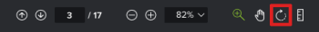
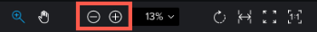

# View content in a proof

You can use the proofing viewer to view and markup files in Workfront.

>[!NOTE]
>
>If your Workfront instance is on the Unified Experience, the proofing viewer opens in a new tab.

## Access requirements

+++ Expand to view access requirements for the functionality in this article.

You must have the following access to perform the steps in this article:

<table style="table-layout:auto"> 
 <col> 
 <col> 
 <tbody> 
  <tr> 
   <td role="rowheader">Adobe Workfront plan*</td> 
   <td> 
Current plan: Pro or Higher
 
or
 
Legacy plan: Select or Premium
 
For more information about proofing access with the different plans, see <a href="/help/quicksilver/administration-and-setup/manage-workfront/configure-proofing/access-to-proofing-functionality.md" class="MCXref xref">Access to proofing functionality in Workfront</a>.
 </td> 
  </tr> 
  <tr> 
   <td role="rowheader">Adobe Workfront license*</td> 
   <td> 
Current plan: Work or Plan
 
Legacy plan: Any (You must have proofing enabled for the user)
 </td> 
  </tr> 
  <tr> 
   <td role="rowheader">Proof Permission Profile </td> 
   <td>Manager or higher</td> 
  </tr> 
  <tr> 
   <td role="rowheader">Access level configurations*</td> 
   <td> 
Edit access to Documents
 
For information on requesting additional access, see <a href="../../../../workfront-basics/grant-and-request-access-to-objects/request-access.md" class="MCXref xref">Request access to objects </a>.
 </td> 
  </tr> 
 </tbody> 
</table>

&#42;To find out what plan, role, or Proof Permission Profile you have, contact your Workfront or Workfront Proof administrator.

+++

## Change the view of your proof

You can view a static proof that contains multiple pages in a single view, in a continues view, or in a magazine view.

1. Go to the project, task, or issue that contains the document, then select **Documents**.
1. Find the proof you need, then click **Open proof**. 

1. In the upper-left area of the proofing viewer, locate the viewing options.   
   

1. Click any of the following options:

   <table style="table-layout:auto"> 
    <col> 
    <col> 
    <tbody> 
     <tr> 
      <td role="rowheader">Single view</td> 
      <td>Displays only a single page at a time. Click the thumbnail of the page you want to view, or press the Left and Right arrow keys to navigate between pages. </td> 
     </tr> 
     <tr> 
      <td role="rowheader">Continuous view</td> 
      <td>Displays all pages in a single, stacked view.&nbsp;Click the thumbnail of the page you want to view, or press the Left and Right arrow keys to scroll up or down all pages in a continuous view. </td> 
     </tr> 
     <tr> 
      <td role="rowheader">Magazine view</td> 
      <td>Displays all pages in a single, magazine view (side-by-side and stacked).&nbsp;Click the thumbnail of the page you want to view, or press the Left and Right arrow keys to scroll among all pages. </td> 
     </tr> 
    </tbody> 
   </table>

## Use thumbnails

The thumbails panel displays on the left side of the proofing viewer. You can use the thumbnails area to navigate throughout the proof. Thumbnails are especially useful when a proof contains multiple pages.

* [Hide and display the thumbnails panel](#hide-and-display-the-thumbnails-panel) 
* [Zoom and pan in the thumbnail view](#zoom-and-pan-in-the-thumbnail-view)

### Hide and display the thumbnails panel {#hide-and-display-the-thumbnails-panel}

The thumbnails panel displays by default. You can hide or adjust the size of the panel.

1. Go to the project, task, or issue that contains the document, then select **Documents**.
1. Find the proof you need, then click **Open proof**.

1. Click the **Thumbnail** icon in the upper-left corner of the proofing viewer.  
   

1. (Optional) Click the Thumbnail icon again to display the thumbnails panel.

   >[!TIP]
   >
   >You can mouse over the right edge of the thumbnails panel to resize the panel.

### Zoom and pan in the thumbnail view {#zoom-and-pan-in-the-thumbnail-view}

The zoom area in the thumbnails panel displays the area of the proof you are currently viewing. You can adjust the zoom within the thumbnail area or you can pan the area to view a different part of the proof.

To zoom and pan in the thumbnail view:

1. Go to the project, task, or issue that contains the document, then select **Documents**.
1. Find the proof you need, then click **Open proof**.

1. Locate the current zoom area in the thumbnails panel.  
   The zoom area displays as a blue frame around the edges of the thumbnail.

   

1. To adjust the size of the zoom area, drag the lower-right corner of the zoom area until it is the desired size.
1. To move the zoom area to another part of the proof, drag the zoom area until it covers the part of the proof you want to view.

## Rotate a proof

You can rotate the proof within the proofing viewer. When you rotate a proof that contains multiple pages, all pages are rotated simultaneously.

1. Go to the project, task, or issue that contains the document, then select **Documents**.
1. Find the proof you need, then click **Open proof**.

1. Click the **Rotate** icon at the bottom of the proofing viewer.

   

   The proof is rotated 90 degrees each time you click the **Rotate** icon.

## Zoom and pan a proof

You can adjust the zoom percentage when viewing the proof. When viewing a proof at a larger zoom percentage, the Pan option allows you to use the cursor to navigate to different areas of the proof.

1. Go to the project, task, or issue that contains the document, then select **Documents**.
1. Find the proof you need, then click **Open proof**.

1. Do any of the following to adjust the zoom percentage of the proof:

   * Click the **Zoom** icon, then either click on the proof to view the proof at a higher zoom level, or drag across an area of the proof to view only that area.

     

   * Click the current zoom percentage, the click a new zoom percentage or click&nbsp;**Fit to width**, **Fit to height**, or **Fit to page**.

     

   * Click the **Plus** or **Minus** icons to increase or decrease the zoom percentage.

     

1. If you need to pan to a certain area on the video proof, click the **Pan** icon, then drag the proof as needed.

   

   >[!TIP]
   >
   >To easily switch between the Zoom and Pan tools, hold down the spacebar when using the Zoom icon to pan.
