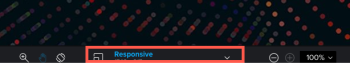
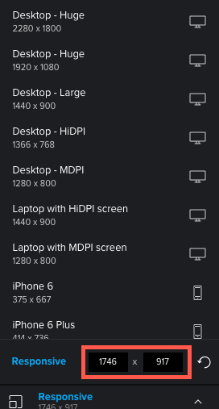
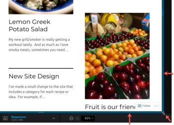

# Change interactive proof resolution in the proofing viewer

You can preview how an interactive proof looks on various devices, allowing you to see how content displays and responds based on different resolutions.

## Access requirements

+++ Expand to view access requirements for the functionality in this article.

You must have the following access to perform the steps in this article:

<table style="table-layout:auto"> 
 <col> 
 <col> 
 <tbody> 
  <tr> 
   <td role="rowheader">Adobe Workfront plan*</td> 
   <td> 
Current plan: Pro or Higher
 
or
 
Legacy plan: Select or Premium
 
For more information about proofing access with the different plans, see <a href="/help/quicksilver/administration-and-setup/manage-workfront/configure-proofing/access-to-proofing-functionality.md" class="MCXref xref">Access to proofing functionality in Workfront</a>.
 </td> 
  </tr> 
  <tr> 
   <td role="rowheader">Adobe Workfront license*</td> 
   <td> 
Current plan: Work or Plan
 
Legacy plan: Any (You must have proofing enabled for the user)
 </td> 
  </tr> 
  <tr> 
   <td role="rowheader">Proof Permission Profile </td> 
   <td>Manager or higher</td> 
  </tr> 
  <tr> 
   <td role="rowheader">Access level configurations*</td> 
   <td> 
Edit access to Documents
 
For information on requesting additional access, see <a href="../../../../workfront-basics/grant-and-request-access-to-objects/request-access.md" class="MCXref xref">Request access to objects </a>.
 </td> 
  </tr> 
 </tbody> 
</table>

&#42;To find out what plan, role, or Proof Permission Profile you have, contact your Workfront or Workfront Proof administrator.

+++

## Device and Resolution Views in Desktop Proofing Viewer vs. Web Proofing Viewer

Your Adobe Workfront administrator has configured your system so that you review interactive content either in the Desktop Proofing Viewer or, as bundled content in a ZIP file, in the Web Proofing Viewer:

* In the Desktop Proofing Viewer, you can view how content appears and responds both in various resolutions and on various devices. When a reviewer specifies a certain device, the content appears as it would on that device, with the user interface specifications for the device. For example, a red button on one brand of smart phone may be blue on a different brand.

* In the Web Proofing Viewer, you can view interactive content as it appears in the resolutions for the various devices. But the Web Proofing Viewer does not emulate the content using interface specifications on these devices, such as button color.

  >[!NOTE]
  >
  >Your Workfront administrator can configure custom devices for users in your organization, as described in [Configuring Custom Devices for Proofs](/help/quicksilver/administration-and-setup/manage-workfront/configure-proofing/configure-proofing-organization.md#configure-custom-devices-for-proofs) in the article [Configure proof settings for your organization](/help/quicksilver/administration-and-setup/manage-workfront/configure-proofing/configure-proofing-organization.md).

## View a proof with a preset device or resolution setting

1. Go to the document list that contains the proof you want to open.
1. Hover over the document, then click&nbsp;**Open proof**.
1. Click **Responsive** at the center-bottom of the proofing viewer.

   

1. In the Desktop Proofing Viewer, in the list of devices and resolutions that appears, click the one you want.

   Or

   In the Web Proofing Viewer, in the list of resolutions that appears, click the one you want.

   If you need information about how these two viewers differ, see [Differences between the Web Proofing Viewer and the Desktop Proofing Viewer overview](../../../../review-and-approve-work/proofing/proofing-overview/understand-differences-between-web-viewer.md).

   The interactive proof renders in the resolution you select.

## View a proof with a custom resolution setting

1. Go to the document list that contains the proof you want to open.
1. Hover over the document, then click&nbsp;**Open proof**.
1. Click **Responsive** at the center-bottom of the Proofing Viewer.
1. Type a custom&nbsp;**Responsive** resolution.

   

   Or

   Mouse over your interactive content and drag the blue border on the bottom-right corner, or the right or bottom edge, to the resolution you want.

   

   The custom resolution displays in the following locations:

   * In the **Resolution** panel at the bottom-center of the viewer.   
     

   * In any comments reviewers add to the proof. Each comment includes the screen resolution that was selected when the reviewer created the comment.
