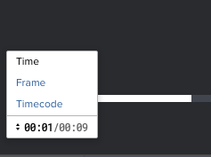
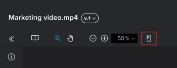
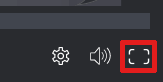
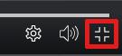
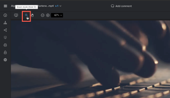
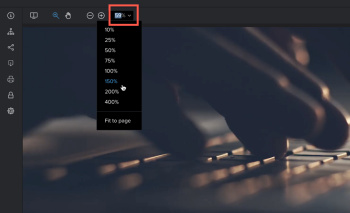

# Review a video proof

You can review a video proof that someone shared with you or that you created.

## Access requirements

You must have the following access to perform the steps in this article:

<table cellspacing="0"> 
 <col> 
 <col> 
 <tbody> 
  <tr> 
   <td role="rowheader">Adobe Workfront plan*</td> 
   <td> 
Current plan: Pro or Higher
 
or
 
Legacy plan: Select or Premium
 
For more information about proofing access with the different plans, see <a href="../../../administration-and-setup/manage-workfront/configure-proofing/access-to-proofing-functionality.md" class="MCXref xref">Access to proofing functionality in Workfront</a>.
 </td> 
  </tr> 
  <tr> 
   <td role="rowheader">Adobe Workfront license*</td> 
   <td> 
Current plan: Work or Plan
 
Legacy plan: Any (You must have proofing enabled for the user)
 </td> 
  </tr> 
  <tr> 
   <td role="rowheader">Proof Permission Profile </td> 
   <td>Manager or higher</td> 
  </tr> 
  <tr> 
   <td role="rowheader">Access level configurations*</td> 
   <td> 
Edit access to Documents
 
For information on requesting additional access, see <a href="../../../workfront-basics/grant-and-request-access-to-objects/request-access.md" class="MCXref xref">Request access to objects in Adobe Workfront</a>.
 </td> 
  </tr> 
 </tbody> 
</table>

&#42;To find out what plan, role, or Proof Permission Profile you have, contact your Workfront or Workfront Proof administrator.

## Open and work with a video proof

1. Go to the document list that contains the video proof you want to open.
1. Hover over the document, then click&nbsp;**Open proof**.

   You can proof video content in the Web Proofing Viewer or the Desktop Proofing Viewer. The viewer that opens depends on how your Adobe Workfront administrator has configured your organization's proofing viewers.

1. Do any of the following:

* Comment on the proof, as explained in [Comment on a proof](../../../review-and-approve-work/proofing/reviewing-proofs-within-workfront/comment-on-a-proof/comment-on-proof.md).
* Use proofing viewer functionality described in the remaining sections below.

For information about creating a video proof, see .

For general information that relates to reviewing proofs, see [Review proofs within Adobe Workfront](../../../review-and-approve-work/proofing/reviewing-proofs-within-workfront/review-proofs-in-wf.md).

If you cannot use a proofing viewer as described in this section, consult your Workfront administrator.

## Change the unit of measurement of the timeline {#change-the-unit-of-measurement-of-the-timeline}

You can adjust the unit of measurement that is used in the video timeline. You can view the timeline in Time, Frame, or Timecode.

1. In the lower-left corner of the proofing viewer, click the current unit of measurement.

   

1. Select from the following options:

   <table cellspacing="0"> 
    <col> 
    <col> 
    <tbody> 
     <tr> 
      <td role="rowheader">Time</td> 
      <td>Displays the video timeline in minutes/seconds.
This option is selected by default.
</td> 
     </tr> 
     <tr> 
      <td role="rowheader">Frame</td> 
      <td>Displays the video timeline in frames.
The proofing viewer uses the information on&nbsp;the original file to determine the number of frames per second that is displayed.
</td> 
     </tr> 
     <tr> 
      <td role="rowheader">Timecode</td> 
      <td>Displays the video timeline in timecode. The numbers of the timecode represent hours, minutes, seconds, and frames. 
For example, a timecode of 1:48:36:18 represents 1 hour, 48 minutes, 36 seconds, and 18 frames into the video.
</td> 
     </tr> 
    </tbody> 
   </table>

## Measure an area within a proof

1. Click the **Measure an area** icon at the top of the proofing viewer.

   

1. (Optional) Click&nbsp;**Measurement markup color**&nbsp;to expand the color options, then click a color and **Opacity** that is easy to see on your proof.

   <!--
   
   -->

   The default measurement tool color is red.

   The proofing viewer remembers your color and opacity selections on all proofs you open until you clear your browser cache.

1. Drag the measurement window to the area of the proof you need to measure.
1. Drag the corners or edges of the measurement window to resize it.
1. (Optional) If you need the measurement area to be an exact size, type **Selection size** values.
1. (Optional) If you need to measure a certain percentage within an area, check the calculate percentage box. A new box appears allowing you to adjust it

## Control video playback

* [Adjust video playback speed](#adjust-video-playback-speed) 
* [View video frame-by-frame](#view-video-frame-by-frame) 
* [Change playback volume](#change-playback-volume)

### Adjust video playback speed {#adjust-video-playback-speed}

You can adjust the playback speed of the video proof. You can select to view the video between a quarter speed, to double speed.

1. In the lower-right corner of the proofing viewer, click the **Settings** icon.

   

1. Click the current speed, then select a new playback speed.  
1. Click the **Play** button on the video to test the new speed.

### View video frame-by-frame {#view-video-frame-by-frame}

For a more detailed look at the video proof, you can manually review&nbsp;the video frame-by-frame.

1. At the bottom of the proofing viewer, click the **Forward**&nbsp;and **Back** arrows to review the video frame-by-frame.

1. (Optional) Change the timeline to measure by frame, as described in&nbsp; [Change the unit of measurement of the timeline](#change-the-unit-of-measurement-of-the-timeline).&nbsp;

### Change playback volume {#change-playback-volume}

You can control the volume in the video playback.

1. In the lower-right corner of the proofing viewer, mouse over the **Volume** icon, then drag the slider to select a new volume.

   

   Or

   Click the **Volume** icon to mute and unmute the volume.

## Enable video loop

You can configure the video to continuously loop (the video begins playing again after it finishes).&nbsp;

1. In the lower-right corner of the proofing viewer, click the **Settings** icon.

   

1. Enable the **Loop** option.

## Use full-screen mode

You can configure videos to occupy more space on the screen and eliminate other distractions such as the header and comment area.

1. In the lower-right corner of the proofing viewer, click the **Full Screen** icon.

   

1. To exit full-screen mode, click the Exit Full Screen icon.

   

## Zoom and pan on a video proof

You can adjust the zoom percentage when viewing a video proof. When viewing a proof at a larger zoom percentage, the Pan option allows you to use your mouse to navigate to different areas of the proof. This is especially useful when you are reviewing small GIF videos, content in a small area, and virtual reality video content, which displays wide in the Proofing Viewer.

1. While viewing a video proof in the proofing viewer, do any of the following to adjust the zoom percentage of the proof (see also the shortcuts for these actions in [Keyboard shortcuts in the Workfront Proof proofing viewer](../../../workfront-proof/wp-work-proofsfiles/review-proofs-wpv/keyboard-shortcuts.md)):

   * Click the **Zoom** icon, then either click on the proof to zoom in, or drag across an area of the proof to zoom in only on that area. You can click the proof multiple times to continue zooming in.  
     

   * Click the current zoom percentage, the click the zoom percentage or click&nbsp;**Fit to page**.  
   
   * Click the **Plus** or **Minus** icons to increase or decrease the zoom percentage.  
     

1. If you need to pan the proof, click the **Pan** icon, then drag the proof as needed.  
   

## Print a proof summary

For information about printing the summary for a video proof, see [Print a proof summary within Adobe Workfront](../../../review-and-approve-work/proofing/managing-proofs-within-workfront/print-proof-summary-in-wf.md).

## View activity on a proof

For information about viewing activity in a video proof, see [View activity on a proof in the proofing viewer](../../../workfront-proof/wp-work-proofsfiles/review-proofs-wpv/view-activity-on-a-proof.md).

## Share a proof

For information about sharing a video proof, see&nbsp; [Share a proof from the proofing viewer](../../../review-and-approve-work/proofing/reviewing-proofs-within-workfront/review-a-proof/share-a-proof-in-proofing-viewer.md).

## Download a proof

For information about downloading a video proof, see [Downloading a Proof in the proofing viewer](../../../workfront-proof/wp-work-proofsfiles/review-proofs-wpv/download-proof.md).

## View previous proof versions

For information about viewing previous versions of a video proof, see [View previous proof versions in the Web Proofing Viewer](../../../workfront-proof/wp-work-proofsfiles/review-proofs-wpv/view-previous-proof-versions.md).

## Keyboard shortcuts

For information about the keyboard shortcuts available when reviewing a proof in the proofing viewer, see [Keyboard shortcuts in the Workfront Proof proofing viewer](../../../workfront-proof/wp-work-proofsfiles/review-proofs-wpv/keyboard-shortcuts.md).
