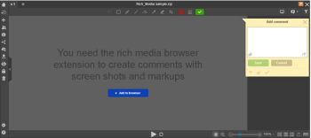
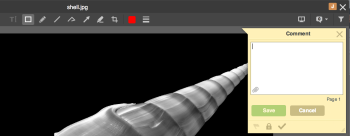
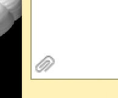
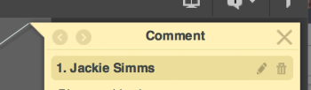
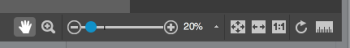
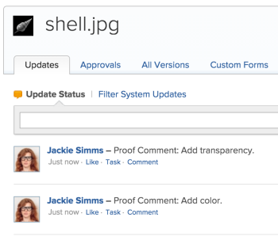
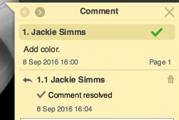
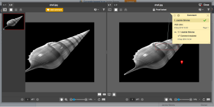
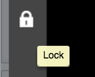

# Reviewing a Proof in the Legacy Proofing Viewer

>[!IMPORTANT]
>
>The information in this article refers to functionality that is currently deprecated and will be removed from Adobe Workfront in 2018.&nbsp;For more information, see [Legacy proofing viewer removed in 2018.3](../../../workfront-proof/wp-work-proofsfiles/review-proofs-lpv/lpv-removed-2018.md).

For information about reviewing a proof in the Web Proofing Viewer, see [Review a proof](../../../review-and-approve-work/proofing/reviewing-proofs-within-workfront/review-a-proof/review-a-proof.md).

## Proofing Interactive Content

Interactive&nbsp;proofs can be viewed in all supported browsers. However, to&nbsp;add comments with markups and screen captures, you&nbsp;must&nbsp;have the Workfront Proof Rich Media Review extension&nbsp;installed in your&nbsp;browser. Without the extension, you can only add comments without the markups.

The extension&nbsp;is available for the following browsers:

* [Chrome 46+](https://chrome.google.com/webstore/detail/proofhq-rich-media-review/hfmcibckpnfcbehahbmfhojlahkenfed) 
* [Firefox 47+](https://addons.mozilla.org/en-US/firefox/addon/proofhq-rich-media-review/?src=cb-dl-created) 
* [Safari 9+](https://safari-extensions.apple.com/details/?id=com.proofhq.safari.screenshot-7WEDVS2S75)

The extension&nbsp;installation can be triggered from the Workfront Proof Viewer directly after clicking the **Add Comment** button (browser restart may be required) via the alert screen.&nbsp;

* When viewing interactive&nbsp;content, you cannot use the Navigation tools&nbsp;(i.e.&nbsp;Zoom, Rotation, Measurement tool, Pan, or Fit to). However, all these functions are&nbsp;available in&nbsp;**Add Comment** mode if&nbsp;the content is captured as a static image, as described in [Proofing Static Content](#proofing-static-content).

When proofing interactive URLs:

* Be&nbsp;wary of version management whenever the actual creative content is changed on the server.
* It is&nbsp;not possible to review the live interactive&nbsp;content for older versions unless each&nbsp;version is placed under a different URL. In cases of the same URLs, the live content displayed in the proofing tool&nbsp;updates for older proof versions as well.&nbsp;
* When&nbsp;proofing HTTP interactive&nbsp;content, make sure that Mixed Content is allowed in your browser.  
  The proofing&nbsp;tool connects over HTTPS. If your external resources load over HTTP, the browser detects this as Mixed Content and might block it,&nbsp;depending on the browser settings.&nbsp;

## Proofing Static Content

1. Go to the document that contains the proof you want to review, then click **Proof**.

   Removing or Archiving a Proof

1. Click the **Add Comment**&nbsp;button located at the top of the proofing area.&nbsp;
1. A comment box and tool bar appears. Select the tool needed to highlight or mark the document&nbsp;within the proofing&nbsp;tool.  
   

1. (Optional) Upload files to a comment by clicking the **Attach File** icon within the **Add Comment** box.   
   &nbsp; 

1. Mouse&nbsp;over the comment area where the user's name appears.

   The&nbsp;**Edit**and**Delete**&nbsp;options appear.

   

1. Click a comment in the sidebar to display&nbsp;that comment on the document.&nbsp;
1. Use the lower-right toolbar to make various changes to the proof.

   

   Options include (in order, from the left):

  * Panning or moving the image
  * Zooming in
  * Scaling the document to fit the screen
  * Select percentage of zoom
  * Fit to page
  * Fit to width
  * Zoom to 100%&nbsp;
  * Zoom to 100%
  * Rotate the document&nbsp;
  * Measure a specific area

Any comments made on the document appear in the stream of your Workfront instance, on the Details tab of the document. Proof Comments&nbsp;are&nbsp;marked to distinguish them from document updates.

You can specify if the comment has been resolved by clicking the check mark at the bottom of the comment box. A green check box appears on the comment.

You can select the auto-pixel icon to highlight in red any changes made to the proof.

Each time users upload a different version of a document to the Workfront Digital Proofing tool, a new proof&nbsp;is generated.

You can toggle between each version to see the changes and progress made on the proof.

You can also view different versions side-by-side by clicking the compare button (upper right).

You can remove the most recent version of a proof, but previous versions cannot be deleted. Use the **Remove Proof** button in the Workfront document list to remove a proof.&nbsp;

If you do not want additional comments made on a proof, you can lock it by selecting the lock proof icon, in the upper left corner of&nbsp;the proofing screen.

   

