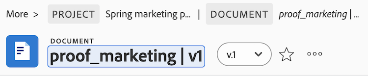

# Document name changed after upload and contains an invalid character

## Problem

Certain documents cannot be converted to proofs.

## Cause

Files that are uploaded to Workfront cannot contain certain characters in file names. If a file contains any of the following characters in the file name, the characters are removed from the file name when the file is uploaded: `! # % * \ | ' " / ? < > { } [ ]`.

If a Document name is updated to include an invalid character after the initial upload, the proof generation will fail. 

## Solution

Remove the invalid character from the document name:

1. Select the document, then click **Document Details**.
1. Click on the document name and remove the invalid character, and press Enter.
    
    Invalid charaters: `! # % * \ | ' " / ? < > { } [ ]`

    

1. Refresh the page, and generate the proof.
