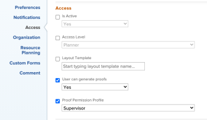

# Edit the Proof Permission Profile field in Bulk

## Access requirements

You must have the following access to perform the steps in this article:

<table style="table-layout:auto"> 
 <col> 
 <col> 
 <tbody> 
  <tr> 
   <td role="rowheader">Adobe Workfront plan*</td> 
   <td> 
Current plan: Pro or Higher
 
or
 
Legacy plan: Select or Premium
 
For more information about proofing access with the different plans, see <a href="/help/quicksilver/administration-and-setup/manage-workfront/configure-proofing/access-to-proofing-functionality.md" class="MCXref xref">Access to proofing functionality in Workfront</a>.
 </td> 
  </tr> 
  <tr> 
   <td role="rowheader">Adobe Workfront license*</td> 
   <td> 
You must be a Workfront administrator. For information on Workfront administrators, see <a href="../../../administration-and-setup/add-users/configure-and-grant-access/grant-a-user-full-administrative-access.md" class="MCXref xref">Grant a user full administrative access</a>.
 </td> 
  </tr> 
  <tr> 
   <td role="rowheader">Proof Permission Profile </td> 
   <td>Administrator</td> 
  </tr> 
  <tr> 
   <td role="rowheader">Access level configurations*</td> 
   <td> 
Edit access to Documents
 
For information on requesting additional access, see <a href="../../../workfront-basics/grant-and-request-access-to-objects/request-access.md" class="MCXref xref">Request access to objects </a>.
 </td> 
  </tr> 
 </tbody> 
</table>

&#42;To find out what plan, role, or Proof Permission Profile you have, contact your Workfront or Workfront Proof administrator.

## Edit the Proof Permission Profile field in Bulk

1. Click the **Main Menu** icon  in the upper-right corner of Adobe Workfront, then click **Users** . 

1. Sort your users by **Access Level**. We recommend batch editing by Access Level to ensure the **Proof Permission Profile** field appears. 

1. Click the checkbox next to the users you want to select within the same access level. The Proof Permission Profile field is available only for Worker access levels and above.
1. Click **Edit** at the top of the list.
1. In the **Access** section, find the **Proof Permission Profile** drop-down menu and make your selection.

   >[!NOTE]
   >
   >Depending on your Workfront plan, you may have to enable the **User can generate proofs** checkbox in order for the **Proof Permission Profile** menu to appear.

   

1. Click **Save Changes**.
