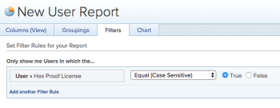

# List users with a proofing license in Adobe Workfront

You can view which users in Adobe Workfront currently have the option "User can generate proofs" enabled in either of the following ways below.

## Access requirements

+++ Expand to view access requirements for the functionality in this article.

You must have the following access to perform the steps in this article:

<table style="table-layout:auto"> 
 <col> 
 <col> 
 <tbody> 
  <tr> 
   <td role="rowheader">Adobe Workfront package</td> 
   <td> 
Any
 </td> 
  </tr> 
  <tr> 
   <td role="rowheader">Adobe Workfront license*</td> 
   <td> 
   
Standard
 
   
Plan
 </td> 
  </tr> 
  <tr> 
   <td role="rowheader">Object permissions</td> 
   <td> 
Edit access to:
 
    <ul> 
     <li> 
Create Reports, Dashboards, and Calendars
 </li> 
     <li> 
Create Filters, Views, and Groupings
 </li> 
    </ul> </td> 
  </tr> 
 </tbody> 
</table>

For information, see [Access requirements in Workfront documentation](/help/quicksilver/administration-and-setup/add-users/access-levels-and-object-permissions/access-level-requirements-in-documentation.md).

+++

## Create a user report

You can create a user report&nbsp;to view which users can generate proofs:

1. Navigate to **Reporting** area.
1. Click the&nbsp;**New Report**&nbsp;drop-down menu, then click&nbsp;**User Report**.

1. On the **Filters** tab, click **Add a Filter Rule**.

1. In the available field, expand **User**, then click **Has Proof License**.

1. Select **Equal** > **True**.

   

1. Click **Save+Close**.

   The report displays all users in Workfront who have a proofing license assigned to them.

## Update the People view

You can add a new column in the People view to view which users can generate proofs:

1. Go to the **People**&nbsp;area.
1. Click the **People** tab.
1. In the **View** drop-down menu, do either of the following:

   * To add this information to an existing view, select the view you want to customize,&nbsp;then click **Customize View**.
   * To add this information to a new view, click **New View**.

1. Click **Add Column**.
1. In the available field, expand **User**, then click **Has Proof License**.

1. Click **Done**, then click **Save View** or **Save as New View**.

   The view displays **True** or **False** depending on whether the user has a proofing license assigned to them.
