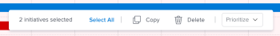

# Copy initiatives in the [!DNL Scenario Planner]

<!--Audited: 07/2024-->

You can create initiatives by copying existing ones. You can copy initiatives on a plan that you create or on a plan that someone shares with you.

## Access requirements

+++ Expand to view access requirements for the functionality in this article. 

<table style="table-layout:auto"> 
 <col> 
 <col> 
 <tbody> 
  <tr> 
   <td> 
[!DNL Adobe Workfront] package
 </td> 
   <td> 
   
Workfront Ultimate

<b>NOTE</b>

Speak with your Workfront representative if you have a different Workfront package.

   </td> 
  </tr> 
  <tr> 
   <td> 
[!DNL Adobe Workfront] license
 </td> 
   <td> 
[!UICONTROL Light] or higher
 
   
[!UICONTROL Review] or higher
 </td> 
  </tr> 
    <tr> 
   <td>Access level configurations</td> 
   <td> 
[!UICONTROL Edit] access to the [!DNL Scenario Planner]
 </td> 
  </tr> 
  <tr> 
   <td> 
Object permissions 
 </td> 
   <td> 
[!UICONTROL Manage] permissions to a plan
 </td> 
  </tr> 
 </tbody> 
</table>

For more information about access to the Scenario Planner, see [Access needed to use the [!DNL Scenario Planner]](../scenario-planner/access-needed-to-use-sp.md).

For information about Workfront access requirements, see [Access requirements to Workfront documentation](/help/quicksilver/administration-and-setup/add-users/access-levels-and-object-permissions/access-level-requirements-in-documentation.md). 

+++

<!--
Old:

<table style="table-layout:auto"> 
 <col> 
 <col> 
 <tbody> 
  <tr> 
   <td> 
[!DNL Adobe Workfront] plan*
 </td> 
   <td> <ul></li>
   <li>
New: Ultimate 
</li>
   
The Scenario Planner is not available for the new Workfront Select or Workfront Prime plans. 

   <li>
Current: [!UICONTROL Business] or higher
</ul>
   </td> 
  </tr> 
  <tr> 
   <td> 
[!DNL Adobe Workfront] license*
 </td> 
   <td> 
New: Light or higher
 
   
Current: [!UICONTROL Review] or higher
 </td> 
  </tr> 
  <tr> 
   <td>Product* </td> 
   <td> <ul><li>
For the new Workfront plans:

 Adobe Workfront</li>

   <li>
For the current Workfront plans: 

   
Adobe Workfront
 
Adobe Workfront Scenario Planner
</li></ul>
   
For more information, see <a href="../scenario-planner/access-needed-to-use-sp.md" class="MCXref xref">Access needed to use the [!DNL Scenario Planner]</a>. 
 </td> 
  </tr> 
  <tr data-mc-conditions=""> 
   <td>Access level </td> 
   <td> 
[!UICONTROL Edit] access to the [!DNL Scenario Planner]
 </td> 
  </tr> 
  <tr data-mc-conditions=""> 
   <td> 
Object permissions 
 </td> 
   <td> 
[!UICONTROL Manage] permissions to a plan
 
For information on requesting additional access to a plan, see <a href="../scenario-planner/request-access-to-plan.md" class="MCXref xref">Request access to a plan in the [!DNL Scenario Planner]</a>.
 </td> 
  </tr> 
 </tbody> 
</table>
-->

## Copy initiatives

Consider the following when copying initiatives:

* Copying an initiative places the copy on the same plan as the original initiative. 
* Copying an initiative copies and adds the following information from the original initiative to the new initiative:

    * [!UICONTROL Duration]
    * [!UICONTROL Job roles]
    * [!UICONTROL People] and [!UICONTROL Fixed Costs]
    * [!UICONTROL Planned Benefit]

* Copying an initiative can modify the following information for the plan, if the information exists on the original initiative:

    * Required amount of job roles 
    * [!UICONTROL Costs]
    * [!UICONTROL Plan Utilization]
    * Job role utilization
    * [!UICONTROL Net Value]

* Copying an initiative that was created by importing a project or has been published to a project at least once has the following implications:

    * It does not duplicate the project associated with the initiative.
    * It does not connect the copied initiative to the project. 
    * It does not modify the [!DNL Scenario Planner] section on the project, for projects that have been published at least once.

     For information about publishing initiatives to projects, see [Update or create projects by publishing initiatives in the [!DNL Scenario Planner]](../scenario-planner/publish-scenarios-update-projects.md).

     For information about creating initiatives by importing projects, see [Import projects to plans in the [!DNL Scenario Planner]](../scenario-planner/import-projects-to-plans.md).

## Copy initiatives

{{step1-to-scenario-planner}}

   A list of plans displays. 

1. Click the name of a plan to open it, then locate the initiatives you want to copy.
1. Select the box to the left of the initiative or initiatives that you want to copy, then click **[!UICONTROL Copy]** from the menu that appears at the bottom of the plan.

   

   [!DNL Workfront] copies the initiatives immediately and places them underneath the last selected initiative.

   The name of the copied initiative is *[!UICONTROL Copy of] `<Name of original initiative>`*.

   >[!NOTE]
   >
   >Depending on where you insert the new initiatives, the numbers of existing initiatives may change.

1. Update the name of the copied initiative.

   >[!TIP]
   >
   >We recommend that you always update the name of the initiative to avoid confusion in case you want to copy them again.

1. (Optional) Update the priority of your newly created initiatives.

   For information about prioritizing initiatives, see [Update initiative priorities in the [!DNL Scenario Planner]](../scenario-planner/prioritize-initiatives.md). 

1. Click **[!UICONTROL Save Plan]** to save your changes.
