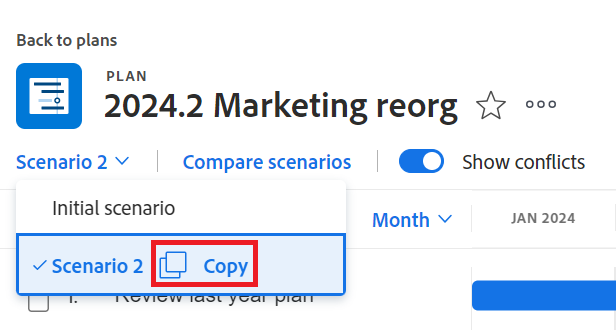
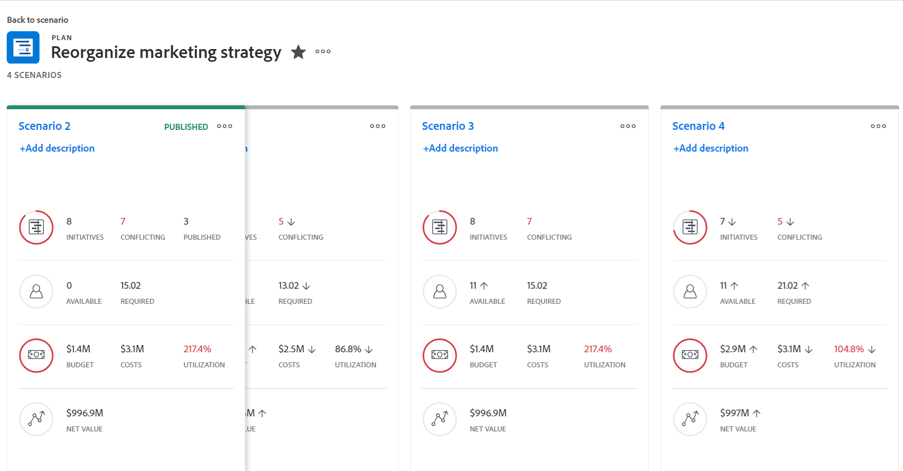
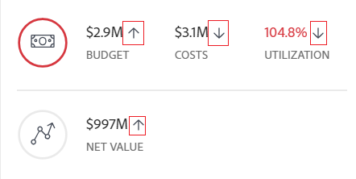
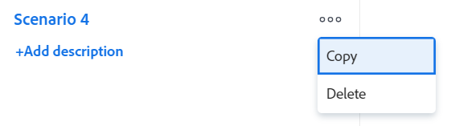

# Create and compare plan scenarios in the [!DNL Scenario Planner]

When you are planning your company's long-term strategy, there is a lot of information that you might not have or think of in the beginning. It takes time and experimentation to arrive at a final strategy that your stakeholders can accept. Conducting a "what if" analysis to create multiple scenarios for your plan can help you accurately predict and evaluate potential circumstances and ultimately develop the best possible plan.

## Access requirements

You must have the following:

<table style="table-layout:auto"> 
 <col> 
 <col> 
 <tbody> 
  <tr> 
   <td> 
[!DNL Adobe Workfront]<b> plan*</b> 
 </td> 
   <td>[!UICONTROL Business] or higher</td> 
  </tr> 
  <tr> 
   <td> 
[!DNL Adobe Workfront]<b> license*</b> 
 </td> 
   <td> 
[!UICONTROL Review] or higher
 </td> 
  </tr> 
  <tr> 
   <td><b>Product</b> </td> 
   <td> 
You must purchase an additional license for the [!DNL Adobe Workfront Scenario Planner] to access functionality described in this article.
 
For information about obtaining the [!DNL Workfront Scenario Planner], see <a href="../scenario-planner/access-needed-to-use-sp.md" class="MCXref xref">Access needed to use the [!DNL Scenario Planner]</a>. 
 </td> 
  </tr> 
  <tr data-mc-conditions=""> 
   <td><strong>Access level configurations*</strong> </td> 
   <td> 
Edit access or higher to the [!DNL Scenario Planner]
 
Note: If you still don't have access, ask your [!DNL Workfront] administrator if they set additional restrictions in your access level. For information on how a Workfront administrator can change your access level, see <a href="../administration-and-setup/add-users/configure-and-grant-access/create-modify-access-levels.md" class="MCXref xref">Create or modify custom access levels</a>.
 </td> 
  </tr> 
  <tr data-mc-conditions=""> 
   <td> 
<strong>Object permissions</strong> 
 </td> 
   <td> 
[!UICONTROL Manage] permissions to a plan
 
For information on requesting additional access to a plan, see <a href="../scenario-planner/request-access-to-plan.md" class="MCXref xref">Request access to a plan in the [!DNL Scenario Planner]</a>.
 </td> 
  </tr> 
 </tbody> 
</table>

&#42;To find out what plan, license type, or access you have, contact your [!DNL Workfront] administrator.

## Create scenarios 

A scenario is a copy of a plan. You can create as many scenarios as you need. However, we recommend that you keep the number of scenarios to a minimum so that you can easily compare them.

1. Click the **[!UICONTROL Main Menu]** icon , then click [!UICONTROL Scenarios].

1. Create a plan.

   For information about creating plans, see [Create and edit plans in the [!DNL Scenario Planner]](../scenario-planner/create-and-edit-plans.md).

   The first plan you create is automatically saved as the "[!UICONTROL Initial scenario]."

1. Click the down-pointing arrow next to an existing scenario, then  click the **[!UICONTROL Copy]** icon.

   

   This creates a new scenario with the same information as the copied scenario. It is automatically named "[!UICONTROL Scenario 2]" if it's the second scenario of your plan, "[!UICONTROL Scenario 3]" if it's the third, and so on. You cannot rename your scenarios. There is not a limit to the number of copies you can make.

   <!--
   <MadCap:conditionalText data-mc-conditions="QuicksilverOrClassic.Draft mode">
   (NOTE:this might change)
   </MadCap:conditionalText>
   -->

1. Update your new scenario in any of the following ways:

   * Create, update, or delete initiatives

     >[!TIP]
     >
     >When you delete an initiative in a scenario it is removed only from the selected scenario, not from all the scenarios.

     For information about creating initiatives, see [Create and edit initiatives in the [!DNL Scenario Planner]](../scenario-planner/create-and-edit-initiatives.md).
   
   * Update the priorities of your initiatives
   * Adjust people or budget information
   * Review and adjust initiative conflicts in your scenario

     For information about resolving conflicts, see [Resolve initiative conflicts in the [!DNL Scenario Planner]](../scenario-planner/resolve-conflicts-in-sp.md).

1. Click **[!UICONTROL Save Plan]** to save your changes.

## Compare scenarios

After creating your scenarios, you can compare them to find the best one for your organization.

1. Go to the plan for which you want to compare scenarios.
1. Click **[!UICONTROL Compare scenarios]**. The scenario comparison page displays.

   All existing scenarios for the plan display in a side-by-side card format. The Initial scenario is always listed first and it is static.

   

1. (Optional) Scroll to the right to view all scenario cards.

   The following information displays on a scenario card:

   <table style="table-layout:auto"> 
    <col> 
    <col> 
    <tbody> 
     <tr> 
      <td>Name of the scenario</td> 
      <td> 
An automatically generated name by Workfront and cannot be edited. For example, "[!UICONTROL Initial scenario]", "[!UICONTROL Scenario 2]", and so on. 
 </td> 
     </tr> 
     <tr> 
      <td>Scenario description</td> 
      <td>A manual entry where you can describe specifics about the scenario. </td> 
     </tr> 
     <tr> 
      <td>Available Job Roles</td> 
      <td>The number of job roles available from the plan's budget for the duration of the plan. </td> 
     </tr> 
     <tr> 
      <td>Required Job Roles</td> 
      <td>The number of job roles required, based on your initiatives. </td> 
     </tr> 
     <tr> 
      <td>Budget</td> 
      <td>The total budget defined for the plan in this scenario. For budget information about plans, see <a href="../scenario-planner/plans-overview.md" class="MCXref xref">Plans overview in the [!DNL Scenario Planner]</a>. </td> 
     </tr> 
     <tr> 
      <td>Costs</td> 
      <td>The costs associated with the initiatives on the scenario. For information about costs, see <a href="../scenario-planner/initiatives-overview.md" class="MCXref xref">Initiatives overview in the [!DNL Scenario Planner]</a>. </td> 
     </tr> 
     <tr> 
      <td>Utilization</td> 
      <td>The [!UICONTROL Budget Utilization] percentage for the plan in this scenario. For information about the [!UICONTROL Budget Utilization] percentage, see <a href="../scenario-planner/plans-overview.md" class="MCXref xref">Plans overview in the [!DNL Scenario Planner]</a>. </td> 
     </tr> 
     <tr> 
      <td>Net Value</td> 
      <td>The [!UICONTROL Net Value] of the plan in this scenario. For information about the [!UICONTROL Net Value] of a plan, see <a href="../scenario-planner/plans-overview.md" class="MCXref xref">Plans overview in the [!DNL Scenario Planner]</a>. </td> 
     </tr> 
     <tr> 
      <td>Initiatives</td> 
      <td>The number of initiatives for the plan in this scenario.</td> 
     </tr> 
     <tr> 
      <td>Conflicting</td> 
      <td>The number of initiatives that show any type of conflicts in the plan for this scenario. For information about initiatives conflicts, see <a href="../scenario-planner/resolve-conflicts-in-sp.md" class="MCXref xref">Resolve initiative conflicts in the [!DNL Scenario Planner]</a>. </td> 
     </tr> 
    </tbody> 
   </table>

   >[!NOTE]
   >
   >When information differs between the initial scenario and additional scenarios, an up or down arrow displays next to the value that changed to indicate an increase or decrease in that value, compared to the initial scenario. 
   >
   >
   >
   >
   >For example, the budget, the number of job roles, the number of initiatives might change from one scenario to another.

1. Click the name of a scenario to access it and make changes to it.

   For more information, see the [Create scenarios](#create-scenarios) section in this article.

1. Click **[!UICONTROL Add description]** to add a description for the scenario

   Or

   Click the description field to update it, then click anywhere on the screen to save your changes.

1. (Optional) Click the **[!UICONTROL More]** menu  to **[!UICONTROL Copy]** or **[!UICONTROL Delete]** the scenario.

   

   When you copy a scenario, it automatically appears on the card page and is renamed according to this pattern: "[!UICONTROL Scenario] `<next number in order>`." 

1. (Conditional) If you clicked **[!UICONTROL Delete]**, click **[!UICONTROL Yes, delete it]** to confirm.

   Deleted scenarios cannot be recovered.

   For information about deleting scenarios, see [Delete plans in the [!DNL Scenario Planner]](../scenario-planner/delete-plans.md).

1. Click **[!UICONTROL Save Plan]** to save your scenarios and your plan.
