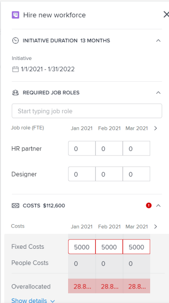

# Create and edit initiatives in the [!DNL Scenario Planner]

When using the [!UICONTROL Adobe Workfront Scenario Planner], you can create initiatives in a plan that you created or that was shared with you. By creating initiatives you can show how smaller organizational units contribute to the completion of the plan. For example, if your organization has a plan for the next three years to expand into a new market, you can create initiatives within this plan for each department to estimate each department's need for people and budget to accomplish this plan.

## Access requirements

+++ Expand to view access requirements for the functionality in this article. 

<table style="table-layout:auto"> 
 <col> 
 <col> 
 <tbody> 
  <tr> 
   <td> 
[!DNL Adobe Workfront] plan*
 </td> 
   <td> 
Current: [!UICONTROL Business] or higher

   
New: Ultimate 

   </td> 
  </tr> 
  <tr> 
   <td> 
[!DNL Adobe Workfront] license*
 </td> 
   <td> 
New: Light or higher
 
   
Current: [!UICONTROL Review] or higher
 </td> 
  </tr> 
  <tr> 
   <td>Product </td> 
   <td> 
   
For the current Workfront plans: 

   
You must purchase an additional license for the [!DNL Adobe Workfront Scenario Planner] to access functionality described in this article.
 
For information about access and permissions for the [!DNL Workfront Scenario Planner], see <a href="../scenario-planner/access-needed-to-use-sp.md" class="MCXref xref">Access needed to use the [!DNL Scenario Planner]</a>. 
 </td> 
  </tr> 
  <tr data-mc-conditions=""> 
   <td>Access level configurations </td> 
   <td> 
[!UICONTROL Edit] access to the [!DNL Scenario Planner]
 </td> 
  </tr> 
  <tr data-mc-conditions=""> 
   <td> 
Object permissions 
 </td> 
   <td> 
[!UICONTROL Manage] permissions to a plan
 
For information on requesting additional access to a plan, see <a href="../scenario-planner/request-access-to-plan.md" class="MCXref xref">Request access to a plan in the [!DNL Scenario Planner]</a>.
 </td> 
  </tr> 
 </tbody> 
</table>

*For information, see [Access requirements to Workfront documentation](/help/quicksilver/administration-and-setup/add-users/access-levels-and-object-permissions/access-level-requirements-in-documentation.md). 

+++

## Prerequisites

You must create a plan or another user must share a plan with you before you can create an initiative inside that plan. For information about creating plans, see [Create and edit plans in the [!DNL Scenario Planner]](../scenario-planner/create-and-edit-plans.md).

For more information about what initiatives are, see [Initiatives overview in the [!DNL Scenario Planner]](../scenario-planner/initiatives-overview.md).

## Create initiatives

You can create initiatives in the following ways:

* From scratch. 
* By importing projects into a plan

  For information about importing projects as initiatives in a plan, see [Import projects to plans in the [!DNL Scenario Planner]](../scenario-planner/import-projects-to-plans.md).

* By copying existing initiatives.

  For information about copying initiatives, see [Copy initiatives in the [!DNL Scenario Planner]](../scenario-planner/copy-initiatives.md).

To create initiatives from scratch:

{{step1-to-scenario-planner}} 

1. Click the name of the plan for which you want to create an initiative.
1. Click the **+ icon** to the left of **[!UICONTROL New initiative]**

   Or

   Click the **[!UICONTROL New initiative]** drop-down menu and select either **[!UICONTROL New initiative]** or **[!UICONTROL Import Projects].**

1. Type a name for your initiative in the **[!UICONTROL Untitled Initiative]** field, then press Enter or click anywhere else on the page.

   The initiative displays on the timeline of the plan, as a blue bar. By default, the duration of an initiative is one month and it always starts on the first month of the plan. 

1. (Optional) Drag the separation bar between the left panel and the timeline to resize the left panel. 

1. (Optional) Drag the end of the initiative bar to extend its duration to more than one month and release it where you want the end month of the initiative to be. 
1. (Optional and conditional) If the duration of the initiative is shorter than that of the plan, drag and drop the initiative bar in a different position on the timeline of the plan, to move it to another time frame.

   

   >[!IMPORTANT]
   >
   >You can only select a duration in months. The duration of an initiative that you create from scratch can never exceed the Duration of the plan.

1. (Optional) From the **[!UICONTROL Month]** drop-down menu, select one of the following options to change the timeline of the plan:

   | Drop-down menu option |Description  |
   |---|---|
   | [!UICONTROL Month] |Displays the timeline by month. This is the default option for a one-year plan.  |
   | [!UICONTROL Quarter] |Displays the timeline by quarter. This option is available only when the [!UICONTROL Duration] of the plan is 3 or 5 years. This is the default option for a 3-year plan. |
   | [!UICONTROL Year] |Displays the timeline by year. This option is available only when the [!UICONTROL Duration] of the plan is 5 years. This is the default option for a 5-year plan.  |

   
1. (Optional) Scroll from left to right to see the entire duration of the initiative. 
1. (Optional) Click the **[!UICONTROL Today]** indicator line to come back to the current date.

   

   >[!TIP]
   >
   >If your plan is in the future or in the past and does not include the current date, the Today indicator does not display.

1. Click the bar of an initiative. The initiative details panel opens on the right.

   

   Specify or review the following information:

   <table style="table-layout:auto"> 
    <col> 
    <col> 
    <tbody> 
     <tr data-mc-conditions=""> 
      <td role="rowheader">Initiative Duration</td> 
      <td>The duration of the initiative in months. </td> 
     </tr> 
     <tr data-mc-conditions=""> 
      <td role="rowheader">Start and End Dates</td> 
      <td>The start and end dates of the initiative.</td> 
     </tr> 
     <tr> 
      <td role="rowheader">Required Job Roles Section </td> 
      <td> 
Click the <strong>[!UICONTROL Start typing job role]</strong> field and select a role from the list or start typing the name of an active job role. 
 
Depending on whether the plan is set up to use FTEs or hours, add the number of job roles needed for this initiative in FTE or hours for each month in the initiative. The first three months of the initiative display by default.
 
Updating the job role information for the initiative also updates the Required job role information for the plan. 
 
For information about setting up the plan to use FTE or hours, see <a href="../scenario-planner/create-and-edit-plans.md" class="MCXref xref">Create and edit plans in the [!DNL Scenario Planner]</a>. 

      
<b>IMPORTANT</b>
  
      
For all calculations in the [!DNL Scenario Planner], [!DNL Workfront] uses the following value: 1 FTE = 8 Hours. 
 
      
      
<b>TIP</b>

      <ul> 
       <li> 
Use the [!UICONTROL Tab] key to move to the next month. 
 </li> 
      <li> 
 All active job roles in the system are listed when you click this field. 
 </li> 
       <li> 
The job roles that have already been added to the Available job roles of the plan display first. For information about adding available job roles to a plan, see <a href="../scenario-planner/create-and-edit-plans.md" class="MCXref xref">Create and edit plans in the Scenario Planner</a>. 
 </li> 
       <li> 
[!DNL Workfront] considers that a full-time equivalent is 160 hours for a month. 
 
For all calculations in the Scenario Planner, Workfront uses the following value: 1 FTE = 8 Hours. 
</li> 
      </ul> 
 
You can enter a number lower than 1 FTE or decimal numbers for FTE or hours. For example, a 0.5 Consultant job role would mean that a consultant would dedicate half of his FTE (typically, 4 hours, where 8 hours is 1 FTE) to working on this initiative. 
  </td> 
     </tr> 
     <tr> 
      <td rowspan="3" role="rowheader">Costs section</td> 
      <td> 
The total costs of the initiative display to the right of the [!UICONTROL Costs] section. [!DNL Workfront] calculates an initiative's costs using the following formula:
 
<code>[!UICONTROL Initiative Costs] = [!UICONTROL Fixed Costs] + [!UICONTROL People] Costs</code> 
 </td> 
     </tr> 
     <tr> 
      <td> 
In the <strong>[!UICONTROL Fixed Costs]</strong> field, manually enter a rough estimate amount of what you believe it will cost to complete this initiative. This should not include costs associated with the job roles estimated for the initiative.
 
Enter an amount for each month of the initiative by moving from one month to the next as you use the Tab key. 
 </td> 
     </tr> 
     <tr> 
      <td> 
       
 
        
Depending on whether the plan is set up to use FTEs or hours, [!UICONTROL Workfront] uses the following formulas to calculate [!UICONTROL People Cost]:
 
        <ul> 
         <li> 
When using FTEs: 
 
<code>[!UICONTROL People Costs] = SUM(Job role hourly rate * Number of months in the Duration * 160 * Number of FTEs)</code>, where 160 is the total number of working hours in a month. 
 </li> 
         <li> 
When using hours: 
 
<code>Monthly People Costs = SUM(Job role hourly rate * Number of hours estimated for an initiative)</code> 
 
For information about setting up the plan to use hours or FTE, see <a href="../scenario-planner/create-and-edit-plans.md" class="MCXref xref">Create and edit plans in the Scenario Planner</a>.
 </li> 
        </ul> 
        
People costs are calculated in the base currency selected in your Exchange Rates preferences. For information about Exchange Rates, see <a href="../administration-and-setup/manage-workfront/exchange-rates/set-up-exchange-rates.md" class="MCXref xref">Set up exchange rates</a>.
 
        
Updating the cost information for an initiative also updates the [!UICONTROL Costs] area for the plan. 
 
       
 </td> 
     </tr> 
     <tr> 
      <td colspan="2" role="rowheader"> 
After you defined the required job role and cost values for your initiative and you modify the duration of the initiative, one the following scenarios may occur:
 
       <ul> 
        <li> 
If you shorten the initiative, [!DNL Workfront] removes the Required amount of resources and the costs associated with the time removed from the Plan. The job roles remain on the plan, but they have no Required FTE or hours. The Available resources for the plan and the Budget remain unchanged. For updating information on the plan, see <a href="../scenario-planner/create-and-edit-plans.md" class="MCXref xref">Create and edit plans in the [!DNL Scenario Planner]</a>. 
 </li> 
        <li> 
If you make the initiative longer, you must specify the amount of job roles and costs for the newly added months on the initiative. 
 </li> 
       </ul> </td> 
     </tr> 
     <tr> 
      <td role="rowheader">[!DNL Net Value] section</td> 
      <td>In the <strong>[!DNL Net Value]</strong> section, manually enter a rough estimate amount in the <strong>[!UICONTROL Planned Benefit]</strong> field. This is what you believe the benefit of achieving this initiative will be. </td> 
     </tr> 
    </tbody> 
   </table>

   >[!NOTE]
   >
   >If you have already defined the number of job roles and the budget for your plan and the number of job role and the costs of the initiative you are editing and of all the initiatives above it and they all exceed the amounts you specified for the plan, [!DNL Workfront] might find that you do have not have enough resources to finish the initiative. [!DNL Workfront] marks this as a conflict when trying to achieve this initiative and it displays it as a red bar. All the initiatives that follow the conflicted initiative display in a red background. You might need to adjust some of the needs of your initiatives starting with the first one that has insufficient resources. For information about adjusting conflicting initiatives, see [Resolve initiative conflicts in the [!DNL Scenario Planner]](../scenario-planner/resolve-conflicts-in-sp.md).

1. (Optional) Hover over the name of a job role, then click the **[!UICONTROL trash can icon]**  to remove it from the initiative. 

1. (Conditional) If you made changes to the initiative, click **[!UICONTROL Apply]**.

   <!--
   <MadCap:conditionalText data-mc-conditions="QuicksilverOrClassic.Draft mode">
   (NOTE: Add more steps here as you can do more in the Initiative box over time)
   </MadCap:conditionalText>
   -->

1. (Conditional) If you made no changes, click the **X** icon in the upper-right of the initiative details panel to close it. 
1. (Optional) Update the priority of your initiatives.

   For information about prioritizing initiatives, see [Update initiative priorities in the Scenario Planner](../scenario-planner/prioritize-initiatives.md).

   >[!TIP]
   >
   >Initiatives listed first in the list have a higher priority and get resources before the initiatives listed lower in the list.

1. Click **[!UICONTROL Save plan]**.

   The initiative is now included in your plan.

   For information about deleting initiatives from a plan, see [Delete initiatives in the [!DNL Scenario Planner]](../scenario-planner/delete-initiatives.md).
