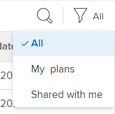
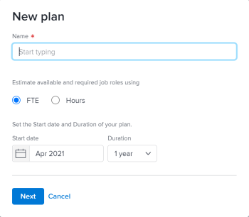
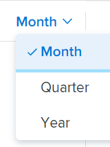
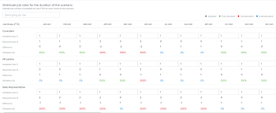
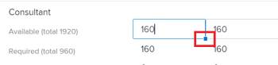
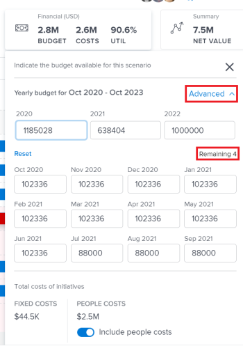
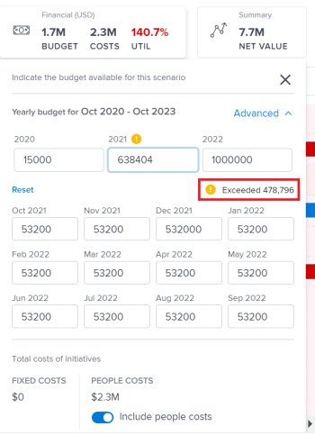

# Create and edit plans in the [!DNL Scenario Planner]

You can create plans as part of using the [!DNL Workfront Scenario Planner], when prioritizing your company's higher-level strategy. For more information about plans, see [Plans overview in the [!DNL Scenario Planner]](../scenario-planner/plans-overview.md).

<!--

(NOTE: talk about:

- Show people conflicts >> this impacts the conflicts calculation for initiatives>> link to the conflicts article

- explain what hovering over the green upward-pointing arrow does, with screen shot)

-->

## Access requirements

+++ Expand to view access requirements for the functionality in this article. 

<table style="table-layout:auto"> 
 <col> 
 <col> 
 <tbody> 
  <tr> 
   <td> 
[!DNL Adobe Workfront] plan*
 </td> 
   <td> 
Current: [!UICONTROL Business] or higher

   
New: Ultimate 

   </td> 
  </tr> 
  <tr> 
   <td> 
[!DNL Adobe Workfront] license*
 </td> 
   <td> 
New: Light or higher
 
   
Current: [!UICONTROL Review] or higher
 </td> 
  </tr> 
  <tr> 
   <td>Product* </td> 
   <td> 
   
For the current Workfront plans: 

   
You must purchase an additional license for the [!DNL Adobe Workfront Scenario Planner] to access functionality described in this article.
 
For information about access and permissions for the [!DNL Workfront Scenario Planner], see <a href="../scenario-planner/access-needed-to-use-sp.md" class="MCXref xref">Access needed to use the [!DNL Scenario Planner]</a>. 
 </td> 
  </tr> 
  <tr data-mc-conditions=""> 
   <td>Access level </td> 
   <td> 
[!UICONTROL Edit] access to the [!DNL Scenario Planner]
 </td> 
  </tr> 
  <tr data-mc-conditions=""> 
   <td> 
Object permissions 
 </td> 
   <td> 
[!UICONTROL Manage] permissions to a plan
 
For information on requesting additional access to a plan, see <a href="../scenario-planner/request-access-to-plan.md" class="MCXref xref">Request access to a plan in the [!DNL Scenario Planner]</a>.
 </td> 
  </tr> 
 </tbody> 
</table>

*For information, see [Access requirements to Workfront documentation](/help/quicksilver/administration-and-setup/add-users/access-levels-and-object-permissions/access-level-requirements-in-documentation.md). 

+++

## Create or edit plans

You can create a plan from scratch or you can edit an existing one that was shared with you.

>[!NOTE]
>
>After you create a plan, you are considered the plan creator and owner. When a user is deactivated, the plan has no owner and is not visible to anyone unless previously shared with a link.

This article describes how you can create a plan from scratch or you can edit an existing plan.

For all considerations about plans including the information available for a plan, see [Plans overview in the [!DNL Scenario Planner]](../scenario-planner/plans-overview.md).

For information about deleting plans, see [Delete plans in the [!DNL Scenario Planner]](../scenario-planner/delete-plans.md).

To create or edit a plan:

{{step1-to-scenario-planner}} 

   A list of existing plans that you created displays in the [!DNL Workfront Scenario Planner]. 

1. (Optional) Click the **[!UICONTROL Filter]** icon in the upper-right corner of the plan list, and select from the following:

   | Filter |Description  |
   |---|---|
   | [!UICONTROL All] |Displays all plans that you created or that have been shared with you.  |
   | [!UICONTROL My plans] |Displays plans that you created.  |
   | [!UICONTROL Shared with me] |Displays plans shared with you.  |

   

1. (Optional) Click the **[!UICONTROL Search]** icon  to type a keyword and quickly locate a plan in the list. 

1. Click the name of an existing plan to edit it and continue with step 7.

   <!--
   
(NOTE: is the step still accurate) 

   -->

   Or

   Click **[!UICONTROL New Plan]** in the upper-left corner to create a plan and continue with step 5.

   <!--
   
(NOTE: is the step still accurate)

   -->

   

   The [!UICONTROL New Plan] box displays.

   

1. (Conditional) When you create a new plan, specify the following information:

   <table style="table-layout:auto"> 
    <col> 
    <col> 
    <tbody> 
     <tr> 
      <td role="rowheader">[!UICONTROL Name]</td> 
      <td>Type a name for the plan. This is a required field.</td> 
     </tr> 
     <tr> 
      <td role="rowheader" colspan="2"> 
Important: You cannot modify the following selections after you create and save the plan. 
 </td> 
     </tr> 
     <tr data-mc-conditions=""> 
      <td role="rowheader">FTE ([!UICONTROL Full Time Equivalent]) or [!UICONTROL Hours] </td> 
      <td> 
Select one of the following options to indicate how you want to estimate job role information for this plan: 
 
       <ul> 
      <li> 
<strong>FTE</strong>. This is the default  
 
      
<b>IMPORTANT</b>
  
      
For all calculations in the [!DNL Scenario Planner], [!DNL Workfront] uses the following value: 1 FTE = 8 Hours. 
 </li> 
      <li> 
<strong>[!UICONTROL Hours]</strong> 
 </li> 
       </ul> 
<b>IMPORTANT</b>

       
      The option you select here determines how job role information displays for the plan, the plan's scenarios, and initiatives
 </td> 
     </tr> 
     <tr> 
      <td role="rowheader">[!UICONTROL Start date]</td> 
      <td> 
Select the month and year when you want the plan to start. You can select only months in this field. [!DNL Workfront] assumes that the start date of the plan is the first day of the selected month and the end date is the last day of the end of month in its duration. 
 </td> 
     </tr> 
     <tr> 
      <td role="rowheader">[!UICONTROL Duration]</td> 
      <td> 
From the drop-down menu select from the following durations:
 
       <ul> 
        <li>1 year. This is the default duration. </li> 
        <li>3 years</li> 
        <li> 
5 years
 </li> 
       </ul> </td> 
     </tr> 
    </tbody> 
   </table>

<!--for table above - how FTE is calcualted: NOTE: snippet below: this is per Ani; it does NOT look at the system FTE.) 
-->

1. (Conditional) Click **[!UICONTROL Next]**.

   The timeline of the plan displays as the **[!UICONTROL Initial scenario]**.

   For information about creating additional scenarios, see [Create and compare plan scenarios in the [!DNL Scenario Planner]](../scenario-planner/create-and-compare-scenarios-for-a-plan.md).

1. (Optional) From the timeline drop-down menu select one of the options in the following table to change the way you view the timeline of the plan.

   

   | Drop-down menu option |Description  |
   |---|---|
   | [!UICONTROL Month] |Displays the timeline by month. This is the default and only option for a one year plan.  |
   | [!UICONTROL Quarter] |Displays the timeline by quarter. This option is available only when the [!UICONTROL Duration] of the plan is 3 or 5 years. This is the default option for a 3-year plan. |
   | [!UICONTROL Year] |Displays the timeline by year. This option is available only when the [!UICONTROL Duration] of the plan is 5 years. This is the default option for a 5-year plan.  |

1. (Optional) Scroll from left to right to view the entire duration of the plan. 
1. (Optional) Click the **[!UICONTROL Today]** indicator line to return to the current day.

   

1. Click the **[!UICONTROL Job Roles]** box in the header of the plan to add job roles that will be available to execute the plan.

   The details of the [!UICONTROL Job Roles] box display.

   >[!TIP]
   >
   >The role allocation unit (FTE or hours) that [!DNL Workfront] uses for this plan displays in parentheses in the title of the box.

   

1. Click the **[!UICONTROL Start typing job role]** field and select a role from the list or start typing the name of an active job role.

   All active job roles in the system are listed when you click this field.

   This adds the job role to the Job Roles column. 

1. Update or review the following information for the job role: 

   <table style="table-layout:auto"> 
    <col> 
    <col> 
    <tbody> 
     <tr> 
      <td role="rowheader"> 
[!UICONTROL Max available] (for FTE) 
 
or 
 
[!UICONTROL Total available] (for hours) 
 </td> 
      <td> 
Depending on whether you selected to use hours or FTE for your plan, type the number of job role FTEs or hours that are available to execute work on the plan in the following fields: 
 
       <ul> 
        <li> 
<strong>[!UICONTROL Total available]</strong> (for hours): Indicate the total number of hours for all months during the duration of the scenario. By default, [!DNL Workfront] divides the Total available number equally across all months in the duration of the scenario. 
 
Example: </b>"><b>Example: </b>If you enter 1200 hours for a Designer, this means the Designer is available for 100 hours for each month during the duration of the plan, when the plan [!UICONTROL Duration] is 1 year. 
 </li> 
        <li> 
<b>[!UICONTROL Max available]</b> (for FTE): Indicate the number of FTEs that the job role is available for each month during the duration of the plan. By default, <strong>Workfront</strong> assigns the [!UICONTROL Max available] number to each month in the duration of the scenario.
 
Example: </b>"><b>Example: </b>If you enter 1 FTE for a Consultant, this means the Consultant is available for 1 FTE for each month during the duration of the plan. 
 
You can enter a number lower than 1 FTE. 
 
Example: </b>"><b>Example: </b>A 0.5 Consultant job role would mean that a consultant would dedicate half of their FTE (typically, 4 hours, where 8 hours is 1 FTE) to working on this plan. For all calculations in the Scenario Planner, Workfront uses the following value: 1 FTE = 8 Hours. 
 </li> 
       </ul> </td> 
     </tr> 
     <tr> 
      <td role="rowheader"> 
[!UICONTROL Max required] (for FTE)
 
or 
 
[!UICONTROL Total required] (for hours) 
 </td> 
      <td> 
Depending on whether you selected to use hours or FTE for your plan, review the number of job role FTEs or hours that are required to complete the initiatives in the scenario. Review the following fields:
 
       <ul> 
        <li> 
<strong>[!UICONTROL Total required]</strong> (for hours): The total number of hours required for all months during the duration of the plan.
 </li> 
        <li> 
<strong>[!UICONTROL Max required]</strong> (for FTE): The maximum number of FTEs required for any of the months during the duration of the plan. 
 </li> 
       </ul> 
Tip: The maximum number of FTEs or the total number of hours required for that job role displays after you start adding initiatives. For information about adding initiatives to a plan, see <a href="../scenario-planner/create-and-edit-initiatives.md" class="MCXref xref">Create and edit initiatives in the [!DNL Scenario Planner]</a>.
 </td> 
     </tr> <!--
      <tr data-mc-conditions="QuicksilverOrClassic.Draft mode"> 
       <td role="rowheader">[!UICONTROL Avg utilization]</td> 
       <td> 
(NOTE: this field was removed in 21.2 - May 2021) 
 
[!DNL Workfront] calculates the average utilization for each job role using the job role FTEs associated with initiatives (required) and the job role FTEs associated with the plan (available). 
 
 [!DNL Workfront] calculates the job role utilization percentage for a plan using the following formula: 
 
<code>Job role utilization percentage = Sum [(Required job roles for each month of the plan *100)/ (Available job roles for each month of the plan)] / Number of months in the Duration of the plan</code> 
 
        
Example: </b>"> <b>Example: </b> 
         
For example, if you have a plan with a duration of 12 months and an initiative with the duration of 2 months, where you use 1 Designer for your initiative (required job role) and there are 2 Designers available on the plan (available), the Utilization percentage for the Designer job role is calculated as follows:
 
         
<code>Designer utilization percentage = [(1/2 + 1/2) * 100] / 12 = 100 / 12 = 8.3%</code> 
 
        
 
As you add job roles to the plan and indicate the Available amount for each one, the [!UICONTROL Utilization] value for each role also updates and [!DNL Workfront] calculates a utilization percentage for the plan. For information about how [!DNL Workfront] calculates the Job Role Utilization for a plan, see <a href="../scenario-planner/plans-overview.md" class="MCXref xref">Plans overview in the [!DNL Scenario Planner]</a>. 
 
Tip: The Utilization percentage is rounded and has one decimal. 
 </td> 
      </tr>
     --> 
     <tr> 
      <td role="rowheader">[!UICONTROL Hourly rate]</td> 
      <td> 
This is the [!UICONTROL Cost Hour] rate for the job role. The hourly rate displays in the currency of your system. For information about setting up Exchange Rates for your system, see <a href="../administration-and-setup/manage-workfront/exchange-rates/set-up-exchange-rates.md" class="MCXref xref">Set up exchange rates</a>.
 </td> 
     </tr> 
    </tbody> 
   </table>

1. (Optional) Hover over the name of a job role or click tab after updating the role information, then click the **[!UICONTROL trash can icon]**  to remove it from the plan. 
1. Click **[!UICONTROL Job role distribution]**.

   The job role distribution panel displays for all months in the duration of the scenario.

   

1. Type the name of a job role to add it to the plan in the **[!UICONTROL Start typing job role field]**, then click Enter when it appears on the list. This adds the job role to the [!UICONTROL Job Roles] column. 
1. Update or review the following information for each month of the scenario: 

   <table style="table-layout:auto"> 
    <col> 
    <col> 
    <tbody> 
     <tr> 
      <td role="rowheader">[!UICONTROL Job Roles] (FTE or Hours)</td> 
      <td>Both the job role available for the scenario and those required for the initiatives on the scenario display in the job role distribution panel. There is an indication whether job role estimations are in FTEs or hours in the column header. </td> 
     </tr> 
     <tr> 
      <td role="rowheader"> 
[!UICONTROL Available] (max &lt;number of FTEs&gt;) 
 
       
 
        
or
 
        
[!UICONTROL Available] (total &lt;number of hours&gt;) 
 
       
 </td> 
      <td> 
Depending on whether you selected to use hours or FTE for your plan, review or update the monthly number of job role FTEs or hours available for the scenario in the following fields:
 
       <ul> 
        <li> 
<strong>[!UICONTROL Available] (max &lt;number of FTEs&gt;)</strong>: The number in parentheses displays the maximum number of roles available for any one of the months for the scenario. Review or update the number of FTEs for each month of the scenario. Changing the monthly allocation might update the number of FTEs in the parentheses. 
 </li> 
        <li> 
<strong>[!UICONTROL Available] (total &lt;number of hours&gt;)</strong>: The number in parentheses displays the total number of hours available for all the months in the scenario. Review or update the number of hours for each month of the scenario. Changing the monthly allocation updates the number of hours in the parentheses. 
 </li> 
       </ul> 
Manually updating the monthly job role allocations is another way of resolving job role conflicts between initiatives on the scenario. 
 
Tip:   
To update the monthly role availability for several months, type the number of hours or FTEs in the [!UICONTROL Available] field of any month, then drag the corner of the field over the adjacent months to copy the same value for each month. Drop it to update all months. 
 
  
 
 </td> 
     </tr> 
     <tr> 
      <td role="rowheader"> 
[!UICONTROL Required] (max &lt;number&gt;)
 
       
 
        
or
 
        
[!UICONTROL Required] (total &lt;number&gt;)
 
       
 </td> 
      <td> 
Depending on whether you selected to use hours or FTE for your plan, review the monthly number of job role FTEs or hours required for the scenario in the following fields: 
 
       <ul> 
        <li> 
<strong>[!UICONTROL Required] (max &lt;number of FTEs&gt;)</strong>: The number in parentheses displays the maximum number of roles required for any one of the months for the scenario. 
 </li> 
        <li> 
<strong>[!UICONTROL Required] (total &lt;number of hours&gt;)</strong>: The number in parentheses displays the total number of hours required for all the months in the scenario. 
 </li> 
       </ul> 
Tip: You cannot modify the Required number of FTEs or hours for the job role. This number populates for the scenario after you start adding initiatives and their job role requirements. 
 </td> 
     </tr> 
     <tr> 
      <td role="rowheader">[!UICONTROL Difference]</td> 
      <td> 
       
 
        
The monthly difference between the amounts of required and available job roles for the scenario. [!DNL Workfront] calculates the difference for each job role for each month using the following formula:
 
        
<code>Monthly role difference = Monthly required roles - Monthly available roles</code> (in FTEs or hours) 
 
        
Tip: When the difference displays a negative number, the scenario requires more job roles than the plan has available. Your resources are overallocated. 
 
       
 </td> 
     </tr> 
     <tr> 
      <td role="rowheader">[!UICONTROL Utilization] %</td> 
      <td> 
       
 
        
The percentage of utilization displays how many of the job roles available are actually used (or required) on the initiatives in the scenario. 
 
        
[!DNL Workfront] calculates the utilization per job role per month using the following formula: 
 
        
<code>Monthly role utilization % = Monthly required roles / Monthly available roles * 100</code> 
 
        
The utilization percentage might display in the following colors, depending on the allocation of your resources:
 
        <ul> 
         <li> 
<b>Green</b>: The available and required numbers of job roles match. The resources are fully allocated and the utilization percentage is 100%. 
 </li> 
         <li> 
<b>Red</b>: There are more required job roles than the plan has available. The resources are overallocated and the utilization percentage is higher than 100%.
 </li> 
         <li> 
<b>Blue</b>: There are more available job roles than they are required. The resources are underallocated and the utilization percentage is lower than 100%. 
 </li> 
        </ul> 
       
 
  
 </td> 
     </tr> 
    </tbody> 
   </table>

1. Click **[!UICONTROL Apply]** to save the monthly job role distribution

   Or

   Click **[!UICONTROL Cancel]** to close the job role distribution list and return to the scenario. 

1. Click the **[!UICONTROL Financial]** box in the header of the plan, to add the budget for this plan.

   The details of the [!UICONTROL Financial] box display.

   >[!TIP]
   >
   >The currency that [!DNL Workfront] uses for this plan displays in parentheses in the title of the box.

1. Specify the **[!UICONTROL Yearly budget]**.

   >[!NOTE]
   >
   >If your plan spans multiple years, you must specify a budget amount for each year.

1. Press Enter to save the yearly budget, then [!UICONTROL Tab] to move to the following year.

   The yearly budget is automatically distributed equally for each month of the selected year. 

1. Click **[!UICONTROL Advanced]** to see the monthly budget distribution. The yearly and monthly budgets are always rounded numbers. When the budget amount cannot be distributed equally to all the months within a year because of decimals a **[!UICONTROL Remaining]** indicator displays under the yearly budget distribution.

   

1. Manually adjust the monthly budgets to eliminate the exceeding amounts.

   When the total of all monthly budget amounts is larger than the yearly budget, an **[!UICONTROL Exceeding]** warning indicator displays under the yearly budget distribution. Manually adjust the monthly budget amounts until they are equal or lower to the available budget for the plan.

   

1. Disable the **[!UICONTROL Include people costs]** setting to exclude costs associated with job roles from counting towards the overall cost of the plan. Fixed Costs are always counting towards the overall cost of the plan. This setting is enabled by default and affects all scenarios on the plan. 
1. Click anywhere outside the [!UICONTROL Financial] box to close it. The information you entered is automatically saved.

   You can now start creating the initiatives on the plan, and adding scenarios. 

1. (Recommended) Click **[!UICONTROL New initiative]** to add a new initiative.

   <!--
   
(NOTE: Should this include information on how to create scenarios - see also information about scenarios in Manage Plans?)

   -->

   For information about adding initiatives, see the article [Create and edit initiatives in the [!DNL Scenario Planner]](../scenario-planner/create-and-edit-initiatives.md).

1. (Optional) Make a copy of the existing scenario to create a new scenario of the same plan. For more information about creating and working with multiple scenarios, see [Create and compare plan scenarios in the [!DNL Scenario Planner]](../scenario-planner/create-and-compare-scenarios-for-a-plan.md). 
1. Click **[!UICONTROL Save Plan]**.

   Your plan is created or updated.

1. (Optional) Click the **[!UICONTROL Favorites icon]**  to the right of the plan name to add the plan to your list of Favorites. 

1. (Optional) Copy the URL of the plan and send it to any other user that might need to review or update it. They must have at least [!UICONTROL View] access in their access level to be able to view the plan. They must have [!UICONTROL Edit] access to edit it. If they must review financial information on the plan, like budgets, costs, and job role rates information, they must also have access to [!UICONTROL Financial Data] in their Access level. For information about the access needed for the [!DNL Scenario Planner], see [Access needed to use the [!DNL Scenario Planner]](../scenario-planner/access-needed-to-use-sp.md).
