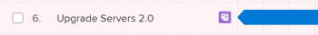
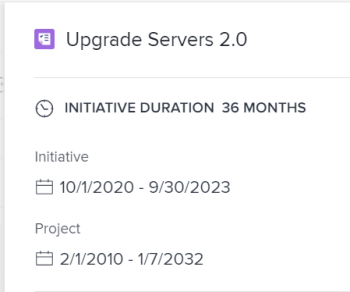

# Import projects to plans in the [!DNL Scenario Planner]

You can import existing projects into a plan. The imported projects are converted to initiatives and you can manage them within the plan as you would manage a new initiative. The original project remains linked to the new initiative.

<!--

(NOTE: add information about what happens when you import projects and where the info from projects show up;

- the hours/ FTE come from WorkPerDay

- if a task has a Duration of 0, the FTE should be 0 for that asignee but it should still come across) 

-->

## Access requirements

+++ Expand to view access requirements for the functionality in this article. 

<table style="table-layout:auto"> 
 <col> 
 <col> 
 <tbody> 
  <tr> 
   <td> 
[!DNL Adobe Workfront] plan*
 </td> 
   <td> 
Current: [!UICONTROL Business] or higher

   
New: Ultimate 

   </td> 
  </tr> 
  <tr> 
   <td> 
[!DNL Adobe Workfront] license*
 </td> 
   <td> 
New: Light or higher
 
   
Current: [!UICONTROL Review] or higher
 </td> 
  </tr> 
  <tr> 
   <td>Product* </td> 
   <td> 
   
For the current Workfront plans: 

   
You must purchase an additional license for the [!DNL Adobe Workfront Scenario Planner] to access functionality described in this article.
 
For information about access and permissions for the [!DNL Workfront Scenario Planner], see <a href="../scenario-planner/access-needed-to-use-sp.md" class="MCXref xref">Access needed to use the [!DNL Scenario Planner]</a>. 
 </td> 
  </tr> 
  <tr data-mc-conditions=""> 
   <td>Access level </td> 
   <td> 
[!UICONTROL Edit] access to the [!DNL Scenario Planner]
 </td> 
  </tr> 
  <tr data-mc-conditions=""> 
   <td> 
Object permissions 
 </td> 
   <td> 
[!UICONTROL Manage] permissions to a plan
 
For information on requesting additional access to a plan, see <a href="../scenario-planner/request-access-to-plan.md" class="MCXref xref">Request access to a plan in the [!DNL Scenario Planner]</a>.
 </td> 
  </tr> 
 </tbody> 
</table>

*For information, see [Access requirements to Workfront documentation](/help/quicksilver/administration-and-setup/add-users/access-levels-and-object-permissions/access-level-requirements-in-documentation.md). 

+++

## Considerations about importing projects into plans as new initiatives

* You must create projects before you can import them into a plan as new initiatives.

  <!--
  
(NOTE: no caveats for project statuses yet, mentioned in the import steps as a tip) 

  -->

* You must have at least [!UICONTROL View] permissions to the projects to be able to import them into a plan as new initiative. 
* You can import the same project into multiple plans. 
* The projects you want to import must have dates included in the time frame of your plan. You cannot import projects with a [!UICONTROL Planned Completion Date] earlier than the start of the plan or a [!UICONTROL Planned Start Date] later than the end of the plan. 
* You cannot import more than 100 projects at a time. 
* Some project information is also imported into the plan and becomes initiative information. For information about what project information is imported into the plan and becomes initiative information, see the [Project information imported into the plan](#project-information-imported-into-the-plan) section in this article. 
* Changes that occur on the linked projects do not affect the initiatives on the plan. 
* Changes that occur on the initiatives on the plan do not automatically affect the linked projects Initiative changes affect the linked projects only when you publish the initiative from the plan. For information about how publishing initiatives affects the linked projects, see [Update or create projects by publishing initiatives in the [!DNL Scenario Planner]](../scenario-planner/publish-scenarios-update-projects.md). 
* Deleting an initiative that has been created by importing a project does not delete the project. 
* Deleting a project linked to an initiative does not delete the initiative.

## Project information imported into the plan {#project-information-imported-into-the-plan}

When you import a project into a plan some project information is also imported into the plan and it becomes initiative information. The following table shows what project information becomes initiative information when you import a project into a plan:

<!--

(NOTE: add what happens if you import a 5 year project to a 1 year plan - how does this display?) 

-->

<table style="table-layout:auto"> 
 <col> 
 <col> 
 <tbody> 
  <tr> 
   <td>Project information</td> 
   <td>Initiative information </td> 
  </tr> 
  <tr> 
   <td>Project Name</td> 
   <td>Initiative name</td> 
  </tr> 
  <tr> 
   <td>Project Planned Dates</td> 
   <td> 
Initiative start and end months.
 
If a project starts or ends in the middle of a month, the imported dates are extended to cover a full month in the plan. For example, if the Project Planned Dates are March 20 - May 5, 2020, then the dates of the imported initiative are March - May, 2020.
 
If the Planned Start or Completion Date is beyond the duration of the plan, there is a visual indication that the imported initiative starts before or ends after the plan. 
 </td> 
  </tr> 
  <tr> 
   <td>Job roles assigned to tasks and issues</td> 
   <td> 
Initiative Job Roles. 
 
Note:   
If a user changes roles during the life of the project, the roles that are imported depend on the status of the assignment when you import the project. The following scenarios exist:
 
     <ul> 
      <li> 
If a user assigned to a task or an issue changed their role after they marked their assignment as [!UICONTROL Done], [!DNL Workfront] imports to the initiative the role the user fulfilled before they marked the assignment as [!UICONTROL Done].
 </li> 
      <li> 
If a user assigned to a task or issue changed the role during the life of the project but their assignment on the task or issue is not marked as [!UICONTROL Done] when you import the project, [!DNL Workfront] imports only the current role of the assigned user. 
 </li> 
     </ul> 
For information about the status of an assignment, see "Assignment Status" in <a href="../workfront-basics/navigate-workfront/workfront-navigation/workfront-terminology-glossary.md" class="MCXref xref">Glossary of Adobe [!DNL Workfront] terminology</a>. 
 
 </td> 
  </tr> 
  <tr> 
   <td>Project [!UICONTROL Planned Hours] associated with job roles assigned to tasks or issues</td> 
   <td> 
Depending on whether the plan is set up to use FTEs or hours, the [!UICONTROL Planned Hours] from the tasks on the project become either [!UICONTROL Required FTEs] or [!UICONTROL Required hours] on the plan. 
 
For information about setting up a plan to use FTEs or hours, see <a href="../scenario-planner/create-and-edit-plans.md" class="MCXref xref">Create and edit plans in the [!DNL Scenario Planner]</a>. 
 
Consider the following:
 
    <ul> 
     <li> 
[!DNL Workfront] uses the job roles assigned to tasks and issues or the job roles that the users assigned to tasks or issues are associated with on the project and transfers them to the new initiative as Required Job Roles. 
 </li> 
     <li> 
When the plan is set up to use FTEs, the Planned Hours associated with the job roles on the tasks and issues of the project are first converted to FTE. This FTE is then assigned to the initiative's job role. Planned Hours are equally distributed in [!DNL Workfront]. If a task or an issue spans multiple months, the amount of Planned Hours for each month in the duration of the initiative is converted in monthly FTE and transferred to each month of the initiative.
 
Example: </b>"><b>Example: </b>For example, if a task is assigned to a job role for 80 Planned Hours in September, then the imported job role displays 0.5 FTE for the initiative in September. 
 </li> 
     <li> 
[!DNL Workfront] calculates the FTE of the Required Job roles associated with the initiative using the following formula:
 
<code>Required Job Role FTE (initiative) = Job Role assignment Planned Hours (</code><code>from tasks and issues on the project)/ 160</code> 
 
Tip: The [!DNL Scenario Planner] assumes that there are 160 working hours in a month.
 
For example, if a project has a Duration of 1200 minutes and a job role on the project is associated with 600 minutes of Planned Hours, their FTE is 0.5. When importing the project, the Required Job Role FTE on the newly created initiative is 0.5 for each month of the initiative. 
 </li> 
     <li>When a job role is assigned to a task on the project with zero Planned Hours, the Required FTE for the job role of the initiative is zero by default. <!--
       <MadCap:conditionalText data-mc-conditions="QuicksilverOrClassic.Draft mode">
         (NOTE: this used to be 1, not zero in Production) 
       </MadCap:conditionalText>
      --></li> 
     <li>When a job role is assigned to a task on the project with a zero [!UICONTROL Duration], the Required FTE or hours for the job role of the initiative is zero by default, even if the task has Planned Hours. </li> 
    </ul> </td> 
  </tr> 
 </tbody> 
</table>

## Import projects into a plan

>[!IMPORTANT]
>
>After importing projects into a plan, they become initiatives on the plan. Although the two items are linked, they exist as independent entities and do not automatically affect each other when they are updated. 
>
>The following occur:
>
>* Changes to the project never affect the initiative after you import the project into the plan.These changes include changes to the job role allocations. 
>
>  <!--
>  
(NOTE: this might change if projects will ever affect initiatives automatically) 
>
>  -->
>
>* Changes to the initiative affect the information in the [!DNL Scenario Planner] area on the project only when you publish the initiative to the corresponding project. Otherwise, they do not affect the [!UICONTROL Planned Hours] information for the tasks and issues of the project. 
>
>  For information about how publishing initiatives affects the linked projects, see  [Update or create projects by publishing initiatives in the Scenario Planner](../scenario-planner/publish-scenarios-update-projects.md). 
>

{{step1-to-scenario-planner}}

1. Click the name of a plan where you want to import projects.
1. Click **[!UICONTROL New Initiative]**, then click **[!UICONTROL Import Projects]**.

   The [!UICONTROL Import Projects] box displays. Projects that have dates included in the time frame of your plan display in a list.

   

   >[!TIP]
   >
   >Projects in any status display in the list.

   <!--
   
(NOTE: the status of the projects in the import projects UI might change; right now it's ALL statuses)

   -->

1. (Optional) Click the **[!UICONTROL Filter icon]** and select an available filter from the list to reduce the amount of projects on your list. By default, the list of projects is filtered by the user's currently selected project filter in a list of projects. 

1. (Optional) Click the **[!UICONTROL Search icon]**  and add a keyword displayed on any field on the screen. The items containing the search word display in the list automatically and all items are hidden. 

1. (Conditional) Click the **[!UICONTROL X icon]** to remove the search and display all projects. 
1. Select up to 100 projects and click **[!UICONTROL Import]**.

   The projects are imported as new initiatives.

   Notice the following:

   * A project icon  displays to the right of the initiative name.
   * If the project timeline exceeds the duration of the plan, the bar of the initiative ends with a pointed margin to the left (when the Start Date is earlier than the plan's date) or to the right (when the End Date is later than the plan's date).

     

   * The number of months and job roles have been updated to match those of the project.

   >[!TIP]
   >
   >The costs associated with the job roles update at the initiative level and are not imported from the project.

1. Click the bar representing the new initiative to open the initiative details panel to the right.

   

   In the **[!UICONTROL Initiative Duration]** area review the following information: 

   <table style="table-layout:auto"> 
    <col> 
    <col> 
    <tbody> 
     <tr> 
      <td role="rowheader">[!UICONTROL Initiative Duration]</td> 
      <td>This is the duration of the initiative in months. </td> 
     </tr> 
     <tr> 
      <td role="rowheader">[!UICONTROL Initiative]</td> 
      <td>The Start and End dates of the initiative. </td> 
     </tr> 
     <tr> 
      <td role="rowheader">[!UICONTROL Project]</td> 
      <td> 
The [!UICONTROL Planned Start] and [!UICONTROL Completion dates] of the linked project.
 
Tip: If the [!UICONTROL Project] information is missing, the project was deleted.
 </td> 
     </tr> 
    </tbody> 
   </table>

1. Edit the name of the initiative. By default, it matches the name of the project. 
1. (Optional) Do one of the following:

   * Update job roles in the **[!UICONTROL Required Job Roles]** section
   * Update the **[!UICONTROL Fixed Costs]** in the **[!UICONTROL Costs]** section
   
   * Click **[!UICONTROL Update available job roles]** or **[!UICONTROL Update available budget]** to resolve conflicts between the new initiative and other initiatives on the plan.

1. (Conditional) Click **[!UICONTROL Apply]** to save changes to your initiative. 
1. Click **[!UICONTROL Save Plan]** to save the changes to your plan. 
1. (Optional) To update the changes you make to the initiative back to the project it was imported from, publish the project from the plan. For information about publishing plans, see [Update or create projects by publishing initiatives in the [!DNL Scenario Planner]](../scenario-planner/publish-scenarios-update-projects.md). 
1. (Optional) Click the project icon to access the linked project.

   
