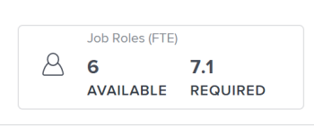

# Plans overview in the [!DNL Scenario Planner]

As a business manager, you can use the [!DNL Adobe Workfront Scenario Planner] to outline the strategy for your organization's near and long-term future by outlining its one-, three-, or five-year plans.

## Access requirements

For information about access requirements to access the Scenario Planner, see [Access needed to use the Scenario Planner](/help/quicksilver/scenario-planner/access-needed-to-use-sp.md). 

<!--To use the [!DNL Adobe Workfront Scenario Planner] you must have the following access:

<table style="table-layout:auto"> 
 <col> 
 <col> 
 <tbody> 
  <tr> 
   <td role="rowheader"> 
<a href="https://www.workfront.com/plans" target="_blank">[!DNL Adobe Workfront] plan</a>*
 </td> 
   <td>[!UICONTROL Business] or higher</td> 
  </tr> 
  <tr> 
   <td role="rowheader"> 
License type*
 </td> 
   <td> 
[!UICONTROL Review] or higher. For more information, see <a href="../administration-and-setup/add-users/access-levels-and-object-permissions/wf-licenses.md" class="MCXref xref">[!DNL Adobe Workfront] licenses overview</a>.
 </td> 
  </tr> 
  <tr> 
   <td role="rowheader">Product</td> 
   <td> 
You must purchase an additional license for the [!DNL Adobe Workfront Scenario Planner] to access functionality described in this article.
 
For information about obtaining the [!DNL Workfront Scenario Planner], see <a href="../scenario-planner/access-needed-to-use-sp.md" class="MCXref xref">Access needed to use the [!DNL Scenario Planner]</a>. 
 </td> 
  </tr> 
  <tr data-mc-conditions=""> 
   <td role="rowheader">Access level*</td> 
   <td> 
[!UICONTROL View] access or higher to the [!DNL Scenario Planner]
 
Note: If you still don't have access, ask your Workfront administrator if they set additional restrictions in your access level. For information on how a Workfront administrator can change your access level, see <a href="../administration-and-setup/add-users/configure-and-grant-access/create-modify-access-levels.md" class="MCXref xref">Create or modify custom access levels</a>.
 </td> 
  </tr> 
  <tr data-mc-conditions=""> 
   <td role="rowheader"> 
Object permissions
 </td> 
   <td> 
[!UICONTROL View] permissions or higher for a plan***************
      <MadCap:conditionalText data-mc-conditions="QuicksilverOrClassic.Draft mode">
        (NOTE: this might change if they have permissions for initiatives/ scenarios, etc) 
      </MadCap:conditionalText>
     ***************
 
For information on requesting additional access to a plan, see <a href="../scenario-planner/request-access-to-plan.md" class="MCXref xref">Request access to a plan in the [!DNL Scenario Planner]</a>.
 </td> 
  </tr> 
 </tbody> 
</table>
*To find out what plan, license type, or access you have, contact your [!DNL Workfront] administrator.
--> 

## Plans overview

<!--

(NOTE: add information about utilization percentage for job roles - per this story?? - https://hub.workfront.com/task/5eb0784900083e1f2cabb60d6e0d04d3/overview)

-->

You can identify each high-level organizational outcome and add it as a plan to the [!DNL Workfront Scenario Planner]. A plan is the largest work item in the [!DNL Scenario Planner]. To make it easier to achieve the plan, you can divide it in several initiatives, to indicate what steps individual organizational units need to take towards its completion.

 You can then connect initiatives with real projects to indicate how real work factors into actually completing the plan. This article provides general information about plans. For information about initiatives, see [Initiatives overview in the [!DNL Scenario Planner]](../scenario-planner/initiatives-overview.md).

You can define the labor and financial resources needed to complete the work identified on the plan. You can also view the labor and financial resources required by the initiatives in the plan in order for them to complete.

You can estimate and review the following information for each plan:

* Estimate the type and number of job roles that are available to execute the plan. 
* Estimate the budget that your company needs to complete the plan. 
* Review the utilization percentage of each job role against the required job roles associated with the initiatives. 
* Review the utilization percentage of your plan's budget against the costs associated with the initiatives.
* Review the Net Value of the plan at any given point in time.
* The plan-level information changes when you select different scenarios. Each scenario has different budget and people information.

For information about creating plans, see the article [Create and edit plans in the [!DNL Scenario Planner]](../scenario-planner/create-and-edit-plans.md).

For information about creating scenarios, see [Create and compare plan scenarios in the [!DNL Scenario Planner]](../scenario-planner/create-and-compare-scenarios-for-a-plan.md).

## Considerations about plans

Consider the following when creating plans:

* You can build plans for a team, a whole department, or even your entire company. Plans are large planning units that outline the strategy of a company at a high level. 
* The shortest plan can have a duration of 1 year. The longest plan can have a duration of 5 years. 
* You cannot do actual work on a plan. You can roughly estimate whether you have the resources and the budget required to start planning work. For example, if your company wants to expand and acquire a new office in a new location, the steps required to accomplish that can be outlined first in a plan at the upper-management level. 
* You can create multiple scenarios of the same plan. When your original plan has too many conflicting initiatives, you will want to create several scenarios where you can edit initiatives or budgets and costs to see what is the ideal situation for accomplishing the plan. Initiatives can conflict with one another when they try to use the same resources during the same time frame. You can then compare scenarios to see what makes the most sense and which one your company should adopt, before they start adding the actual work to accomplish it. For information about creating scenarios, see the article [Create and compare plan scenarios in the [!DNL Scenario Planner]](../scenario-planner/create-and-compare-scenarios-for-a-plan.md).
* You can add multiple initiatives to a plan to indicate how smaller planning units will contribute to the completion of the plan. For example, when you plan to expand into a specific market, you can have multiple initiatives at the department level that ultimately contribute to accomplishing the expansion at all levels of the organization. For information about creating initiatives, see the article [Create and edit initiatives in the [!DNL Scenario Planner]](../scenario-planner/create-and-edit-initiatives.md). 
* When you create a plan you are the only person who can view it. You must the plan with other users and they can access it if they have at least View access to [!DNL Scenario Planner] in their access level.

## Job role information for plans

You can review job role general information for plans that indicates the amount of job roles available for the plan, as well as the amount of job roles required for the initiatives to complete. You can view this information in the [!UICONTROL Job Roles] box in the plan's header.

You can view the following in the job role box:

| Information|Description  |
|---|---|
| FTE/ Hours indicator |The ([!UICONTROL FTE]) or ([!UICONTROL Hours]) indicator next to the "[!UICONTROL Job Role]" title indicates whether the plan was set up to use FTEs or Hours when it was created. The plan, all the scenarios, and initiatives use this unit.  |
| [!UICONTROL Available] |The number of job role FTEs or hours that are available for the current scenario.  |
| Required |The number of job role FTEs or hours that are required by all the initiatives in the current scenario so that they can be completed.  |

For information about accessing a plan and viewing detailed information about job roles, see [Create and edit plans in the [!DNL Scenario Planner]](../scenario-planner/create-and-edit-plans.md).

## Financial information for plans

You can review financial information about a plan, specifically its planned budget, how that budget is utilized and what the Net Value of the plan is. The Net Value of a plan is based on the Net Value of its initiatives. You can view this information in the [!UICONTROL Financial] and [!UICONTROL Summary] boxes in the plan's header.

You can view the following in the [!UICONTROL Financial] and [!UICONTROL Summary] boxes on the plan: 

<table style="table-layout:auto"> 
 <col> 
 <col> 
 <tbody> 
  <tr> 
   <td role="rowheader"> 
[!UICONTROL Budget] 
 
 
 </td> 
   <td>This is the monetary amount that your company decides that is available for executing the plan. Workfront distributes the budget evenly for each month within the duration of the plan. Budgets are typically set for a year, but it could also be set for a 3 or 5 year period. The currency in the parentheses to the left of the Financial box title indicates the currency of your system. </td> 
  </tr> 
  <tr> 
   <td role="rowheader">[!UICONTROL Costs]</td> 
   <td> 
This is the total amount of costs that come from all initiatives on the plan. Workfront calculates the plan's Costs using the following formula:
 
<code>Plan Costs = SUM(Initiative Costs)</code> 
 
For information about how Initiative Costs are calculated, see <a href="../scenario-planner/create-and-edit-initiatives.md" class="MCXref xref">Create and edit initiatives in the [!DNL Scenario Planner]</a>. 
 </td> 
  </tr> 
  <tr> 
   <td role="rowheader">UTIL (Budget utilization percentage)</td> 
   <td> 
This is a calculated percentage between the costs associated with initiatives and the budget defined for the plan. 
 
[!DNL Workfront] calculates the budget utilization percentage for a plan using the following formula: 
 
<code>Utilization percentage = (Plan Costs* 100))/ Plan Budget</code> 
 
Costs are calculated using the following formula:
 
<code>Plan Costs = SUM(Initiatives People Costs, Initiatives Fixed Costs)</code> 
 
Tip: The Utilization percentage is rounded and has one decimal. 
 </td> 
  </tr> 
  <tr> 
   <td role="rowheader"> 
[!UICONTROL Net Value] area in the [!UICONTROL Summary] box
 
 
 </td> 
   <td> 
This is a calculation of all Net Values of all initiatives in the plan. 
 
Workfront calculates the Net Value for the plan using the following formula: 
 
<code>Plan Net Value = SUM(Initiative Planned Benefit - People Costs)</code> 
 
Or
 
<code>Plan Net Value = SUM(Initiative Net Value)</code> 
 
For information about the Initiatives Net Values, see the article <a href="../scenario-planner/initiatives-overview.md" class="MCXref xref">Initiatives overview in the [!DNL Scenario Planner]</a>.
 </td> 
  </tr> 
 </tbody> 
</table>

For information about accessing a plan and viewing detailed financial information about it, see [Create and edit plans in the [!DNL Scenario Planner]](../scenario-planner/create-and-edit-plans.md).

 
