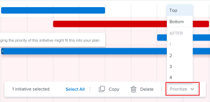

# Update initiative priorities in the [!DNL Scenario Planner]

Prioritizing initiatives is important because initiatives receive job roles and budget resources from the plan in the order they are listed on the plan.

You can prioritize initiatives on a plan that you created or on a plan that someone shared with you.

For information about creating plans, see [Create and edit plans in the [!DNL Scenario Planner]](../scenario-planner/create-and-edit-plans.md).

For information about creating initiatives, see [Create and edit initiatives in the [!DNL Scenario Planner]](../scenario-planner/create-and-edit-initiatives.md).

## Access requirements

+++ Expand to view access requirements for the functionality in this article. 

<table style="table-layout:auto"> 
 <col> 
 <col> 
 <tbody> 
  <tr> 
   <td> 
[!DNL Adobe Workfront] plan*
 </td> 
   <td> 
Current: [!UICONTROL Business] or higher

   
New: Ultimate 

   </td> 
  </tr> 
  <tr> 
   <td> 
[!DNL Adobe Workfront] license*
 </td> 
   <td> 
New: Light or higher
 
   
Current: [!UICONTROL Review] or higher
 </td> 
  </tr> 
  <tr> 
   <td>Product* </td> 
   <td> 
   
For the current Workfront plans: 

   
You must purchase an additional license for the [!DNL Adobe Workfront Scenario Planner] to access functionality described in this article.
 
For information about access and permissions for the [!DNL Workfront Scenario Planner], see <a href="../scenario-planner/access-needed-to-use-sp.md" class="MCXref xref">Access needed to use the [!DNL Scenario Planner]</a>. 
 </td> 
  </tr> 
  <tr data-mc-conditions=""> 
   <td>Access level </td> 
   <td> 
[!UICONTROL Edit] access to the [!DNL Scenario Planner]
 </td> 
  </tr> 
  <tr data-mc-conditions=""> 
   <td> 
Object permissions 
 </td> 
   <td> 
[!UICONTROL Manage] permissions to a plan
 
For information on requesting additional access to a plan, see <a href="../scenario-planner/request-access-to-plan.md" class="MCXref xref">Request access to a plan in the [!DNL Scenario Planner]</a>.
 </td> 
  </tr> 
 </tbody> 
</table>

*For information, see [Access requirements to Workfront documentation](/help/quicksilver/administration-and-setup/add-users/access-levels-and-object-permissions/access-level-requirements-in-documentation.md). 

+++

## Update initiative priorities

When you change the priority of initiatives, you modify their listing order on the plan.

We recommend that you place more urgent initiatives at the top of a plan and the more fluid ones - that could be done any time and only if resources are available - at the bottom of the plan.

>[!NOTE]
>
>[!DNL Workfront] allocates plan resources to initiatives in the order they are listed on the plan. 
>
>For example, if the plan has 3 available Engineers and Initiative 1 and Initiative 2 each require 2 Engineers to complete and they are both scheduled for the same time frame, Workfront associates 2 Engineers with Initiative 1 and one remaining available Engineer with Initiative 2. In this case Initiative 2 shows as having a conflict, because it is missing one Engineer. Sometimes, changing the priority of your initiatives is the only way to avoid conflicts on a plan.

To update initiative priority:

{{step1-to-scenario-planner}}

   A list of plans displays.

1. Click the name of a plan to open it, then locate the initiatives you want to prioritize.
1. Click the box to the left of one or more of the initiatives' name and do one of the following:

   * Click the handle to the left of one of the selected initiatives' names, then drag it up or down in the list to change the initiative's priority.

     Workfront displays the number of selected initiatives.

     

   * Click the **[!UICONTROL Prioritize]** box at the bottom of the plan, then choose from the following options:

      * **[!UICONTROL Top]**: Moves the selected initiatives to the top of the initiative list. The selected initiatives are listed first on the plan.
      * **[!UICONTROL Bottom]**: Moves the selected initiatives to the bottom of the initiative list. The selected initiatives are listed last on the plan.
      * **[!UICONTROL Select a number]**: Moves the selected initiatives after the initiative you indicate here.

        

     [!DNL Workfront] immediately places the selected initiatives where you indicate and the numbers of all initiatives update accordingly.

1. Click **[!UICONTROL Save Plan]** to save your changes.
