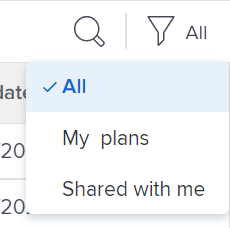
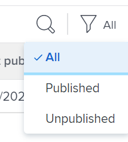
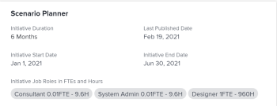

# Update or create projects by publishing initiatives in the [!DNL Scenario Planner]

Publishing a scenario from the [!DNL Adobe Workfront Scenario Planner] accomplishes the following:

* Creates projects from the initiatives on the scenario and links them together.
* Updates projects already linked to initiatives on the scenario with information from the linked initiative. Projects can also be linked to initiatives when you import them in to a plan. For information, see [Import projects to plans in the [!DNL Scenario Planner]](../scenario-planner/import-projects-to-plans.md)

## Access requirements

+++ Expand to view access requirements for the functionality in this article. 

<table style="table-layout:auto"> 
 <col> 
 <col> 
 <tbody> 
  <tr> 
   <td> 
[!DNL Adobe Workfront] plan*
 </td> 
   <td> 
Current: [!UICONTROL Business] or higher

   
New: Ultimate 

   </td> 
  </tr> 
  <tr> 
   <td> 
[!DNL Adobe Workfront] license*
 </td> 
   <td> 
New: Light or higher
 
   
Current: [!UICONTROL Review] or higher
 </td> 
  </tr> 
  <tr> 
   <td>Product* </td> 
   <td> 
   
For the current Workfront plans: 

   
You must purchase an additional license for the [!DNL Adobe Workfront Scenario Planner] to access functionality described in this article.
 
For information about access and permissions for the [!DNL Workfront Scenario Planner], see <a href="../scenario-planner/access-needed-to-use-sp.md" class="MCXref xref">Access needed to use the [!DNL Scenario Planner]</a>. 
 </td> 
  </tr> 
  <tr data-mc-conditions=""> 
   <td>Access level </td> 
   <td> 
[!UICONTROL Edit] access for the [!DNL Scenario Planner] and [!UICONTROL Projects]
 </td> 
  </tr> 
  <tr data-mc-conditions=""> 
   <td> 
Object permissions 
 </td> 
   <td> <ul> 
     <li>[!UICONTROL Manage] permissions for the plan </li> 
     <li>[!UICONTROL Manage] permissions for published projects</li> 
    </ul> 
For information on requesting additional access to a plan, see <a href="../scenario-planner/request-access-to-plan.md" class="MCXref xref">Request access to a plan in the [!DNL Scenario Planner]</a>.
 </td> 
  </tr> 
 </tbody> 
</table>

*For information, see [Access requirements to Workfront documentation](/help/quicksilver/administration-and-setup/add-users/access-levels-and-object-permissions/access-level-requirements-in-documentation.md). 

+++

## Prerequisites

Before you begin:

* You must create and save a plan before you can publish initiatives from it.
* The Allow users to create projects without using a template setting must be enabled in your Project Preferences area of the Setup. For information, see [Configure system-wide project preferences](/help/quicksilver/administration-and-setup/set-up-workfront/configure-system-defaults/set-project-preferences.md).

## Considerations about publishing initiatives to projects

* You can publish only one scenario from a plan. 
* One initiative can be linked to only one project.
* One project can be linked to more than one initiative when the initiatives belong to different plans.

  >[!TIP]
  >
  >When a project exists on multiple plans and you publish information to the project from all plans, the latest publish overwrites the existing [!DNL Scenario Planner] information on the project.

* If initiatives were created on the plan by importing projects to the plan, publishing the initiative also updates the linked projects with initiative information.

  >[!TIP]
  >
  >You can import the same project into multiple plans. Publishing might overwrite initiative information on a project that is linked to multiple initiatives.

  For information about creating initiatives by importing projects, see [Import projects to plans in the [!DNL Scenario Planner]](../scenario-planner/import-projects-to-plans.md). 

* Any changes made to the project do not transfer to the linked initiative.

 

## Publish initiatives

>[!IMPORTANT]
>
>If you make any changes to initiatives on the plan, including resolve conflicts, you must republish the initiative in order for the new information to be visible on the project. This information displays on the projects linked to initiatives only when you publish the corresponding the initiative. For information about resolving conflicts between initiatives, see [Resolve initiative conflicts in the [!DNL Scenario Planner]](../scenario-planner/resolve-conflicts-in-sp.md)

{{step1-to-scenario-planner}}

1. (Optional and conditional) If you want to publish from an existing plan, click the **[!UICONTROL Filter]** icon  in the upper-right corner of the plan and select one of the following options:

   <table style="table-layout:auto"> 
    <col> 
    <col> 
    <tbody> 
     <tr> 
      <td role="rowheader">[!UICONTROL All]</td> 
      <td>Displays all plans that you own or are shared with you. This is the default. </td> 
     </tr> 
     <tr> 
      <td role="rowheader">[!UICONTROL My plans]</td> 
      <td>Displays plans that you created.</td> 
     </tr> 
     <tr> 
      <td role="rowheader">[!UICONTROL Shared with me]</td> 
      <td> 
Displays plans you did not create but are shared with you.
 
Important: You must have [!UICONTROL Manage] permissions to plans shared with you to be able to publish them. 
 </td> 
     </tr> 
    </tbody> 
   </table>

   

1. (Optional) Click the **[!UICONTROL Search]** icon  and start typing the name of a plan to quickly find it in the list.
1. (Conditional) To publish from a new plan, create a plan.

   For information about creating plans, see [Create and edit plans in the [!DNL Scenario Planner]](../scenario-planner/create-and-edit-plans.md) . 

1. (Optional) Click the name of an existing plan and create new scenarios for the plan.

   For information about creating scenarios for a plan, see [Create and compare plan scenarios in the [!DNL Scenario Planner]](../scenario-planner/create-and-compare-scenarios-for-a-plan.md). 

1. (Optional) Update the initiatives of an existing or a new plan or create new ones.

   For information about creating initiatives, see [Create and edit initiatives in the [!DNL Scenario Planner]](../scenario-planner/create-and-edit-initiatives.md).

1. Click **[!UICONTROL Save plan]**. 
1. Select the scenario you want to publish from the **[!UICONTROL Initial scenario]** drop-down menu, then click **[!UICONTROL Go to Publish]**  in the upper-right corner.

   Or

   Click **[!UICONTROL Compare scenarios]**, hover over the scenario card that you want to publish from, then click **[!UICONTROL Go to Publish]** .

   The [!UICONTROL Publish initiatives] page displays, showing a list of all initiatives in the scenario. If any of the initiatives was previously published, the project icon  displays after their name and the **[!UICONTROL Last published]** date is populated in the list.

   >[!TIP]
   >
   >Initiatives that have been created by importing projects also display the project icon  to the right of their name

   

1. (Optional and conditional) If you want to publish from an existing plan, click the **[!UICONTROL Filter]** icon  in the upper-right corner of the plan and select one of the following options:

   <table style="table-layout:auto"> 
    <col> 
    <col> 
    <tbody> 
     <tr> 
      <td role="rowheader">[!UICONTROL All]</td> 
      <td>Displays all initiatives of the selected scenario. </td> 
     </tr> 
     <tr> 
      <td role="rowheader">[!UICONTROL Published]</td> 
      <td>Displays initiatives that you or another user published before. </td> 
     </tr> 
     <tr> 
      <td role="rowheader">[!UICONTROL Unpublished]</td> 
      <td> 
Displays unpublished initiatives. 
 </td> 
     </tr> 
    </tbody> 
   </table>

   

1. (Optional) Click the **[!UICONTROL Search]** icon  and start typing the name of an initiative to quickly find it in the list.
1. Select one or multiple initiatives to publish and create or update projects from them, then click **[!UICONTROL Publish initiatives]**.

   This creates a new project from each selected initiatives or updates the existing connected projects, if the published initiatives were already linked to a project.

   >[!TIP]
   >
   >New projects have the same name as the published initiatives.

1. (Conditional) Do one of the following:

   * If you published one initiative, click **[!UICONTROL See associated project]** to open the project created or updated from the initiative. 
   * If you published more than one initiative, click **[!UICONTROL See associated projects]** to open a list of projects published from initiatives. [!DNL Workfront] applies the [!DNL Scenario Planner] Projects filter to the list of projects by default. The projects published most recently display at the top of the list.

     

1. Go to the following areas to view initiative information on the project:

   * **The [!UICONTROL Updates] section**: An update publishes to indicate that the project was created or updated from the initiative. The update contains the name of the initiative that created or updated the project and the linked name of the plan that contains the initiative. You can click the name of the plan in the update to open the plan in the [!DNL Scenario Planner].

     

   * **The [!UICONTROL Overview] area of the [!UICONTROL Project Details] section**: A new [!DNL Scenario Planner] section is created in this area that contains information from the linked initiative.

     

     The following initiative information is published in the [!DNL Scenario Planner] area of the [!UICONTROL Project Details] section:

     <table style="table-layout:auto"> 
      <col> 
      <col> 
      <tbody> 
       <tr> 
        <td role="rowheader">[!UICONTROL Initiative Duration] </td> 
        <td>The duration of the corresponding initiative when the project is linked to an initiative. This field is not editable. </td> 
       </tr> 
       <tr> 
        <td role="rowheader">[!UICONTROL Last Published Date] </td> 
        <td>The date when the project was last published from a corresponding initiative. </td> 
       </tr> 
       <tr> 
        <td role="rowheader">[!UICONTROL Initiative Start Date] </td> 
        <td>The first day of the start month of the initiative, when the project is linked to an initiative. </td> 
       </tr> 
       <tr> 
        <td role="rowheader">[!UICONTROL Initiative End Date] </td> 
        <td>The last day of the end month of the initiative, when the project is linked to an initiative.  </td> 
       </tr> 
       <tr> 
        <td role="rowheader">[!UICONTROL Initiative Job Roles in FTEs and Hours] </td> 
        <td> 
Information about the associated job roles and their time allocations for the initiative. This includes:
 
         <ul> 
          <li>Job Role name</li> 
          <li>Number of FTEs</li> 
          <li> 
Number of Hours for all FTEs
 
You can estimate the amount of job roles needed for your plan or initiative using hours or FTEs.
 
For more information, see <a href="../scenario-planner/create-and-edit-plans.md" class="MCXref xref">Create and edit plans in the Scenario Planner</a>. 
 </li> 
         </ul> 
      
<b>TIP</b> 
      
      If the number of job role is different for each month in the initiative, this field displays the maximum amount of roles needed for the initiative. For example, if you need 1 Consultant for January and 2 for February, the column displays 2FTE and the corresponding amount of hours for 2 FTEs for all months.
 </td> 
       </tr> 
      </tbody> 
     </table>

     >[!NOTE]
     >
     >All users with [!UICONTROL View] access to the project can see the [!DNL Scenario Planner] section in the [!UICONTROL Overview] area. You can control whether this area displays in the [!UICONTROL Details] section by using a layout template. If users do not have a layout template associated with them, this area displays by default. 
     >
     >   
     >   
     >   * For information about adding or removing areas in the [!UICONTROL Details] section using a layout template, see [Customize the [!UICONTROL Details] view using a layout template](../administration-and-setup/customize-workfront/use-layout-templates/customize-details-view-layout-template.md). 
     >   * For more information about viewing information in the [!UICONTROL Overview] area of the [!UICONTROL Project Details], see [[!UICONTROL Manage] information in the project [!UICONTROL Overview] area](../manage-work/projects/manage-projects/understand-project-overview-area.md).
     >   
     >

   * **The [!UICONTROL Role Allocation] panel in the [!UICONTROL Workload Balancer] or the task list of the project**: Information about role allocation on the initiative populates in this area, in addition to role allocations on the project.

     For more information, see [Overview of reconciling resource allocations between projects and initiatives](../scenario-planner/overview-reconcile-allocations-between-projects-initiatives.md).

     

     Any changes to the dates or resources of the project do not affect the corresponding initiative or any of the areas on the project that contain initiative information. 
   
   * **The [!UICONTROL Resource Budgeting] area of the [!UICONTROL Business Case] of the project**: A new option for managing project resources using [!DNL Scenario Planner] information is added in the [!UICONTROL Resource Budgeting] area of the [!UICONTROL Business Case] of the project.

     For more information, see [Budget resources in the [!UICONTROL Business Case] using the [!DNL Scenario Planner]](../manage-work/projects/define-a-business-case/budget-resources-in-business-case-use-scenario-planner.md).

     

1. (Optional) Review the following information in the [!DNL Scenario Planner] after you published a scenario:

   * The published scenario becomes the first scenario after you publish initiatives from it. 
   * You cannot publish from any other scenario after you have published a scenario at least once. 
   * The [!UICONTROL Go to Publish] option is removed from all other scenarios after at least one initiative has been published from a scenario. 
   * A green indicator displays next to the published initiatives' project icons in the plan.

     

   * A green "Published" indicator displays at the top of the scenario and on the scenario card and the Published field is populated on the scenario card indicating the number of initiatives in the scenario that have been published.

     

     >[!TIP]
     >
     >If all the projects published from the scenario's initiatives are deleted, the indication that the scenario has been published is removed. For information, see [Delete projects](../manage-work/projects/manage-projects/delete-projects.md).

1. (Optional) Update information on the initiative and repeat the process described above to republish the initiative and update initiative information on the linked project.

   For information about editing initiatives, see [Create and edit initiatives in the [!DNL Scenario Planner]](../scenario-planner/create-and-edit-initiatives.md).

 
