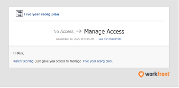

# Request access to a plan in the [!DNL Scenario Planner]

You can request access to a plan in the [!DNL Adobe Workfront Scenario Planner] when the link to the plan is shared with you.

## Access requirements

+++ Expand to view access requirements for the functionality in this article. 

<table style="table-layout:auto"> 
 <col> 
 <col> 
 <tbody> 
  <tr> 
   <td> 
 [!UICONTROL Adobe Workfront] plan*
 </td> 
   <td> 
Current: [!UICONTROL Business] or higher

   
New: Ultimate 

   </td> 
  </tr> 
  <tr> 
   <td> 
[!DNL Adobe Workfront] license*
 </td> 
   <td> 
New: Light or higher
 
   
Current: [!UICONTROL Review] or higher
 </td> 
  </tr> 
  <tr> 
   <td>Product* </td> 
   <td> 
   
For the current Workfront plans: 

   
You must purchase an additional license for the [!DNL Adobe Workfront Scenario Planner] to access functionality described in this article.
 
For information about access and permissions for the [!DNL Workfront Scenario Planner], see <a href="../scenario-planner/access-needed-to-use-sp.md" class="MCXref xref">Access needed to use the [!DNL Scenario Planner]</a>. 
 </td> 
  </tr> 
  <tr data-mc-conditions=""> 
   <td>Access level </td> 
   <td> 
[!UICONTROL View] access to the [!DNL Scenario Planner]
 </td> 
  </tr> 
   </tbody> 
</table>

*For information, see [Access requirements to Workfront documentation](/help/quicksilver/administration-and-setup/add-users/access-levels-and-object-permissions/access-level-requirements-in-documentation.md). 

+++

## Prerequisites

Before you can request access to a plan in the [!DNL Scenario Planner], you must have the following:

* A link to the plan.

>[!NOTE]
>
>If you do not have access level rights to the [!DNL Scenario Planner] and you try to access a plan from a link, you cannot request access to the plan. Instead, a screen displays informing you to contact the [!DNL Workfront] administrator.

## Request access for plans in the [!DNL Workfront Scenario Planner]

If you do not already have permissions to a plan and you navigate to it from a link shared with you, a screen displays to inform you that you do not have permissions to view the plan. You are prompted to request permissions from the plan creator.

>[!TIP]
>
>You can only request permissions from the owner or creator of a plan. You cannot request permissions from other users who also have access to the plan.

To request permissions:

1. Click a link to a plan.

   

1. In the **[!UICONTROL Request access to]** drop-down menu, indicate what level of permissions you wish to be granted. Select from the following:

   * [!UICONTROL View]
   * [!UICONTROL Manage]

   You cannot request a permission that is higher than your access level to the [!DNL Scenario Planner]. For example, you cannot request [!UICONTROL Manage] permissions if you have View access to the [!DNL Scenario Planner].

   For information about the different levels of permissions, see [Share a plan in the [!DNL Scenario Planner]](../scenario-planner/share-a-plan.md).

   For information on a Workfront administrator can manage access to the [!DNL Scenario Planner], see [Grant access to [!DNL Scenario Planner]](../administration-and-setup/add-users/configure-and-grant-access/grant-access-sp.md). 

1. (Optional) Enter a comment or request in the **[!UICONTROL Leave comment box]**, then click **[!UICONTROL Request access]**.

   The following happens: 

   * [!DNL Workfront] sends an email notification to the plan owner where they can grant the permissions requested.  
     

   * After the plan owner grants the permissions requested, you receive an email that the permissions have been granted if your [!DNL Workfront] administrator has the Object share to user notification enabled in your system and you enable the [!UICONTROL Someone shares an object with me] email notification in your profile.

     

   * You can also grant permissions to plans from the [!UICONTROL Home] area and from the [!DNL Workfront] mobile app.

   For information about enabling system notifications, see [Configure event notifications for everyone in the system](../administration-and-setup/manage-workfront/emails/configure-event-notifications-for-everyone-in-the-system.md).

   For information about enabling notifications in your profile, see [Notifications: Miscellaneous information](../workfront-basics/using-notifications/notifications-misc-information.md).
