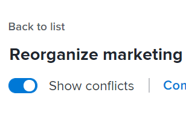
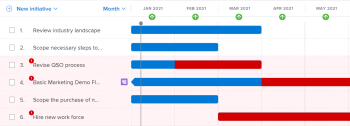
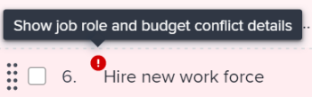
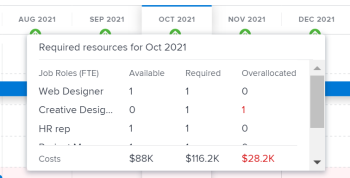
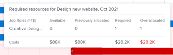
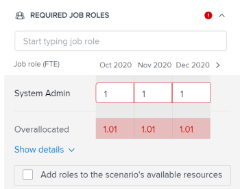
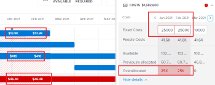

# Resolve initiative conflicts in the [!DNL Scenario Planner]

When initiatives conflict with one another they are competing for the same resources. The resources you have available for a scenario are not enough to cover all of the resources required by all initiatives in the scenario.

This can happen in any of the following cases:

* The number of job roles required for the initiative is larger than the number of roles budgeted for the plan. 
* The costs of the initiative is larger than the budget amount available for the plan.

## Access requirements

+++ Expand to view access requirements for the functionality in this article. 

<table style="table-layout:auto"> 
 <col> 
 <col> 
 <tbody> 
  <tr> 
   <td> 
[!DNL Adobe Workfront] plan*
 </td> 
   <td> 
Current: [!UICONTROL Business] or higher

   
New: Ultimate 

   </td> 
  </tr> 
  <tr> 
   <td> 
[!DNL Adobe Workfront] license*
 </td> 
   <td> 
New: Light or higher
 
   
Current: [!UICONTROL Review] or higher
 </td> 
  </tr> 
  <tr> 
   <td>Product* </td> 
   <td> 
   
For the current Workfront plans: 

   
You must purchase an additional license for the [!DNL Adobe Workfront Scenario Planner] to access functionality described in this article.
 
For information about access and permissions for the [!DNL Workfront Scenario Planner], see <a href="../scenario-planner/access-needed-to-use-sp.md" class="MCXref xref">Access needed to use the [!DNL Scenario Planner]</a>. 
 </td> 
  </tr> 
  <tr data-mc-conditions=""> 
   <td>Access level </td> 
   <td> 
[!UICONTROL Edit] access to the [!DNL Scenario Planner]
 </td> 
  </tr> 
  <tr data-mc-conditions=""> 
   <td> 
Object permissions 
 </td> 
   <td> 
[!UICONTROL Manage] permissions to a plan
 
For information on requesting additional access to a plan, see <a href="../scenario-planner/request-access-to-plan.md" class="MCXref xref">Request access to a plan in the [!DNL Scenario Planner]</a>.
 </td> 
  </tr> 
 </tbody> 
</table>

*For information, see [Access requirements to Workfront documentation](/help/quicksilver/administration-and-setup/add-users/access-levels-and-object-permissions/access-level-requirements-in-documentation.md). 

+++

## Resolve conflicts overview

* A conflict is also understood as an overallocation of the job roles or the budget of a scenario. 
* When [!DNL Workfront] detects a conflict, the bar corresponding to the conflicting month during the initiative's duration displays in red. This can happen in any of the following cases:

   * The number of job roles required monthly for an initiative is larger than the number of roles budgeted for the plan after all previous initiatives have used the resources budgeted for the plan.
   * The monthly costs of the initiative are larger than the budget available for the plan after all previous initiatives have used the plan's budget to cover their costs.

>[!TIP]
>
>By default, the [!DNL Scenario Planner] assumes that you have budgeted for 0 job roles and $0 or the equivalent of $0 in your system's currency for a scenario, unless you specified otherwise. The number of job roles indicates the number of FTEs (Full Time Equivalents) or hours budgeted for the job role. 
>
>For all calculations in the Scenario Planner, Workfront uses the following value: 1 FTE = 8 Hours. 
>
>For information about updating the available roles for a plan and a budget see [Create and edit plans in the [!DNL Scenario Planner]](../scenario-planner/create-and-edit-plans.md).

* You can resolve a conflict by doing one of the following:

   * Adding the missing required resources automatically from the initiatives on the scenario. This article describes how to resolve conflicts using this option. 
   * Adjusting the job role and budget resources for the scenario, by editing the plan. For more information, see [Create and edit plans in the [!DNL Scenario Planner]](../scenario-planner/create-and-edit-plans.md).

## Resolve conflicts between initiatives

1. Go to a plan for which you want to resolve conflicts.

   For information about creating plans, see [Create and edit plans in the [!DNL Scenario Planner]](../scenario-planner/create-and-edit-plans.md).

   For information about creating initiatives, see [Create and edit initiatives in the [!DNL Scenario Planner]](../scenario-planner/create-and-edit-initiatives.md). 

1. (Optional) From the **[!DNL Initial scenario]** drop-down menu, select the scenario you want to review.

   >[!TIP]
   >
   >A plan may have several scenarios. When looking at the plan's conflicts, [!DNL Workfront] is referring to the resources currently available on the selected scenario and those required on that scenario's initiatives. For information about scenarios, see [Create and compare plan scenarios in the [!DNL Scenario Planner]](../scenario-planner/create-and-compare-scenarios-for-a-plan.md).

1. Ensure that **[!UICONTROL Show conflicts]** is enabled. It is enabled by default.

   

   The first conflicting initiative displays the months that have conflicts in red and a warning icon displays next to the initiative name.

   The background of all initiatives starting with the first conflicting one displays in red on the plan's chart.

   When an initiative displays a conflict, it means that the number of job role for at least one specific role, the costs incurred, or both exceed the number of job roles or the budget defined for the plan for a specific month.

   

1. Do one of the following to understand more about the conflicts that might exist:

   * Hover over the warning icon next to the initiative name to understand whether you have a job role or a budget conflict.

     

     Depending on whether you overallocated job roles or overestimated costs for your initiative you might see one of the following options when hovering over the warning icon:

      * Show job role conflict details
      * Show budget conflict details
      * Show job role and budget details

   * When viewing the plan by month, hover over a month in the plan's timeline to view the required resources for that month and whether the conflicts for the month are people or cost-related.

     

     Review the following monthly information at the plan-level:

      * The number of available, required, and overallocated job roles for the month for all initiatives planned for that month
      * The available, required, and overallocated costs for the month for all the initiatives planned for that month

        >[!TIP]
        >
        >The [!UICONTROL Available] costs are the scenario's budget for that month.

   * Hover over an initiative's red bar for a month to display the additional information box about the conflict that occurs that month. 

     

     Review the following fields in the additional information box at the initiative's level:

     <table style="table-layout:auto"> 
      <col> 
      <col> 
      <tbody> 
       <tr> 
        <td role="rowheader">Month when the conflict occurs</td> 
        <td>Displays in the title of the additional information box.</td> 
       </tr> 
       <tr> 
        <td role="rowheader">The initiative name</td> 
        <td>Displays in the title of the additional information box.</td> 
       </tr> 
       <tr> 
        <td role="rowheader">[!UICONTROL Job Roles]</td> 
        <td> 
The job roles associated with this initiative that are overallocated for the selected month. The following columns display information for each job role that is required for the selected month and that conflicts with the number of job roles available for that month:
 
         <ul> 
          <li> 
<strong>[!UICONTROL Available]</strong>: The number of each job role available from the scenario for the selected month.
 </li> 
          <li> 
<strong>[!UICONTROL Required]</strong>: The number of each job role required for the initiative for the selected month.
 </li> 
          <li> 
<strong>[!UICONTROL Overallocated]:</strong> The difference between the number required on the initiative and the number available from the scenario. 
 </li> 
         </ul> 
Tip: Sometimes, the number of [!UICONTROL Available] roles matches or is higher than the number of [!UICONTROL Required] roles, but the [!DNL Scenario Planner] still shows an overallocation. This means that there are higher-ranking initiatives that already used the job roles available on the plan for the same month. 
 </td> 
       </tr> 
       <tr> 
        <td role="rowheader">Costs</td> 
        <td> 
The costs of the initiative for the month selected. The following columns display information for the costs needed and the budget available of the selected month:
 
         <ul> 
          <li> 
<strong>[!UICONTROL Available]</strong>: The budget available from the plan for the selected month .
 </li> 
          <li> 
<strong>[!UICONTROL Required]</strong>: The costs associated with this initiative for the selected month.
 </li> 
          <li> 
<strong>[!UICONTROL Overallocated]:</strong> The difference between the costs of the initiative and the budget available from the plan. 
 </li> 
         </ul> 
Tip: Sometimes, the [!UICONTROL Available] costs match or are higher than the [!UICONTROL Required] cost of the initiative for the selected month and the [!DNL Scenario Planner] still shows an overallocation of cost. This means that there are higher-ranking initiatives that already use the available budget on the plan for the same month. 
 </td> 
       </tr> 
      </tbody> 
     </table>

1. Do one of the following to open the initiative details panel and view more information about where the conflicts occur and to resolve them:

   * Click the warning icon next to the initiative's name.
   * Click the bar of an initiative.
   * Click the **[!UICONTROL More]** icon  to the right of the initiative's name, then click **[!UICONTROL Edit]**.

     The initiative details panel displays on the right.

     When you do not have enough people or budget available for your initiative, a red warning icon displays next to following sections: 
   
   * [!UICONTROL Required Job Roles]
   * [!UICONTROL Costs]

1. (Conditional) For initiatives that have job role conflicts, go to the **[!UICONTROL Required Job Roles]** section to view all job roles required for your initiative. Identify which job roles might be overallocated. Review the number of FTE or hours needed for each job role for each month of the initiative. The box with the FTE or hours number for months that have overallocations displays in a red outline.

   

1. (Optional) Click the right-pointing arrow next to the months in the initiative's timeline to view which additional months display job role conflicts.

   

1. (Optional) Click **[!UICONTROL Show details]** under the job role that displays a conflict to see where the conflicts appear and to highlight the conflicting months in the plan's chart area. Additional information displays for each job role.

   The following fields display for each job role:

   <table style="table-layout:auto"> 
    <col> 
    <col> 
    <tbody> 
     <tr> 
      <td role="rowheader">[!UICONTROL Available]</td> 
      <td> 
The number of job roles available from the plan for each month. 
 </td> 
     </tr> 
     <tr> 
      <td role="rowheader">[!UICONTROL Previously allocated]</td> 
      <td>The number of job roles already allocated from the plan's budget to higher-ranking initiatives for a specific month. </td> 
     </tr> 
     <tr> 
      <td role="rowheader">[!UICONTROL Overallocated]</td> 
      <td> 
The difference between the number of required job roles on the initiative and the number available from the plan after higher-ranking initiatives also used some of the roles. Workfront calculates the number of [!UICONTROL Overallocated] job roles using the following formula:
 
<code>Overallocated roles = (Roles Previously Allocated to higher initiatives + Required roles for current initiative) - Monthly available roles from the plan</code> 
 </td> 
     </tr> 
    </tbody> 
   </table>

   >[!TIP]
   >
   >On the plan's chart, the months where the job roles are allocated display the name and the number of roles needed for each initiative where they are needed. You must select the [!UICONTROL Month] view to see the name of the job roles

   

1. Do one of the following to resolve job role conflicts:

   * Manually adjust the number of job roles for each month of the initiative to a lower number.
   * Hover over the name of the job role and click the **[!UICONTROL delete] icon**  to remove the job role from the initiative. 
   * Select **[!UICONTROL Add roles to the scenario's available resources]**, then click **[!UICONTROL Apply]**.

     This adds the missing number of job role FTEs or hours to the scenario's [!UICONTROL Available] field.

     >[!NOTE]
     >
     >The roles you add to resolve the conflicts modify the [!UICONTROL Available] job roles for the selected scenario and not for all the scenarios in the plan.

     An upward-pointing green arrow  displays for the month in the timeline of the plan to indicate that more resources were added to the plan that month. You must select the [!UICONTROL Month] view to see this indicator. 
   
   * (Conditional) Close the details panel and give the initiative a higher priority to receive budget resources from the plan first, if possible. For information about updating initiative priority, see [Update initiative priorities in the Scenario Planner](../scenario-planner/prioritize-initiatives.md).

1. (Optional) Click **[!UICONTROL Hide details]** to close the additional details box, then click **[!UICONTROL Apply]** to save the changes you make to job roles. 

1. (Conditional) For initiatives that have costs conflicts, go to the **[!UICONTROL Costs]** section in the initiative details panel to review costs for every month of the initiative's duration. Identify which months might not have enough money in the plan's budget to cover the costs for the selected initiative. The box with the insufficient available budget displays in a red outline.
1. (Optional) Click the right-pointing arrow next to the months in the initiative's timeline to view additional months that have insufficient budget to cover the costs.

   

1. (Optional) Click **[!UICONTROL Show details]** under the cost information to see where the conflict appears and to highlight the conflicting months on the plan's chart. The following additional fields display for each type of cost: 

   <table style="table-layout:auto"> 
    <col> 
    <col> 
    <tbody> 
     <tr> 
      <td role="rowheader">[!UICONTROL Available]</td> 
      <td> 
The costs available from the plan's Budget for each month. 
 </td> 
     </tr> 
     <tr> 
      <td role="rowheader">[!UICONTROL Previously allocated]</td> 
      <td>The amount of money already allocated from the plan's budget to higher-ranking initiatives. </td> 
     </tr> 
     <tr> 
      <td role="rowheader">[!UICONTROL Overallocated]</td> 
      <td> 
The monthly difference between the costs needed for the initiative and the amount of money available from the plan's budget after higher-ranking initiatives also used some of the available budget. [!DNL Workfront] calculates the number of Overallocated costs using the following formula:
 
<code>Overallocated costs = (Costs Previously Allocated to higher initiatives + Required costs for the current initiative) - Monthly available budget from the plan</code> 
 
[!DNL Workfront] calculates the Required costs for the current initiative for each month using the following formula:
 
<code>Required initiative costs = Initiative Fixed Costs + Initiative People Costs</code> 
 </td> 
     </tr> 
    </tbody> 
   </table>

   >[!TIP]
   >
   >On the plan's chart, the months where the costs are insufficient display the name and the number of roles still needed for the initiative. You must select the Month view to view the cost amounts.

   

   >[!NOTE]
   >
   >If you disabled the [!UICONTROL Include people cost] setting for the plan's [!UICONTROL Budget] box when you created the plan, the [!UICONTROL People Costs] line does not display for any initiative in any scenario. In this case, Workfront does not take People Costs into calculations to determine cost conflicts. For information about creating a plan, see [Create and edit plans in the [!DNL Scenario Planner]](../scenario-planner/create-and-edit-plans.md).

1. Do one of the following to resolve costs conflicts:

   * Manually adjust the number of [!UICONTROL Fixed Costs] for each month of the initiative to a lower number.
   * In the **[!UICONTROL Required Job Roles]** section, manually adjust the number of job roles for the month with a People Costs budget, if possible. This reduces the number of People Costs.

     >[!TIP]
     >
     >You cannot manually adjust People Costs.

   * Select **[!UICONTROL Add amount to the scenario's budget]**, then click **[!UICONTROL Apply]**.

     This adds the insufficient amount to the scenario's budget for the months where it was missing which also updates the overall scenario budget.

     >[!NOTE]
     >
     >The amount you add to resolve the cost conflicts modify the Budget for the selected scenario and not for all the scenarios in the plan.

   * (Conditional) Close the details panel and give the initiative a higher priority to receive budget resources from the plan first, if possible. For information about updating initiative priority, see [Update initiative priorities in the [!DNL Scenario Planner]](../scenario-planner/prioritize-initiatives.md).

1. Click **[!UICONTROL Apply]** when you make any changes to the Costs section. 
1. Click **[!UICONTROL Save plan]** to save your changes.

 
