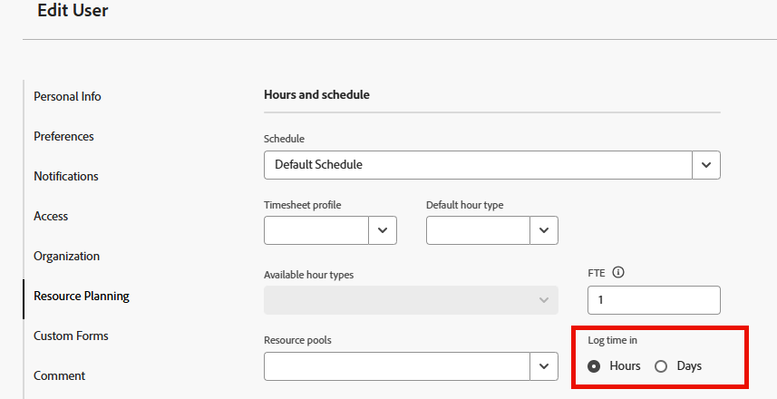

# Configure whether time is logged in hours or days

As a user with a Standard or Plan license, you can configure whether you log time in Adobe Workfront in hours or days. System administrators can configure this setting for individual users or for multiple users in their organization. By default, users log time in hours. For information about how to log time in Workfront, see [Log time](../../timesheets/create-and-manage-timesheets/log-time.md).

>[!NOTE]
>
>We recommend logging time in the same way, either hours or days, across the organization to ensure reporting accuracy.

## Access requirements

+++ Expand to view access requirements for the functionality in this article.

<table style="table-layout:auto">
 <col> 
 <col>
 <tbody> 
  <tr> 
   <td>Adobe Workfront package</td> 
   <td>
Any
</td> 
  </tr> 
  <tr> 
   <td>Adobe Workfront license</td> 
   <td>
   
Standard

   
Plan
</td>
  </tr> 
  <tr> 
   <td>Access level configurations</td> 
   <td>
Standard and Plan users can configure time for themselves. Only a Workfront administrator can configure time for other users.
 </td> 
  </tr> 
 </tbody> 
</table>

For information, see [Access requirements in Workfront documentation](/help/quicksilver/administration-and-setup/add-users/access-levels-and-object-permissions/access-level-requirements-in-documentation.md).

+++

1. Do either of the following, depending on your objective and your access level in the system:

   * **Standard or Plan user configuring time logging for yourself:** Click your profile picture in the top navigation area, then click **[!UICONTROL Workfront Profile]**. Then, click the **More** icon next to your name and select **Edit**.
   
   * **System administrator configuring time logging for others:** Begin editing one or more user accounts, as described in [Edit a user's profile](../../administration-and-setup/add-users/create-and-manage-users/edit-a-users-profile.md).

1. In the user profile dialog box, in the **Resource Planning** section, locate the **Log time in** option.

   

1. Select from the following options for logging time: 

   | Option |Description |
   |---|---|
   | **Hours** | Users specify hours when logging time in Workfront. |
   | **Days** | Users specify days when logging time in Workfront. |

1. (Conditional) If you selected to log time in days, in the **Equivalent Hours for Full Workday** field, type the number of hours that equal a full day. One day on a user's timesheet is the equivalent of the number of hours you enter here.

   Consider the following when configuring this setting:

   * This option is not available when configuring to log time in hours.
   * This option is used only for the purpose of logging time. This option is not related to the **Schedule** option that is also available when editing a user. The **Schedule** option is used when calculating timelines and in other areas of Workfront. (For more information about using the **Schedule** option, see [Create a schedule](../../administration-and-setup/set-up-workfront/configure-timesheets-schedules/create-schedules.md).)&nbsp;

1. Click **Save Changes**.
