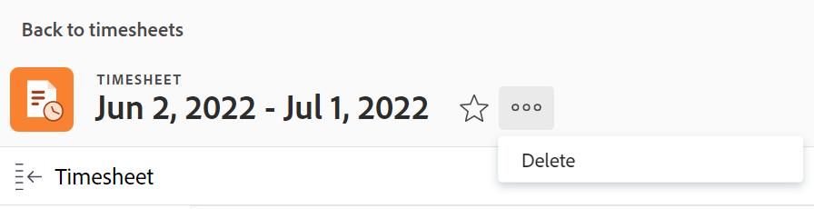

# Delete timesheets in Adobe Workfront

The changes you make to a timesheet profile are not effective right away for the currently existing timesheets, as explained in [Create, edit, and assign timesheet profiles](../../timesheets/create-and-manage-timesheets/create-timesheet-profiles.md). To make the changes visible on existing timesheets, you must&nbsp;delete the timesheets that have been generated and generate new ones. This applies only to timesheets that have been generated by associating timesheet profiles with users.

>[!NOTE]
>
>Timesheets that have been created manually cannot be recreated by regenerating timesheets, unless the users have been associated with a timesheet profile since the timesheet was created manually. Deleting a manually created timesheet can cause loss of data. For information about creating a single timesheets, see [Create a single-use timesheet](../../timesheets/create-and-manage-timesheets/create-tmshts.md).

Adobe Workfront administrators or group administrators can generate timesheets for everyone in the system. For more information about manually generating timesheets, see:

* [Manually generate timesheets](../../timesheets/create-and-manage-timesheets/manually-generate-timesheets.md)
* [Create and manage a group's timesheet profiles](../../administration-and-setup/manage-groups/work-with-group-objects/create-and-modify-a-groups-timesheet-profiles.md)

>[!IMPORTANT]
>
>* You cannot recover a deleted timesheet.
>* We recommend that you do not delete past timesheets because they are not generated automatically based on timesheet profiles. You can delete the current and future timesheets and generate them manually if you want the changes to your timesheet profiles to be immediately visible in the new timesheets.
>* When you delete timesheets, the hours logged against tasks, issues, and projects are not deleted. Only the General Hours are deleted with the timesheet. In a separate text editor, write down&nbsp;what General Hours are associated with the timesheet. After the timesheet is deleted, you can then log them in the new timesheet.
>

## Access requirements

+++ Expand to view access requirements for the functionality in this article.

<table style="table-layout:auto">
 <col> 
 <col>
 <tbody> 
  <tr> 
   <td>Adobe Workfront package</td> 
   <td>
Any
</td> 
  </tr> 
  <tr> 
   <td>Adobe Workfront license</td> 
   <td>
   
Standard

   
Plan
</td>
  </tr> 
  <tr> 
   <td>Access level configurations</td> 
   <td>
Administrative access to Timesheets
 </td> 
  </tr> 
 </tbody> 
</table>

For information, see [Access requirements in Workfront documentation](/help/quicksilver/administration-and-setup/add-users/access-levels-and-object-permissions/access-level-requirements-in-documentation.md).

+++

## Delete timesheets in a list

1. Click the **Main Menu** icon  in the upper-right corner of Adobe Workfront.

1. Click **Timesheets**. The **All** filter is selected by default and it displays all timesheets that you have access to view.

   

1. (Optional) Do one of the following to update the filter in the list of timesheets:

   * Select **My Timesheet Approvals** in the upper-right corner of the page to view only timesheets that you approve

     Or

     Select **My Timesheets** to view only your timesheets.

     This applies the My Timesheet Approvals or the My&nbsp;Timesheet filters to the list of timesheets.

     

   * Click the Filter icon  to apply a different filter, or create a new one. For information about creating or updating filters, see [Create or edit filters in Adobe Workfront](../../reports-and-dashboards/reports/reporting-elements/create-filters.md).

   >[!NOTE]
   >
   >The My Timesheet Approvals and My&nbsp;Timesheets options do not display at the top of the timesheet list or in the list of filters if your Workfront administrator or a group administrator removed the My&nbsp;Timesheet Approvals and the My&nbsp;Timesheets filters from either the List Controls in the Setup area or from your Layout Template.&nbsp;For more information see the following articles:
   >
   >   
   >   
   >   * [Customize Filters, Views, and Groupings using a layout template](../../administration-and-setup/customize-workfront/use-layout-templates/customize-fvg-list-controls-layout-template.md) 
   >   
   >

1. (Optional) Click the **View**  or **Grouping**  icons to apply a different view or grouping or to create a new one.

   For information about creating filters, views, or groupings, see the following articles:

   * [Create or edit filters in Adobe Workfront](../../reports-and-dashboards/reports/reporting-elements/create-filters.md) 
   * [Create or edit views in Adobe Workfront](../../reports-and-dashboards/reports/reporting-elements/create-edit-views.md) 
   * [Create groupings in Adobe Workfront](../../reports-and-dashboards/reports/reporting-elements/create-groupings.md)

1. Select one or several timesheets that you want to delete and click  the **Delete**   icon  at the top of the list of timesheets.

1. Click **Delete**.

   The selected timesheets are deleted and cannot be recovered.

   To generate new timesheets, ensure that users are associated with a timesheet profile and ask the Workfront administrator or a group administrator to generate new timesheets.

   For more information, see the following:

   * [Create, edit, and assign timesheet profiles](../../timesheets/create-and-manage-timesheets/create-timesheet-profiles.md) 
   * [Manually generate timesheets](../../timesheets/create-and-manage-timesheets/manually-generate-timesheets.md) 
   * [Create and manage a group's timesheet profiles](../../administration-and-setup/manage-groups/work-with-group-objects/create-and-modify-a-groups-timesheet-profiles.md)

## Delete a timesheet from the timesheet page

1. Click the [!UICONTROL **Main Menu**] icon  in the upper-right corner of Adobe Workfront.
1. Click the timesheet you want to delete to open it.
1. Click the [!UICONTROL **More**] icon  to the right of the timesheet name, then click **Delete**.

   
1. Click [!UICONTROL **Delete**] to confirm. 

   The timesheet is deleted and cannot be recovered.
