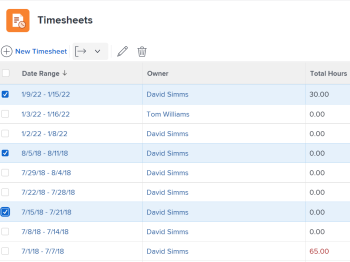

# Export a list of timesheets

<!--Audited: 8/2024-->

As a people manager or timesheet approver, you might need to download a list of timesheets to quickly view information about the timesheets of the people you are responsible for. You can do this by exporting a list of timesheets.

## Access requirements

+++ Expand to view access requirements for the functionality in this article.

You must have the following access to perform the steps in this article:

<table style="table-layout:auto"> 
 <col> 
 <col> 
 <tbody> 
  <tr> 
   <td role="rowheader">Adobe Workfront plan</td> 
   <td> 
Any
 </td> 
  </tr> 
  <tr> 
   <td role="rowheader">Adobe Workfront license</td> 
   <td> 
New: Light or higher 

   
Current: Review or higher 

  </tr> 
  <tr> 
   <td role="rowheader">Access level configurations</td> 
   <td> 
View or higher access to tasks and issues 
 </td> 
  </tr> 
  <tr> 
   <td role="rowheader">Object permissions</td> 
   <td> 
View or higher permissions to the timesheet
 </td> 
  </tr> 
 </tbody> 
</table>

For more detail about the information in this table, see [Access requirements in Workfront documentation](/help/quicksilver/administration-and-setup/add-users/access-levels-and-object-permissions/access-level-requirements-in-documentation.md).

+++

<!--Old permissions:

<table style="table-layout:auto"> 
 <col> 
 <col> 
 <tbody> 
  <tr> 
   <td role="rowheader">Adobe Workfront plan*</td> 
   <td> 
Any
 </td> 
  </tr> 
  <tr> 
   <td role="rowheader">Adobe Workfront license*</td> 
   <td> 
Review or higher
 </td> 
  </tr> 
  <tr> 
   <td role="rowheader">Access level configurations*</td> 
   <td> 
View access or higher to Tasks and Issues
 
If you still don't have access, ask your Workfront administrator if they set additional restrictions in your access level. For information on how a Workfront administrator can modify your access level, see <a href="../../administration-and-setup/add-users/configure-and-grant-access/create-modify-access-levels.md" class="MCXref xref">Create or modify custom access levels</a>.
 </td> 
  </tr> 
  <tr> 
   <td role="rowheader">Object permissions</td> 
   <td> 
View or higher permissions on the timesheets
 
For information on requesting additional access, see <a href="../../workfront-basics/grant-and-request-access-to-objects/request-access.md" class="MCXref xref">Request access to objects </a>.
 </td> 
  </tr> 
 </tbody> 
</table>

*To find out what plan or license type you have, contact your Workfront administrator.-->

## Export a list of timesheets

{{step1-to-timesheets}}
   
   The **Timesheets** area opens. 

   

1. (Optional) Click the **search** icon  and type a keyword and search for a speicific timesheet. For example, you can search for a timehsset time frame or owner name. 

1. (Optional) Do one of the following to update the filter in the list of timesheets:

   * Select **My Timesheet Approvals** in the upper-right corner of the page to view only timesheets that you approve

     Or

     Select **My Timesheets** to view only your timesheets.

     This applies the My Timesheet Approvals or the My&nbsp;Timesheet filters to the list of timesheets.

     

   * Click the Filter icon  to apply a different filter, or create a new one. For information about creating or updating filters, see [Create or edit filters in Adobe Workfront](../../reports-and-dashboards/reports/reporting-elements/create-filters.md).

   >[!NOTE]
   >
   >The My Timesheet Approvals and My&nbsp;Timesheets options do not display at the top of the timesheet list or in the list of filters if your Workfront administrator or a group administrator removed the My&nbsp;Timesheet Approvals and the My&nbsp;Timesheets filters from either the List Controls in the Setup area or from your Layout Template.&nbsp;For more information see the following articles:
   >
   >   
   >   
   >   * [Customize Filters, Views, and Groupings using a layout template](../../administration-and-setup/customize-workfront/use-layout-templates/customize-fvg-list-controls-layout-template.md) 
   >   
   >

1. (Optional) Click the **View**  or **Grouping**  icons to apply a different view or grouping or to create a new one.

   For information about creating filters, views, or groupings, see the following articles:

   * [Create or edit filters in Adobe Workfront](../../reports-and-dashboards/reports/reporting-elements/create-filters.md) 
   * [Create or edit views in Adobe Workfront](../../reports-and-dashboards/reports/reporting-elements/create-edit-views.md) 
   * [Create groupings in Adobe Workfront](../../reports-and-dashboards/reports/reporting-elements/create-groupings.md)

1. Select the timesheets that you want to export, then click the **Export**   icon.

   

1. Select the type of file that you want to export the list of timesheets to from the following options:

   * PDF Ladscape
   * PDF Portrait
   * PDF Other Sizes
   * Excel
   * Excel (xlsx)
   * Tab Delimited

   A list of timesheets is downloaded to your computer in the selected format and includes the following timesheet information:

   * Date Range
   * Owner name
   * Total Hours
   * Overtime amount
   * Approvers names
   * Status
