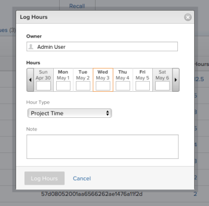

# Log time

You can log time for work items in Adobe Workfront to indicate the number of hours you spend working on them. You can also log time that is not related to work, like vacation, sick time, or time you spend in meetings. The time you log displays in your timesheet.

For more information about the type of hours you can log in Workfront, see [Manage hour types](../../administration-and-setup/set-up-workfront/configure-timesheets-schedules/hour-types.md).

## Access requirements

You must have the following access to perform the steps in this article and log Project Specific hours:

<table style="table-layout:auto"> 
 <col> 
 <col> 
 <tbody> 
  <tr> 
   <td role="rowheader">Adobe Workfront plan*</td> 
   <td> 
Any
 </td> 
  </tr> 
  <tr> 
   <td role="rowheader">Adobe Workfront license*</td> 
   <td> 
Review or higher
 </td> 
  </tr> 
  <tr> 
   <td role="rowheader">Access level configurations*</td> 
   <td> 
Edit access to the type of work item you log time for 
 
For example, you need Edit access to Issues, to log time for issues
 
If you still don't have access, ask your Workfront administrator if they set additional restrictions in your access level. For information on how a Workfront administrator can modify your access level, see <a href="../../administration-and-setup/add-users/configure-and-grant-access/create-modify-access-levels.md" class="MCXref xref">Create or modify custom access levels</a>.
 </td> 
  </tr> 
  <tr> 
   <td role="rowheader">Object permissions</td> 
   <td> 
Contribute or higher permissions on the work item you log time for that includes permissions to Log Hours
 
For information on requesting additional access, see <a href="../../workfront-basics/grant-and-request-access-to-objects/request-access.md" class="MCXref xref">Request access to objects </a>.
 </td> 
  </tr> 
 </tbody> 
</table>

*To find out what plan, license type, or access you have, contact your Workfront administrator.

## Considerations when logging time in Workfront

* You can log time for projects, tasks, or issues, or you can log time directly in your timesheet.

  For information about creating timesheets, see [Create a single-use timesheet](../../timesheets/create-and-manage-timesheets/create-tmshts.md). 

* All time logged through tools other than the timesheet appear in the timesheet for the corresponding time period.
* Tasks and issues on a project that is not current are not pre-populated into a timesheet.
* Time logged in the timesheet is immediately applied to the task, issue, or project.
* Timesheets include the total time for all logged dates. Weekends are always included, even when timeline calculations have been configured to exclude them (as described in [Configure system-wide project preferences](../../administration-and-setup/set-up-workfront/configure-system-defaults/set-project-preferences.md)).
* The maximum number of items displayed in a timesheet is 45. If there are more than 45 items whose dates match the timesheet time frame, only the most recently updated items display.
* Hour entries that are included in billed billing records are dimmed and cannot be edited in the timesheet. For more information, see [Create billing records](../../manage-work/projects/project-finances/create-billing-records.md). 

## Log time

You can log time in the following areas in Workfront:

* [Timesheet](#timesheet) 
* [Home](#home) 
* [Project, task, or issue](#project-task-or-issue) 
* [Summary panel](#summary-panel)
* [Mobile app](#mobile-app)

### Timesheet {#timesheet}

You can log general hours or project-specific hours on a timesheet.

>[!NOTE]
>
>Review users assigned to a Timesheet Profile can see the Timesheets tab and log general hours. However, they cannot log hours on any tasks or issues assigned to them that appear on the timesheet.

1. Click the [!UICONTROL **Main Menu**] icon  in the upper-right corner of Adobe Workfront.

1. Click [!UICONTROL **Timesheets**]. Your current timesheet displays by default. 
   

   The timesheet is pre-populated with items assigned to you during the timesheet's time frame. For information about how timesheets are prepopulated, see [Configure timesheet and hour preferences](../../administration-and-setup/set-up-workfront/configure-timesheets-schedules/timesheet-and-hour-preferences.md). If you do not see an item on the timesheet, you can add it. 

1. (Optional) To add a project, task, or issue to the timesheet, click the **Add item** drop-down menu in the upper-left corner of the timesheet, then click **Add Projects**, **Add Tasks**, or **Add Issues**. 

   A list of projects, tasks, or issues displays. 

1. (Optional) Click the search icon  to search for a specific item  using a keyword to add to the timesheet.

1. (Optional) Expand the filter, view, or grouping drop-down menus to apply or customize one and to view the item information that you want. 

1. Select an item in the list when it displays, then click **Add**. 

   The item is added to the timesheet and it is pinned. You must manually unpin it to remove it from the timesheet. For information about unpinning items to remove them from the timesheet, continue with Step 9. <!--(ensure this stays accurate)-->
   
   When you add tasks or issues to the timesheet, the project is also added. 

1. (Optional) Click the **full-screen** icon  to display the timesheet in full-screen mode, then click the **exit-full-screen**  icon to return to the timesheet. 

1. (Optional) Click the search icon  and start typing a keyword to find a project, task, or an issue on the timesheet. 

1. (Optional) You can remove an item (project, task, or issue) from the timesheet if you manually added the item (as described in Steps 3-6), and if you have not yet logged time against it by unpinning it. <!--ensure this stays accurate-->

   You cannot remove items that are included in the timesheet automatically according to the timesheet preferences in your Workfront system or group that are configured to pre-populate the timesheets (as described in [Configure timesheet and hour preferences](../../administration-and-setup/set-up-workfront/configure-timesheets-schedules/timesheet-and-hour-preferences.md). 

   To remove an item from the timesheet that was manually added:

   1. Ensure that no time is logged against the item.
   1. Click the pin icon  next to the item to unpin the item from the timesheet.

   The item is removed from the timesheet after you refresh the page.
  
1. (Conditional) If your Workfront administrator has enabled the **Assign job roles to hour entries manually** setting, select a job role from the drop-down menu. The role specified when you are assigned to the work item displays by default. If you are not assigned a role on the object, your Primary Role displays as the default. For more information on this setting, see the article [Configure timesheet and hour preferences](../../administration-and-setup/set-up-workfront/configure-timesheets-schedules/timesheet-and-hour-preferences.md).

   

1. Click the **delete** icon   next to the job role to remove it. Any time logged for the role is also removed. 

1. (Optional) Click the **+** icon, then select a new hour type from the drop-down menu in the [!UICONTROL Hour Type] column to log time for a different hour type.

   

   Hour types are available depending on what has been defined at the system, project, and user levels, as described in [Define hour types and availability for timesheets](define-hour-types-and-availability.md).

   The hour type cannot be changed after a timesheet is closed. 

1. Specify the amount of time you want to log on any given day in the timeline section of the timesheet, then click outside the hour box to save the hour entry. The hours are saved automatically. The row for which you log time is highlighted in light blue and the hour entry box is outlined in dark blue.

   

   You log time in either hours or days. This setting is configured by users with a Plan license or the system administrator, as described in [Configure whether time is logged in hours or days](../../timesheets/config-timesheet-prefs/config-time-logged-hrs-days.md).

1. (Optional) Specify the amount of overtime in the Overtime field in the timesheet's header. 

   >[!TIP]
   >
   >You cannot log a larger number of overtime hours than the current total hours on the timesheet. For example, if you logged 7 hours on the timesheet so far, you cannot log 8 hours of overtime.

1. (Optional) Click **Comment** to add a comment for your hour entry, then click **Done**.

   

1. (Optional) Click **Show comments** in the toolbar to display hour entry comments under the work item.

   

   >[!TIP]
   >
   >   All changes you make to the timesheet are saved automatically.

1. (Optional) Click the row of a task or issue, then click **Open Summary** in the upper-right corner of the timesheet to add an update or to update information on the task or issue. The Summary panel opens on the right. 

   

   Your update displays in the Updates area of the work item associated with the logged time.

   >[!TIP]
   >
   >You cannot comment on projects or General Time hour entries.

1. Click [!UICONTROL **Close Summary**] to close the Summary panel and return to the timesheet. 

1. (Optional) Click [!UICONTROL **Updates**] in the left panel, then add an update to the timesheet. For more information about Workfront updates, see [Update work](../../workfront-basics/updating-work-items-and-viewing-updates/update-work.md).

   

   * **Close**: Close the timesheet when you are done updating it. This option is only available when your timesheet is not associated with an approver.

   * **Submit for approval:** This option is available only if there is an approver on the timesheet. Save your changes and submit for approval. You can open the timesheet after closing it by clicking **Recall**, if an approval has not been granted yet. For more information, see [Submit a timesheet for approval](../../timesheets/create-and-manage-timesheets/submit-timesheet-for-approval.md).
      
   * **Reject**: This option displays when you are a timesheet approver and the timesheet has been submitted to you for approval. Clicking it changes the status of the timesheet to Rejected and the timesheet remains open. 

   * **Approve**: This option displays when you are a timesheet approver and the timesheet has been submitted to you for approval. Clicking it changes the status of the timesheet to Approved and closes the timesheet.

   >[!TIP]
   >
   >The Reject and Approve options also display on your timesheet when you are a system administrator and the timesheet is associated with an approver.

1. (Conditional) If you have either closed or submitted your timesheet for approval, click one of the following options:

   * **Re-Open**: This option is available for timesheets that you have already closed and which have no approvers, or timesheets that have already been approved. Reopen the timesheet to modify hour entries. 
   * **Recall**: This option is available for timesheets that have been submitted for approval but have not been approved or rejected yet. Click **Recall** to reopen the timesheet and modify hour entries.

### Home {#home}

You can log project-specific time in Home.

For general information about using the Home area, see [Use the Home area](../../workfront-basics/using-home/using-the-home-area/use-the-home-area.md).

To log time on a work item from the Home area:

1. In the **Work List** area, select the item where you want to log time.
1. In the right panel, click **Log Time**.  
  
     

1. In the **Enter Hours** drop-down menu, select the appropriate hour type.  
   Hour types are available depending on what has been defined at the system, project, and user levels, as described in [Define hour types and availability for timesheets](../../timesheets/create-and-manage-timesheets/define-hour-types-and-availability.md).
1. (Conditional) If your Workfront administrator has enabled the **Assign job roles to hour entries manually** setting, select a job role from the drop-down menu. The role specified when you are assigned to the work item displays by default. If you are not assigned a role on the object, your Primary Role displays as the default. For more information on this setting, see the article [Configure timesheet and hour preferences](../../administration-and-setup/set-up-workfront/configure-timesheets-schedules/timesheet-and-hour-preferences.md).
1. Specify the time you want to log, then click **Log Time**.

### Project, task, or issue {#project-task-or-issue}

You can log project-specific time on a project, task, or issue.

#### Permissions required for logging time

In order to log hours on a project, task, or issue, you need to have specific permissions. You can log time in two places on a project, task, or issue:

* [Updates tab](#updates-tab) 
* [Hours tab](#hours-tab)

##### Updates tab{#updates-tab} 

The following are required before you can log hours on the Updates tab of a project, task, or issue:

* You must have a Work or Plan license.
* You must have at least Contribute permissions to the project, task, or issue with access to Log Hours.  
  For more information about granting permissions on projects, see [Share a project in Adobe Workfront](../../workfront-basics/grant-and-request-access-to-objects/share-a-project.md).

* If you want to log time directly to a project, your Workfront administrator must enable the Log time directly on projects setting under [!UICONTROL **Timesheet & Hours** ]> [!UICONTROL **Preferences**].  
  For more information about allowing users to log hours directly to projects, see [Configure timesheet and hour preferences](../../administration-and-setup/set-up-workfront/configure-timesheets-schedules/timesheet-and-hour-preferences.md).

##### Hours tab{#hours-tab}

The following are required before you can log hours on the Hours tab of a project, task, or issue:

* You must be the system administrator.

Or you must have all of the following:

* You must have a Plan license with administrative access to Timesheets & hours. For more information about granting administrative access to Timesheets & hours, see [Grant users administrative access to certain areas](../../administration-and-setup/add-users/configure-and-grant-access/grant-users-admin-access-certain-areas.md).
* You must have at least Contribute permissions to the project with access to Log Hours. For more information about granting permissions on projects, see [Share a project in Adobe Workfront](../../workfront-basics/grant-and-request-access-to-objects/share-a-project.md).
* If you want to log time directly to a project, your Workfront administrator must enable the Log time directly on projects setting under Timesheet & Hours > Preferences. For more information about allowing users to log hours directly to projects, see [Configure timesheet and hour preferences](../../administration-and-setup/set-up-workfront/configure-timesheets-schedules/timesheet-and-hour-preferences.md).

To log time on a project, task, or issue:

1. Navigate to a project, task, or issue.
1. In the left panel, select **Hours**.
1. Click **Log Time**.

   The Log Hours dialog box displays.

1. Specify the following information:

   * **Owner:** Your name displays in this field, by default.   
     If you are logging the hours for another user, specify their name.
   
   * **Hours**: Enter the number of hours for the project, task, or issue.
   * **Hour Type**: Select an Hour Type from the drop-down menu, if it is different from the one displayed by default.

     Depending on what hour types are configured in your system, the options here might vary. For more information about configuring hour types, see [Define hour types and availability for timesheets](../../timesheets/create-and-manage-timesheets/define-hour-types-and-availability.md).

   * **Job Role**: (Conditional) If your Workfront administrator has enabled the **Assign job roles to hour entries manually** setting, select a **Job Role** from the drop-down menu. The Role specified when you are assigned to the object displays by default. If you are not assigned a Role on the object, your Primary Role displays as the default. For more information on this setting, see the article [Configure timesheet and hour preferences](../../administration-and-setup/set-up-workfront/configure-timesheets-schedules/timesheet-and-hour-preferences.md).

     

1. Click **Log Hours**.

### Summary panel

You can log time for tasks and issues in the Summary panel. 
For more information, see [Summary overview](../../workfront-basics/the-new-workfront-experience/summary-overview.md).

### Mobile app {#mobile-app}

You can log time from the Workfront mobile app.
