# Log time

<!--Audited: 12/2023-->

<!--remove all preview and production references from this article with 23.3 release-->

<!--
The highlighted information on this page refers to functionality not yet generally available. It is available only in the Preview environment for all customers. After the monthly releases to Production, the same features are also available in the Production environment for customers who enabled fast releases.   
For information about fast releases, see [Enable or disable fast releases for your organization](../../administration-and-setup/set-up-workfront/configure-system-defaults/enable-fast-release-process.md). 

For information about the current release schedule, see [Fourth Quarter 2023 release overview](../../product-announcements/product-releases/23-q4-release-activity/23-q4-release-overview.md) 
-->

You can log time for work items in Adobe Workfront to indicate the number of hours you spend working on them. You can also log time that is not related to work, like vacation, sick time, or time you spend in meetings. The time you log displays in your timesheet.

For more information about the type of hours you can log in Workfront, see [Manage hour types](../../administration-and-setup/set-up-workfront/configure-timesheets-schedules/hour-types.md).

## Access requirements

<!--drafted for P&P - replace the table:

<table style="table-layout:auto"> 
 <col> 
 <col> 
 <tbody> 
  <tr> 
   <td role="rowheader">Adobe Workfront plan*</td> 
   <td> 
Any
 </td> 
  </tr> 
  <tr> 
   <td role="rowheader">Adobe Workfront license*</td> 
   <td> 
Current license: Light or higher

   
Legacy license: 
   <ul><li>Review or higher to log General Hours in a timesheet</li>
   <li>Work or higher to log hours on a project, task, or issue</li></ul> </td> 
  </tr> 
  <tr> 
   <td role="rowheader">Access level configurations*</td> 
   <td> 
Edit access to the type of work item you log time for 
 
For example, you need Edit access to Issues, to log time for issues
 
If you still don't have access, ask your Workfront administrator if they set additional restrictions in your access level. For information on how a Workfront administrator can modify your access level, see <a href="../../administration-and-setup/add-users/configure-and-grant-access/create-modify-access-levels.md" class="MCXref xref">Create or modify custom access levels</a>.
 </td> 
  </tr> 
  <tr> 
   <td role="rowheader">Object permissions</td> 
   <td> 
Contribute or higher permissions on the work item you log time for that includes permissions to Log Hours
 
For information on requesting additional access, see <a href="../../workfront-basics/grant-and-request-access-to-objects/request-access.md" class="MCXref xref">Request access to objects </a>.
 </td> 
  </tr> 
 </tbody> 
</table>
-->

You must have the following access to perform the steps in this article and log Project Specific hours:

<table style="table-layout:auto"> 
 <col> 
 <col> 
 <tbody> 
  <tr> 
   <td role="rowheader">Adobe Workfront plan*</td> 
   <td> 
Any
 </td> 
  </tr> 
  <tr> 
   <td role="rowheader">Adobe Workfront license*</td> 
   <td> 
New:<ul><li>Light or higher to log General Hours in a timesheet</li>

   <li> Standard or higher to log hours on a project, task, or issue</li></ul>

   
or

   
Current:<ul><li>Review or higher to log General Hours in a timesheet</li>

   <li> Work or higher to log hours on a project, task, or issue</li></ul>

   </td> 
  </tr> 
  <tr> 
   <td role="rowheader">Access level configurations*</td> 
   <td> 
Edit access to the type of work item you log time for 
 
For example, you need Edit access to Issues, to log time for issues
 
If you still don't have access, ask your Workfront administrator if they set additional restrictions in your access level. For information on how a Workfront administrator can modify your access level, see <a href="../../administration-and-setup/add-users/configure-and-grant-access/create-modify-access-levels.md" class="MCXref xref">Create or modify custom access levels</a>.
 </td> 
  </tr> 
  <tr> 
   <td role="rowheader">Object permissions</td> 
   <td> 
Contribute or higher permissions on the work item you log time for that includes permissions to Log Hours.
 
For information on requesting additional access, see <a href="../../workfront-basics/grant-and-request-access-to-objects/request-access.md" class="MCXref xref">Request access to objects </a>.
 </td> 
  </tr> 
 </tbody> 
</table>

*To find out what plan, license type, or access you have, contact your Workfront administrator.

## Considerations when logging time in Workfront

* You can log time for projects, tasks, or issues, or you can log time directly in your timesheet.

  For information about creating timesheets, see [Create a single-use timesheet](../../timesheets/create-and-manage-timesheets/create-tmshts.md). 

* All time logged through tools other than the timesheet appear in the timesheet for the corresponding time period.
* Tasks and issues on a project that is not current are not pre-populated into a timesheet.
* Time logged in the timesheet is immediately applied to the task, issue, or project.
* Timesheets include the total time for all logged dates. Weekends are always included, even when timeline calculations have been configured to exclude them (as described in [Configure system-wide project preferences](../../administration-and-setup/set-up-workfront/configure-system-defaults/set-project-preferences.md)).
* The maximum number of items displayed in a timesheet is 45. If there are more than 45 items whose dates match the timesheet time frame, only the most recently updated items display.
* Hour entries that are included in billed billing records are dimmed and cannot be edited in the timesheet. For more information, see [Create billing records](../../manage-work/projects/project-finances/create-billing-records.md). 
* Personal tasks do not display in the timesheet by default. Personal tasks display in the timesheet only when they have time logged. After you log the time on a personal task, you can pin the task to the timesheet and it will remain on the timesheet if it remains pinned. For more information, see [Create work items from the Home area](../../workfront-basics/using-home/using-the-home-area/create-work-items-in-home.md). 

## Log time {#log-time-section}

You can log time in the following areas in Workfront:

* [Timesheet](#timesheet) 
* [Home](#home) 
* [Project, task, or issue](#project-task-or-issue) 
* [Summary panel](#summary-panel)
* [Boards](#boards)
* [Mobile app](#mobile-app)

### Timesheet {#timesheet}

#### Log time on a timesheet {#log-time-on-a-timesheet}

You can log time to the following items in the timesheet: 

* Pre-populated tasks, issues, and projects that display automatically, based on how your Workfront administrator sets the timesheet preferences. For information about how timesheets are pre-populated, see [Configure timesheet and hour preferences](../../administration-and-setup/set-up-workfront/configure-timesheets-schedules/timesheet-and-hour-preferences.md).

   Only the the tasks and issues assigned to you are pre-populated in your timesheet. Tasks and issues assigned to your teams or job roles do not populate your timesheet automatically. 

   Clicking Work On It on an item assigned to your teams assigns the item to you and the item will display in your timesheet. 
   
* Tasks, issues, or projects you manually add. 
* Tasks, issues, or projects for which you already logged time elsewhere in Workfront. 
* General time (vacation, training, overhead time). 

>[!NOTE]
>
>Review users assigned to a Timesheet Profile can see the Timesheets area and log general hours. However, they cannot log hours on any tasks or issues assigned to them that appear on the timesheet.

To log time on a timesheet: 

1. Click the **[!UICONTROL Main Menu]** icon  in the upper-right corner of Adobe Workfront, or (if available), click the **[!UICONTROL Main Menu]** icon  in the upper-left corner.

1. Click [!UICONTROL **Timesheets**]. Your current timesheet displays by default. 
   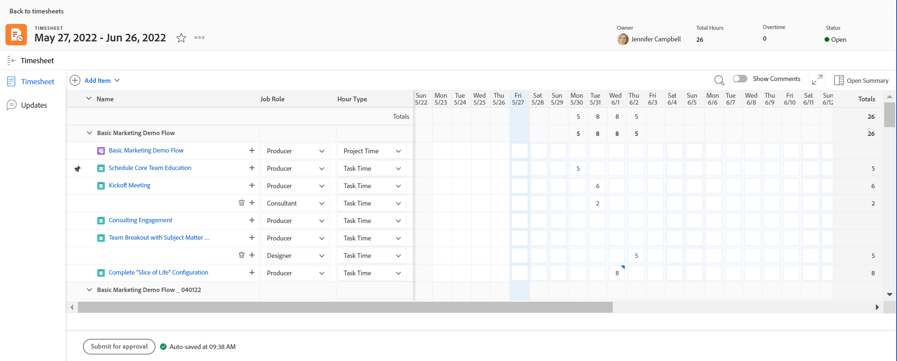

1. (Optional) Click the **full-screen** icon  to display the timesheet in full-screen mode, then click the **exit-full-screen**  icon to return to the timesheet. 

   <!-- drafted for the resize columns in timesheet story: 1. (optional) Click on the separator lines between weeks or between the time frame area and the work item area to resize the columns of the timesheet.-->

1. (Optional) To add a project, task, or issue to the timesheet, click the **Add item** drop-down menu in the upper-left corner of the timesheet, then click **Add Projects**, **Add Tasks**, or **Add Issues**. 

   A list of projects, tasks, or issues displays. 

   <!--drafted for full screen mode for add projects story - align it with the rest of the steps when you enable this:: 1. (Optional) Click the **full-screen** icon  to display the list of objects in full-screen mode.-->

1. (Optional) Click the search icon  to search for a specific item using a keyword to add to the timesheet.

1. (Optional) Expand the filter, view, or grouping drop-down menus to apply or customize one and to view the item information that you want. 

1. Select one or several items in the list, then click **Add**. 

   If you have added fewer than 50 items at one time, the items are added to the timesheet. Tasks and issues are listed under the name of the project. 

   >[!NOTE]
   >
   >When you add tasks or issues to the timesheet, the project is also added. 

   
1. (Conditional) If you add 50 or more items at one time, a confirmation message displaying the number of items added to your timesheet displays. 

   Click **Add all** to add all items
   Or 
   Click **Cancel** to stop the adding of the selected items, then **Cancel** to close the list of items. 

   Tasks and issues are listed under the name of the project. 

   >[!NOTE]
   >
   >The items that you manually add to the timesheet are pinned and will stay on the current and future timesheets until you manually unpin them to remove them. For information about unpinning items to remove them from the timesheet, continue with Step 10. 

   <!--(ensure this stays accurate)-->

1. (Optional) Click the **Collapse**  or **Expand**  icons next to the project name  to either display or hide the list of tasks and issues for the project.   

   >[!TIP]
   >
   >   When using a standard QWERTY keyboard, and after clicking the name of a project in the timesheet, press the following set of keys to collapse or expand the project:
   >   * To expand the project and display its work items:
   >     * Shift + Alt + Up arrow for Windows computers
   >     * Shift + Option + Up arrow for Mac computers
   >   * To collapse the project and hide its work items:
   >     * Shift + Alt + Down arrow  for Windows computers
   >     * Shift + Option + Down arrow for Mac computers.
  
   
1. (Optional) To manually pin an item that displays on the timesheet automatically, hover over the name of the item, then click the **pin** icon .

   >[!TIP]
   >
   >   When using a standard QWERTY keyboard after clicking an item in the timesheet, press the following set of keys to pin an item:
   >   * Option + P for both Windows and Mac computers. 
   

1. (Optional) Click the search icon  and start typing a keyword to find a project, task, or an issue on the timesheet. 

1. (Conditional) If your Workfront or group administrator has enabled the **Assign job roles to hour entries manually** setting, select a job role from the drop-down menu. The role specified when you are assigned to the work item displays by default. If you are not assigned a role on the object, your Primary Role displays as the default. For more information on this setting, see the article [Configure timesheet and hour preferences](../../administration-and-setup/set-up-workfront/configure-timesheets-schedules/timesheet-and-hour-preferences.md).

   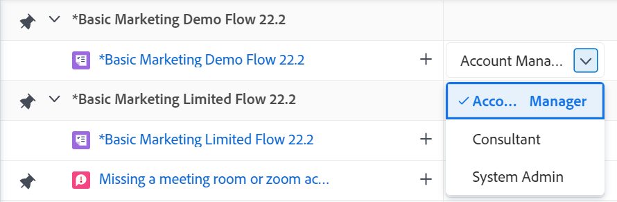

1. (Optional) Click the **+** icon to add another row, then select a new hour type from the drop-down menu in the [!UICONTROL Hour Type] column to log time for a different hour type.

   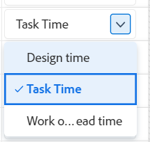

   
   >[!TIP]
   >
   >   Depending on your operating system or browser and when using a standard QWERTY keyboard, press the following set of keys to add another row:
   >   * Ctrl + Option + + for Windows computers 
   >   * Cmd + Option + + for Mac computers
   
   Hour types are available depending on what has been defined at the system, project, and user levels, as described in [Define hour types and availability for timesheets](define-hour-types-and-availability.md).

   The hour type cannot be changed after a timesheet is closed.

   >[!TIP]
   >
   >If you previously logged time and the hour type you selected is now deactivated, the entire row for the logged time is dimmed. Selecting another hour type and refreshing the page removes the deactivated hour type option from the drop-down list so you cannot add additional hours to that hour type. 
   >
   >Consider adding a new line for the work item you want to log additional time  for and selecting a new hour type, if you want to keep the deactivated hour type associated with the past logged time. 

1. Click the **delete** icon   next to the job role to remove it. Any time logged for the role is also removed. 

   >[!TIP]
   >
   >   Depending on your operating system or browser and when using a standard QWERTY keyboard, press the following set of keys to delete a row:
   >   * Ctrl + Option + - for Windows computers 
   >   * Cmd + Option + - for Mac computers

1. Specify the amount of time you want to log on any given day in the timeline section of the timesheet, then click outside the hour box to save the hour entry. The hours are saved automatically. The row for which you log time is highlighted in light blue and the hour entry box is outlined in dark blue.

   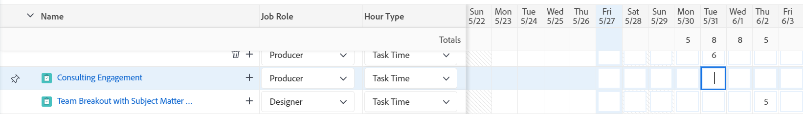

   You log time in either hours or days. This setting is configured by users with a Plan license or the system administrator, as described in [Configure whether time is logged in hours or days](../../timesheets/config-timesheet-prefs/config-time-logged-hrs-days.md).

   >[!IMPORTANT]
   >
   >You must save the timesheet manually if any of the following scenarios occur:
   >
   >* The job role associated with time that you previously logged has changed and the **Assign job roles to hour entries manually** setting has been disabled. Logging time for new dates will associate it with a different job role.
   >   
   >   If the role has changed and the **Assign job roles to hour entries manually** setting is enabled, you can log time or update the role and your changes are saved automatically.
   >
   >* The job role assigned to a task or issue is different than the job role the timesheet owner is logging time with <!--or assigned to them_ this last  piece came from a Support note but but sure what role it's referring to. Leaving it out for now.-->.
   >
   >The timesheet will again save the time automatically when there are no more conflicting entries between the two roles.
   >

1. (Optional) Specify the amount of overtime in the Overtime field in the timesheet's header. 

   >[!TIP]
   >
   >You cannot log a larger number of overtime hours than the current total hours on the timesheet. For example, if you logged 7 hours on the timesheet so far, you cannot log 8 hours of overtime.

1. (Optional) Click **Comment** to add a comment for your hour entry. 

   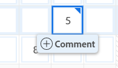

   >[!TIP]
   >
   >   When using a standard QWERTY keyboard after clicking the hour entry box, press the following set of keys to open the comment box:
   >   * Shift + F2 for both Windows and Mac computers. 

1. Click **Done** to save the comment.

   >[!TIP]
   >
   >   When using a standard QWERTY keyboard, from inside the comment box, press the following set of keys to save the comment:
   >   * Ctrl + Enter for Windows computers.
   >   * Cmd + Return for Mac computers.
   

1. (Optional) Click **Show comments** in the toolbar to display hour entry comments under the work item.

   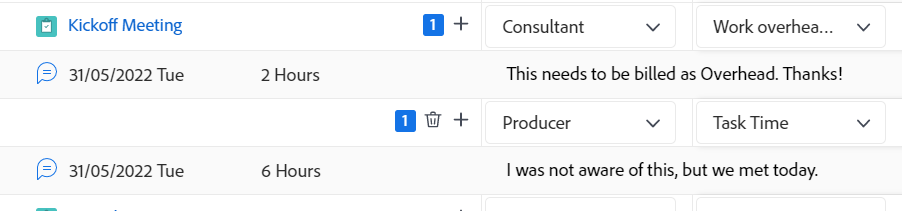

   >[!TIP]
   >
   >   All changes you make to the timesheet are saved automatically.

1. (Optional) Click the row of a task or issue, then click **Open Summary** in the upper-right corner of the timesheet to add an update or to update information on the task or issue. The Summary panel opens on the right. 

   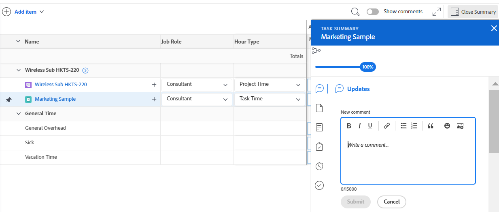

   Your update displays in the Updates area of the work item associated with the logged time.

   >[!TIP]
   >
   >You cannot comment on projects or General Time hour entries.

1. Click [!UICONTROL **Close Summary**] to close the Summary panel and return to the timesheet. 

1. (Optional) Click [!UICONTROL **Updates**] in the left panel, then add an update to the timesheet. For more information about Workfront updates, see [Update work](../../workfront-basics/updating-work-items-and-viewing-updates/update-work.md).

   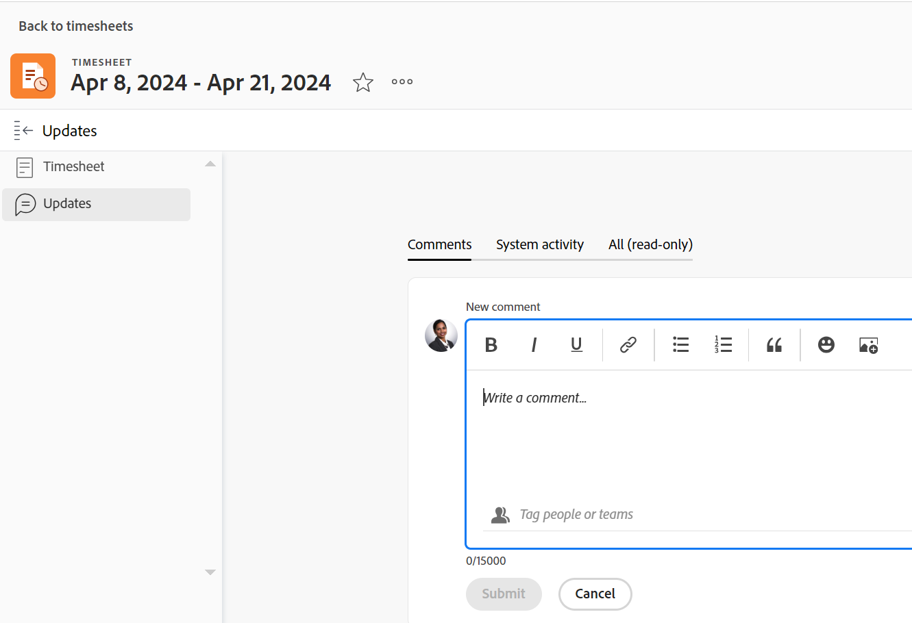

1. (Optional) Return to the **Timesheet** area to close or submit your timesheet.

   * **Close**: Close the timesheet when you are done updating it. This option is only available when your timesheet is not associated with an approver.

   * **Submit for approval:** This option is available only if there is an approver on the timesheet. Save your changes and submit for approval. You can open the timesheet after closing it by clicking **Recall**, if an approval has not been granted yet. For more information, see [Submit a timesheet for approval](../../timesheets/create-and-manage-timesheets/submit-timesheet-for-approval.md).
      
   * **Reject**: This option displays when you are a timesheet approver and the timesheet has been submitted to you for approval. Clicking it changes the status of the timesheet to Rejected and the timesheet remains open. 

   * **Approve**: This option displays when you are a timesheet approver and the timesheet has been submitted to you for approval. Clicking it changes the status of the timesheet to Approved and closes the timesheet.

   >[!TIP]
   >
   >The Reject and Approve options also display on your timesheet when you are a system administrator and the timesheet is associated with an approver.

1. (Conditional) If you have either closed or submitted your timesheet for approval, click one of the following options:

   * **Re-Open**: This option is available for timesheets that you have already closed and which have no approvers, or timesheets that have already been approved. Reopen the timesheet to modify hour entries. 
   * **Recall**: This option is available for timesheets that have been submitted for approval but have not been approved or rejected yet. Click **Recall** to reopen the timesheet and modify hour entries.

#### Remove an item from the timesheet

You can remove an hour entry or an item (project, task, or issue) from a timesheet. 

To remove an hour entry from a timesheet: 

1. Go to the timesheet and find the hour entry you want to remove. 
1. Replace the hours entered with 0
      Or
   Remove the hours and replace them with 0, then press Enter. 

   The hours are removed and the timesheet is saved automatically.

You can remove an item (project, task, or issue) from the timesheet by unpinning it, if you have not yet logged time for it, and if you manually added the item (as described in Steps 4-8 in the [Log time on a timesheet](#log-time-on-a-timesheet) section in this article). <!--ensure this stays accurate-->

You cannot remove items that are included in the timesheet automatically according to the timesheet preferences in your Workfront system or group that are configured to pre-populate the timesheets (as described in [Configure timesheet and hour preferences](../../administration-and-setup/set-up-workfront/configure-timesheets-schedules/timesheet-and-hour-preferences.md)). The items stop pre-populating the timesheet when the dates of the items are outside of the time frame of the timesheet. 

To remove an item from the timesheet that was manually added:

1. Ensure that no time is logged against the item.
1. Click the **unpin** icon  next to the item to unpin the item from the timesheet.

   >[!TIP]
   >
   >   When using a standard QWERTY keyboard after clicking an item in the timesheet, press the following set of keys to unpin an item:
   > * Option + P for both Windows and Mac computers.

   The item is removed from the timesheet after you refresh the page.

### Home {#home}

You can log project-specific time in Home.

For general information about using the Home area, see the following sections: 

* For information about using the legacy Home area, see [Use the Home area](../../workfront-basics/using-home/using-the-home-area/use-the-home-area.md).
* For information about using the new Home area, see [Get started with New Home](../../workfront-basics/using-home/new-home/get-started-with-new-home.md). 

#### Log time on a work item from the new Home area

1. Got to the **Home** area. 
1. Add any of the following widgets: 

   * My Tasks
   * My Issues
   * My Work
   * My Requests
1. Select a task, issue, or request in a list, then click **Summary**

   Or

   Click the **Summary** icon  from a task or an issue in the My Work widget. 

   The Summary panel opens to the right. 

   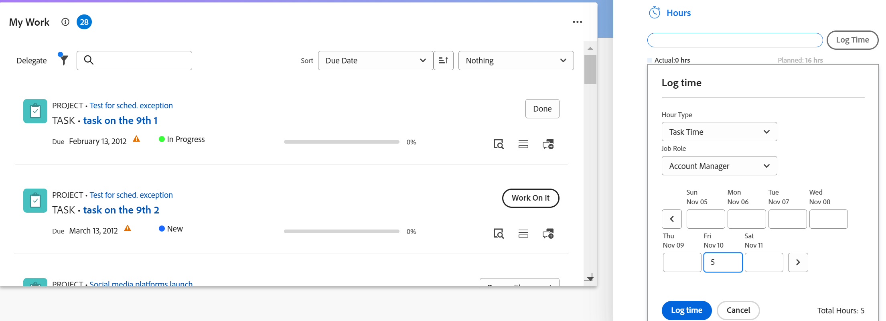
1. Continue logging time in the Summary panel, as described in [Summary overview](../../workfront-basics/the-new-workfront-experience/summary-overview.md).

#### Log time on a work item from the legacy Home area

1. In the **Work List** area, select the item where you want to log time.
1. In the right panel, click **Log Time**.  
  
   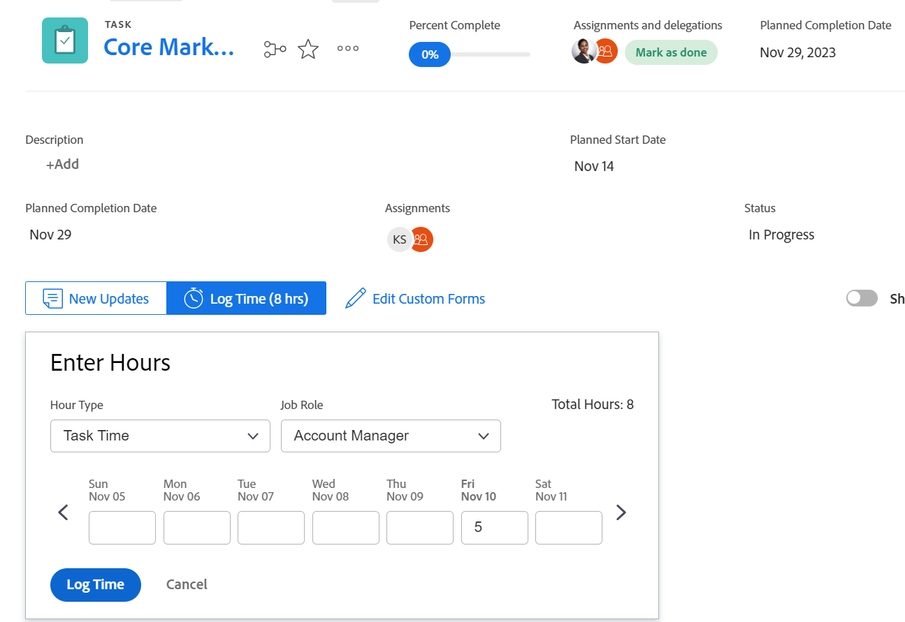  

1. In the **Enter Hours** drop-down menu, select the appropriate hour type.  
   Hour types are available depending on what has been defined at the system, project, and user levels, as described in [Define hour types and availability for timesheets](../../timesheets/create-and-manage-timesheets/define-hour-types-and-availability.md).
1. (Conditional) If your Workfront or group administrator has enabled the **Assign job roles to hour entries manually** setting, select a job role from the drop-down menu. The role specified when you are assigned to the work item displays by default. If you are not assigned a role on the object, your Primary Role displays as the default. For more information on this setting, see the article [Configure timesheet and hour preferences](../../administration-and-setup/set-up-workfront/configure-timesheets-schedules/timesheet-and-hour-preferences.md).
1. Specify the time you want to log, then click **Log Time**.

### Project, task, or issue {#project-task-or-issue}

You can log project-specific time on a project, task, or issue in the following sections:

* [Updates section](#updates-section) 
* [Hours section](#hours-section)

#### Updates section{#updates-section} 

To log time in the Updates section of a project, task, or issue, you must have the following:

* A Work or Plan license.
* Contribute or higher permissions to the project, task, or issue with access to Log Hours.  
  For more information about granting permissions on projects, see [Share a project in Adobe Workfront](../../workfront-basics/grant-and-request-access-to-objects/share-a-project.md).

* Your Workfront administrator must enable the Log time directly on projects setting under [!UICONTROL **Timesheet & Hours** ]> [!UICONTROL **Preferences**], if you want to log time directly to a project. 

  For more information about allowing users to log hours directly to projects, see [Configure timesheet and hour preferences](../../administration-and-setup/set-up-workfront/configure-timesheets-schedules/timesheet-and-hour-preferences.md).

To log time in the Updates section of a project, task, or issue:

1. Go to a project, task, or issue.
1. In the left panel, select **Updates**.
1. Click **Log Time**. <!-- did Anna B change the casing for this button? If yes and if she changed it for the other areas, update screen shot too-->

   The Log time dialog box displays.
   
   >[!TIP]
   >
   >   If your profile's preference is set to log time in days, the Enter Days box displays. 
   >   
   >   There is an indication in the upper-right corner of the Enter Days box of how many hours are included in a day. 

   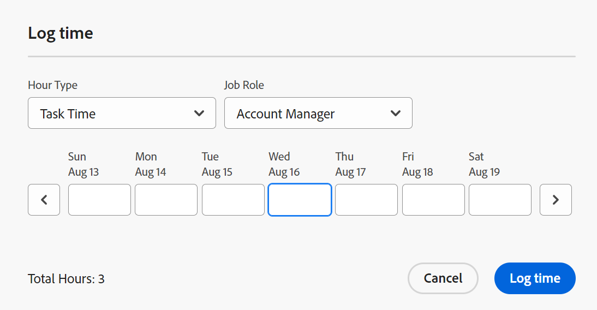

1. Specify the following information:

   * **Hour Type**: Select an Hour Type from the drop-down menu, if it is different from the one displayed by default.

     Depending on what hour types are configured in your system, the options here might vary. For more information about configuring hour types, see [Define hour types and availability for timesheets](../../timesheets/create-and-manage-timesheets/define-hour-types-and-availability.md).

   * **Job Role**: (Conditional) If your Workfront or group administrator has enabled the **Assign job roles to hour entries manually** setting, select a **Job Role** from the drop-down menu. The Role specified when you are assigned to the object displays by default. If you are not assigned a Role on the object, your Primary Role displays as the default. For more information on this setting, see the article [Configure timesheet and hour preferences](../../administration-and-setup/set-up-workfront/configure-timesheets-schedules/timesheet-and-hour-preferences.md).

   * **Hours**: Enter the number of hours for the project, task, or issue.

1. Click **Log time**.

#### Hours section{#hours-section}

You must be a Workfront administrator to log time for projects, tasks, and issues in the Hours section, 

Or

You must have all of the following:

* A Plan license with administrative access to Timesheets & hours. For more information about granting administrative access to Timesheets & hours, see [Grant users administrative access to certain areas](../../administration-and-setup/add-users/configure-and-grant-access/grant-users-admin-access-certain-areas.md).
* Contribute or higher permissions to the project with access to Log Hours. For more information about granting permissions on projects, see [Share a project in Adobe Workfront](../../workfront-basics/grant-and-request-access-to-objects/share-a-project.md).
* Your Workfront administrator must enable the Log time directly on projects setting under Timesheet & Hours > Preferences, if you want to log time directly to a project. For more information about allowing users to log hours directly to projects, see [Configure timesheet and hour preferences](../../administration-and-setup/set-up-workfront/configure-timesheets-schedules/timesheet-and-hour-preferences.md).

To log time in the Hours section of a project, task, or issue:

1. Go to a project, task, or issue.
1. In the left panel, click **Hours**.
1. Click **Log Time**.

   The Log Hours dialog box displays.

1. Specify the following information:

   * **Owner:** Your name displays in this field, by default.   
     If you are logging the hours for another user, specify their name.
   
   * **Hour Type**: Select an Hour Type from the drop-down menu, if it is different from the one displayed by default.

     Depending on what hour types are configured in your system, the options here might vary. For more information about configuring hour types, see [Define hour types and availability for timesheets](../../timesheets/create-and-manage-timesheets/define-hour-types-and-availability.md).

   * **Job Role**: (Conditional) If your Workfront or group administrator has enabled the **Assign job roles to hour entries manually** setting, select a **Job Role** from the drop-down menu. The Role specified when you are assigned to the object displays by default. If you are not assigned a Role on the object, your Primary Role displays as the default. For more information on this setting, see the article [Configure timesheet and hour preferences](../../administration-and-setup/set-up-workfront/configure-timesheets-schedules/timesheet-and-hour-preferences.md).

     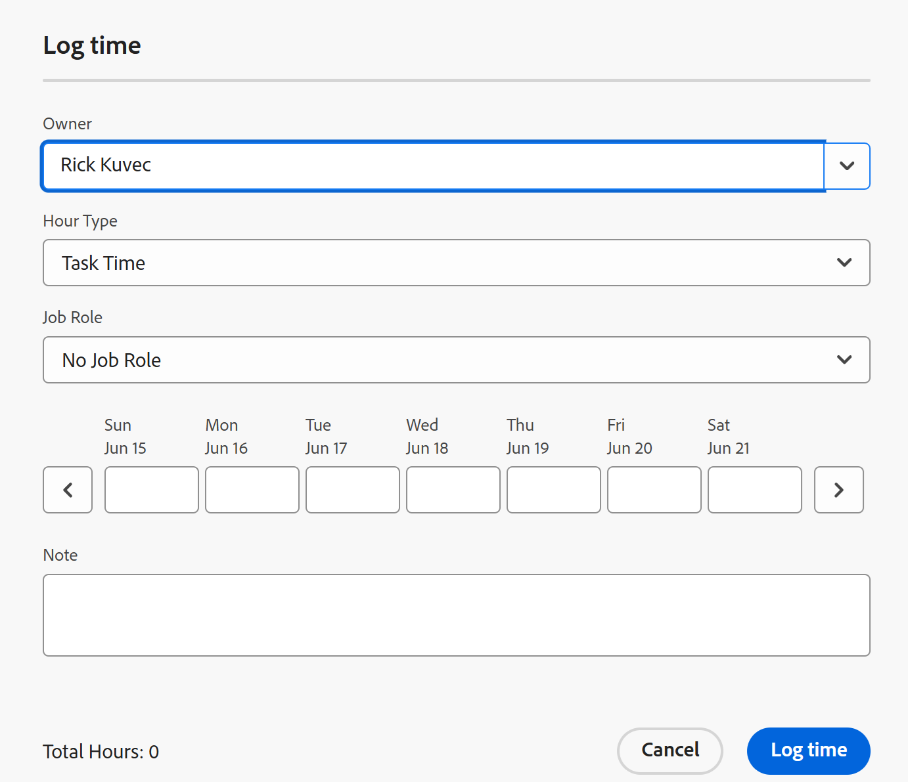
   * **Hours**: Enter the number of hours for the project, task, or issue.

1. Click **Log Time**.

### Summary panel

You can log time for tasks and issues in the Summary panel. 
For more information, see [Summary overview](../../workfront-basics/the-new-workfront-experience/summary-overview.md).

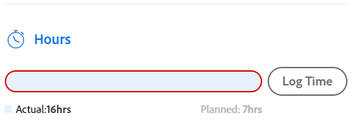

### Boards {#boards}

You can log time on connected cards on a Workfront board. This is the same process as logging time on a task or issue, and the hours logged on the card are saved on the connected task or issue.
For more information, see [Use connected cards on boards](/help/quicksilver/agile/get-started-with-boards/connected-cards.md).

### Mobile app {#mobile-app}

You can log time from the Workfront mobile app.
For more information, see [Adobe Workfront for Android](/help/quicksilver/workfront-basics/mobile-apps/using-the-workfront-mobile-app/workfront-for-android.md) or [Adobe Workfront for iOS](/help/quicksilver/workfront-basics/mobile-apps/using-the-workfront-mobile-app/workfront-for-ios.md).
