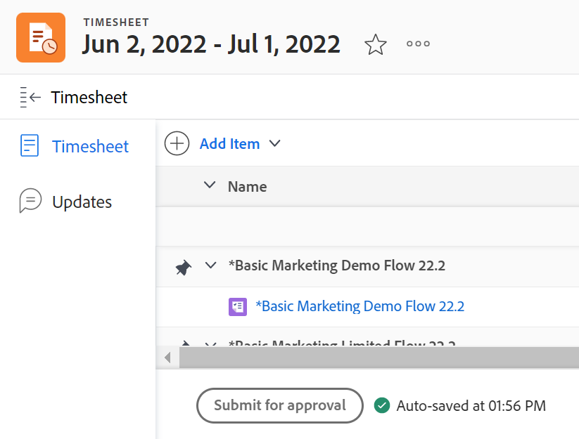
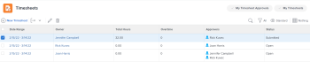
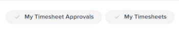

# Submit a timesheet for approval

<!--Audited: 8/2024-->

Submitting your timesheet for approval provides your manager with visibility into your work hours. Approvers can verify that all time recorded has been allocated in the correct areas and that a sufficient number of hours have been recorded for the time period.

## Access requirements

+++ Expand to view access requirements for the functionality in this article.

You must have the following access to perform the steps in this article:

<table style="table-layout:auto"> 
 <col> 
 <col> 
 <tbody> 
  <tr> 
   <td role="rowheader">Adobe Workfront plan</td> 
   <td> 
Any
 </td> 
  </tr> 
  <tr> 
   <td role="rowheader">Adobe Workfront license</td> 
   <td> 
New: Light or higher 

   
Current: Review or higher 

  </tr> 
  <tr> 
   <td role="rowheader">Access level configurations</td> 
   <td> 
View or higher access to tasks and issues 
 </td> 
  </tr> 
  <tr> 
   <td role="rowheader">Object permissions</td> 
   <td> 
View or higher permissions to the timesheet
 </td> 
  </tr> 
 </tbody> 
</table>

For more detail about the information in this table, see [Access requirements in Workfront documentation](/help/quicksilver/administration-and-setup/add-users/access-levels-and-object-permissions/access-level-requirements-in-documentation.md).

+++

## Submit a timesheet for approval

* [Submit a timesheet for approval](#submit-a-timesheet-for-approval) 
* [View the status of a submitted timesheet](#view-the-status-of-a-submitted-timesheet)

### Submit a timesheet for approval

After a timesheet approver is set (as described in the section [Designate timesheet approvers](../../timesheets/create-and-manage-timesheets/timesheet-approvals.md#designating-a-timesheet-approver) in the article [Approve a timesheet](../../timesheets/create-and-manage-timesheets/timesheet-approvals.md)), the **Close** button at the bottom of the timesheet changes to a **Submit for approval** button.

To submit a timesheet for approval:

1. Go to a timesheet that has been configured to have an approver.
1. Log time, as described in [Log time](../../timesheets/create-and-manage-timesheets/log-time.md).
1. Click **Submit for approval** to launch the timesheet approval process.

   

   The **Submit for approval** button is replaced by the **Approve**, **Reject**, and **Recall** buttons. The status of the timesheet changes to **Submitted**.

   When your timesheet is submitted for approval, the approver sees the timesheet listed in the **Approvals** area on the **Home** page. The following things might occur:

   * If they approve it, the **Recall** button changes to **Re-open** and the timesheet status updates to **Open**.
   * If they reject it, the **Submit for approval** button replaces the **Recall** button and the timesheet status updates to **Rejected**.

1. (Optional) Click **Recall** if you need to reopen the timesheet and update your time. For information, see the [Recall a timesheet](#recall-a-timesheet) section in this article.

### View the status of a submitted timesheet {#view-the-status-of-a-submitted-timesheet}

You can view the status of a timesheet after you submit it.

If the Workfront administrator has enabled the Timesheet Approval to User and the Timesheet Rejection to User event handlers, you are notified after the timesheet is approved or rejected. For information about enabling event notifications, see [Event notification types](../../administration-and-setup/manage-workfront/emails/event-notifications-available-in-wf.md).

Without these notifications, you can learn about the status of your submitted timesheets in the Timesheet area of Workfront.

To view the status of a timesheet:

1. Click the **Main Menu** icon  in the upper-right corner of Adobe Workfront.
1. Click **Timesheets**. The **All** filter is selected by default.

   

1. (Optional) Do one of the following to update the filter in the list of timesheets:

   * Select **My Timesheet Approvals** in the upper-right corner of the page to view only timesheets that you approve

     Or

     Select **My Timesheets** to view only your timesheets.

     This applies the My Timesheet Approvals or the My Timesheet filters to the list of timesheets.

     

   * Click the Filter icon  to apply a different filter, or create a new one. For information about creating or updating filters, see [Create or edit filters in Adobe Workfront](../../reports-and-dashboards/reports/reporting-elements/create-filters.md).

   >[!NOTE]
   >
   >The My Timesheet Approvals and My Timesheets options do not display at the top of the timesheet list or in the list of filters if your Workfront administrator or a group administrator removed the My Timesheet Approvals and the My Timesheets filters from either the List Controls in the Setup area or from your Layout Template. For more information see the following articles:
   >
   >   
   >   
   >   * [Customize Filters, Views, and Groupings using a layout template](../../administration-and-setup/customize-workfront/use-layout-templates/customize-fvg-list-controls-layout-template.md) 
   >   
   >

1. (Conditional) If you selected **My Timesheets**, ensure that the **Standard** view is applied and notice the **Status** column.

   Timesheets may have the following statuses:

   <table style="table-layout:auto"> 
    <col> 
    <col> 
    <tbody> 
     <tr> 
      <td role="rowheader">Open</td> 
      <td> 
Your timesheet is currently open and you may log time. 
 
A recalled timesheet displays with a status of Open. For information, see the <a href="#recall-a-timesheet" class="MCXref xref">Recall a timesheet</a> section in this article. 
 </td> 
     </tr> 
     <tr> 
      <td role="rowheader">Submitted</td> 
      <td>You submitted your timesheet for approval but it has not been approved yet. You may recall a submitted timesheet to continue editing it. For information, see the <a href="#recall-a-timesheet" class="MCXref xref">Recall a timesheet</a> section in this article. </td> 
     </tr> 
     <tr> 
      <td role="rowheader">Closed</td> 
      <td> 
The following scenarios exist:
 
       <ul> 
        <li> 
If the timesheet has no approver, you saved your time and closed it.
 </li> 
        <li> 
If the timesheet has an approver, you have submitted it for approval and it has been approved.
 </li> 
       </ul> </td> 
     </tr> 
     <tr> 
      <td role="rowheader">Rejected</td> 
      <td>You submitted the timesheet for approval and the approver rejected it.</td> 
     </tr> 
    </tbody> 
   </table>

## Recall a timesheet {#recall-a-timesheet}

You can recall a timesheet that has already been submitted for approval. Only timesheets that haven't been approved can be recalled.

To recall a timesheet:

1. Click the **Main Menu** icon  in the upper-right corner of Adobe Workfront.

1. Click **Timesheets**.
1. Click **My Timesheets** in the upper-right corner of the screen or select **My Timesheets** from the **Filter**  drop-down menu.
1. Click the time frame for a timesheet with a status of **Submitted**.
1. Click **Recall**.

   The timesheet becomes editable again and its status changes to **Open**.
