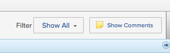
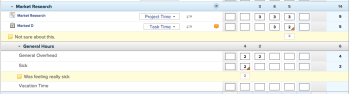
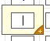
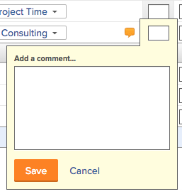
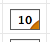

# View and manage comments on a timesheet

You can make comments on the following items in a timesheet:

* On the timesheet
* On the hour entries 
* On an individual item, like a task or an issue

## Access requirements

You must have the following access to perform the steps in this article:

<table cellspacing="0"> 
 <col> 
 <col> 
 <tbody> 
  <tr> 
   <td role="rowheader">Adobe Workfront plan*</td> 
   <td> 
Any
 </td> 
  </tr> 
  <tr> 
   <td role="rowheader">Adobe Workfront license*</td> 
   <td> 
Review 
 </td> 
  </tr> 
  <tr> 
   <td role="rowheader">Access level configurations*</td> 
   <td> 
View access or higher to Tasks and Issues
 
Note: If you still don't have access, ask your Workfront administrator if they set additional restrictions in your access level. For information on how a Workfront administrator can modify your access level, see <a href="../../administration-and-setup/add-users/configure-and-grant-access/create-modify-access-levels.md" class="MCXref xref">Create or modify custom access levels</a>.
 </td> 
  </tr> 
  <tr> 
   <td role="rowheader">Object permissions</td> 
   <td> 
View or higher permissions on tasks and issues
 
For information on requesting additional access, see <a href="../../workfront-basics/grant-and-request-access-to-objects/request-access.md" class="MCXref xref">Request access to objects in Adobe Workfront</a>.
 </td> 
  </tr> 
 </tbody> 
</table>

&#42;To find out what plan, license type, or access you have, contact your Workfront administrator.

## View comments on a timesheet

You can configure comments that are made on individual&nbsp;hour entries to be displayed in the timesheet. The option to show and hide comments does not affect comments made on the overall timesheet or comments made on individual items. For more information, see&nbsp; [Make comments on a timesheet](#making-comments-on-a-timesheet).

By default, comments are hidden the first time you&nbsp;access a timesheet.

To show comments on a timesheet:

1. Click the **Main Menu** icon  in the upper-right corner of Adobe Workfront.

1. Click **Timesheets**.
1. In the left panel, click **All Timesheets**.
1. Go to the timesheet where you want to display comments.
1. Click **Show Comments**&nbsp;in the upper-right corner of the timesheet.

   

   Comments are displayed and highlighted in yellow below the hour entry where they were made.

   

## Make comments on a timesheet

* [Comment on the overall timesheet](#commenting-on-an-overall-timesheet) 
* [Comment on an individual hour entry in a timesheet](#commenting-on-an-individual-hour-entry-in-a-timesheet) 
* [Comment on a work item in a timesheet](#comment)

### Comment on the overall timesheet

You can make general comments about the timesheet.

1. Click the **Main Menu** icon  in the upper-right corner of Adobe Workfront.

1. Click **Timesheets**.
1. In the left panel, click **All Timesheets**.
1. Go to the timesheet where you want to make a comment.
1. Below the timesheet, click **Include a comment**.

   

1. Type your comment, then click **Save**.

   Your comment is displayed in the **Recent Updates** area.

### Comment on an individual hour entry in a timesheet

1. Click the **Main Menu** icon  in the upper-right corner of Adobe Workfront.

1. Click **Timesheets**.
1. In the left panel, click **All Timesheets**.
1. Go to the timesheet where you want to make a comment.
1. Click in the entry field where you want to make a comment.

   

1. Click the **+** icon.

   

1. Type your comment, then click **Save**.

   After a comment is submitted, a notch appears on the record in the box, indicating that a comment was made.

   

1. (Optional) To configure comments to be displayed in the timesheet, see [View comments on a timesheet](#viewing-comments-on-a-timesheet).

### Comment on a work item in a timesheet

You can comment on individual items in the timesheet, update their Actual Start Date or Condition. The update displays in the Updates area of the object associated with the logged time.

1. Click the **Main Menu** icon  in the upper-right corner of Workfront.
1. Click **Timesheets**.
1. In the left panel, click **All Timesheets**.
1. Go to the timesheet where you want to make a comment.
1. Click the **Update Status** icon  inline with a task or issue.

   >[!TIP]
   >
   >You cannot comment on projects or General Time hour entries.

   The Update Status box displays.

1. Do one of the following:

   * Update the Condition of the item.

     This is possible only when the Condition Type of the project is set to Manual. For more information, see [Edit projects](../../manage-work/projects/manage-projects/edit-projects.md). 
   
   * Update the Actual Start Date. 
   * Enter an update in the space provided and click the **People** icon  to include others in the update or the **Lock** icon  to make the update visible only to users in your Company.

1. Click&nbsp;**Update**.

   The update is now visible in the Updates area of the task or the issue.

