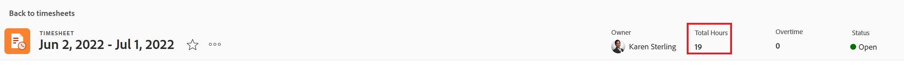
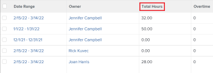

# View total hours on the timesheet

<!--Audited: 8/2024-->

You can view the total number of hours on your timesheet. The total number of timesheet hours includes hours logged for projects, tasks, issues, and all general hours.

The total hours reflect hours submitted through the timesheet, the Updates area, or in the Hours area for projects, tasks, or issues.

## Access requirements

+++ Expand to view access requirements for the functionality in this article. 

You must have the following access to perform the steps in this article:

<table style="table-layout:auto"> 
 <col> 
 <col> 
 <tbody> 
  <tr> 
   <td role="rowheader">Adobe Workfront plan</td> 
   <td> 
Any
 </td> 
  </tr> 
  <tr> 
   <td role="rowheader">Adobe Workfront license*</td> 
   <td> 
New: Light or higher 

   
Current: Review or higher
 </td> 
  </tr> 
  <tr> 
   <td role="rowheader">Access level configuration</td> 
   <td> 
View or higher access to Tasks and Issues
 </td> 
  </tr> 
  <tr> 
   <td role="rowheader">Object permissions</td> 
   <td> 
View or higher permissions on tasks and issues
 </td> 
  </tr> 
 </tbody> 
</table>

*To find out what plan, license type, or access you have, contact your Workfront administrator. For more information, see [Access requirements in Workfront documentation](/help/quicksilver/administration-and-setup/add-users/access-levels-and-object-permissions/access-level-requirements-in-documentation.md). 

+++

## View the total hours of a timesheet in the timesheet header

You can view a timesheet's Total Hours in the timesheet header.

## View the total hours on your timesheet in a list of timesheets

{{step1-to-timesheets}}
   
   The **Timesheets** area opens. 

   

1. (Optional) Do one of the following to update the filter in the list of timesheets:

   * Select **My Timesheet Approvals** in the upper-right corner of the page to view only timesheets that you approve

     Or

     Select **My Timesheets** to view only your timesheets.

     This applies the My Timesheet Approvals or the My Timesheet filters to the list of timesheets.

     

   * Click the Filter icon  to apply a different filter, or create a new one. For information about creating or updating filters, see [Create or edit filters in Adobe Workfront](../../reports-and-dashboards/reports/reporting-elements/create-filters.md).

   >[!NOTE]
   >
   >The My Timesheet Approvals and My Timesheets options do not display at the top of the timesheet list or in the list of filters if your Workfront administrator or a group administrator removed the My Timesheet Approvals and the My Timesheets filters from either the List Controls in the Setup area or from your Layout Template. For more information see the following articles:
   >
   >   
   >   
   >   * [Customize Filters, Views, and Groupings using a layout template](../../administration-and-setup/customize-workfront/use-layout-templates/customize-fvg-list-controls-layout-template.md) 
   >   
   >

1. (Optional) Click the **View**  or **Grouping**  icons to apply a different view or grouping or to create a new one.

   For information about creating filters, views, or groupings, see the following articles:

   * [Create or edit filters in Adobe Workfront](../../reports-and-dashboards/reports/reporting-elements/create-filters.md) 
   * [Create or edit views in Adobe Workfront](../../reports-and-dashboards/reports/reporting-elements/create-edit-views.md) 
   * [Create groupings in Adobe Workfront](../../reports-and-dashboards/reports/reporting-elements/create-groupings.md)

1. The total number of hours for each timesheet displays in the **Total Hours** column.

   

   >[!TIP]
   >
   >When using the Standard view for a list of timesheets, the Total Hours column displays in red if the time logged for the items on the timesheet exceeds the number of hours in the timesheet's time frame. For more information, see the "Total Hours" field in [Glossary of Adobe Workfront terminology](../../workfront-basics/navigate-workfront/workfront-navigation/workfront-terminology-glossary.md).
