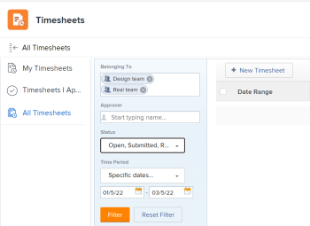
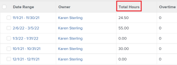

# View total hours on the timesheet

The highlighted information on this page refers to functionality not yet generally available. It is available only in the Preview Sandbox environment.

You can view&nbsp;the total number of hours on&nbsp;your timesheet. The total number of timesheet hours includes hours logged for projects, tasks, issues, and all general hours.

The total hours reflect hours submitted through the timesheet, the Updates area, or in the Hours area for projects, tasks, or issues.

## Access requirements

You must have the following access to perform the steps in this article:

<table cellspacing="0"> 
 <col> 
 <col> 
 <tbody> 
  <tr> 
   <td role="rowheader">Adobe Workfront plan*</td> 
   <td> <p>Any</p> </td> 
  </tr> 
  <tr> 
   <td role="rowheader">Adobe Workfront license*</td> 
   <td> <p>Review </p> </td> 
  </tr> 
  <tr> 
   <td role="rowheader">Access level configurations*</td> 
   <td> <p>View access or higher to Tasks and Issues</p> <p>Note: If you still don't have access, ask your Workfront administrator if they set additional restrictions in your access level. For information on how a Workfront administrator can modify your access level, see <a href="../../administration-and-setup/add-users/configure-and-grant-access/create-modify-access-levels.md" class="MCXref xref">Create or modify custom access levels</a>.</p> </td> 
  </tr> 
  <tr> 
   <td role="rowheader">Object permissions</td> 
   <td> <p>View or higher permissions on tasks and issues</p> <p>For information on requesting additional access, see <a href="../../workfront-basics/grant-and-request-access-to-objects/request-access.md" class="MCXref xref">Request access to objects in Adobe Workfront</a>.</p> </td> 
  </tr> 
 </tbody> 
</table>

&#42;To find out what plan or license type you have, contact your Workfront administrator.

## View the total hours on your timesheet

1. Click the **Main Menu** icon  in the upper-right corner of Adobe Workfront, then click **Timesheets**.
1. 

   <!--
   <MadCap:conditionalText data-mc-conditions="QuicksilverOrClassic.Draft mode">
   (Conditional) Depending on which environment you are accessing timesheets from, select from the following:&nbsp;In the Production environment,
   </MadCap:conditionalText>
   -->

   Click **All Timesheets** in the left panel.

1. The timesheet filter is prepopulated with the teams you belong to. 
1. 

1. ```<li> <!--  <p class="preview" data-mc-conditions="QuicksilverOrClassic.Draft mode">In the Preview environment, the <strong>All</strong> filter is selected by default. </p> --> </li>```

   <!--
   <p data-mc-conditions="QuicksilverOrClassic.Draft mode">  </img> </p>
   -->

1. 

   <!--
   (Conditional and optional) In the Production environment, do the following to modify the filter in the list of timesheets:
   -->

   (Optional) To modify the filter in the list of timesheets, do the following:

  1. Click **Filter** to apply the default filter and display timesheets for people in your teams.

     Or

     Click **Reset Filter** to clear the filter selection and add new filtering criteria. 
  
  1. Select from the following filtering options:

     | Belonging to |Displays timesheets associated with the users you specify or the users associated with the roles or teams that you specify. |
     |---|---|
     | Approver |Displays timesheets associated with the approvers that you specify. |
     | Status |Displays timesheets associated with the status that you specify. |
     | Time Period |Displays timesheets that include the time period you select. |

  1. Click&nbsp;**Filter** after defining your filter criteria.

     >[!TIP]
     >
     >Leaving the filter criteria blank and clicking Filter displays all timesheets in the system.

   <!--
   <p>(Conditional and optional) In the Preview environment, do one of the following to update the filter in the list of timesheets:</p>
   <ul>
   <li> <p>Select <strong>My Timesheet Approvals</strong> in the upper-right corner of the page to view only timesheets that you approve</p> <p>Or</p> <p>Select <strong>My Timesheets</strong> to view only your timesheets. </p> <p>This applies the My Timesheet Approvals or the My&nbsp;Timesheet filters to the list of timesheets.</p> <p>  </img> </p> </li>
   <li> <p>Click the Filter icon  to apply a different filter, or create a new one.</p> </li>
   </ul>
   -->

1. (Optional)&nbsp;Click 

   <!--
   the
   -->

   **View**

   <!--

   -->

   or **Grouping **

   <!--

   -->

   <!--
   icons
   -->

   to apply a different view or grouping or to create a new one.

   For information about creating filters, views, or groupings, see the following articles:

  * [Create or edit filters in Adobe Workfront](../../reports-and-dashboards/reports/reporting-elements/create-filters.md) 
  * [Create or edit views in Adobe Workfront](../../reports-and-dashboards/reports/reporting-elements/create-edit-views.md) 
  * [Create groupings in Adobe Workfront](../../reports-and-dashboards/reports/reporting-elements/create-groupings.md)

1. The total number of hours for each timesheet displays in the **Total Hours** column.

   

   <!--
   
   -->

   ``` ```**Tip: **`````` The total number of hours for each timesheet displays in the **Total Time** column in the **My Timesheets** and **Timesheet I Approve** sections.

&nbsp;

&nbsp;

&nbsp;

&nbsp;

&nbsp;

&nbsp;
