# Timesheet layout overview

{{highlighted-preview}}

<!-- Audited: 12/2023 -->

This article describes the layout of timesheets in Adobe Workfront, allowing you to better understand how to customize and utilize timesheets to record time.

Timesheet and hour preferences control what appears on a timesheet. This article provides an overview of all available options. For information on selecting the options, see [Configure timesheet and hour preferences](../../administration-and-setup/set-up-workfront/configure-timesheets-schedules/timesheet-and-hour-preferences.md).

For information about how to log time on a time sheet, see [Log time](../../timesheets/create-and-manage-timesheets/log-time.md).

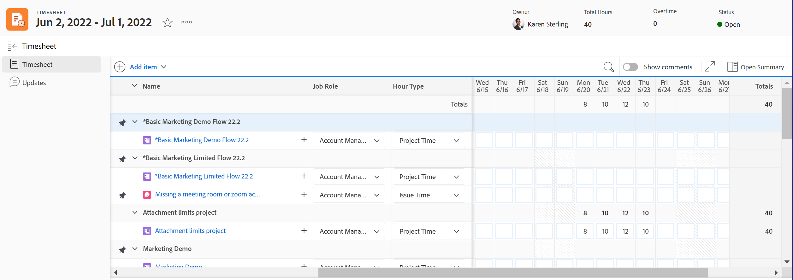

The following are the areas of a timesheet:

* [Timesheet header](#timesheet-header)
* [The left panel](#the-left-panel)
* [Work items](#work-items)
* [Toolbar](#toolbar)
* [Timesheet footer](#timesheet-footer)
* [Job role](#job-role)
* [Hour Type](#hour-type)
* [Updates area in the left panel](#updates-area-in-the-left-panel)
* [Summary panel](#summary-panel)
* [Time frame and hour-entry area](#time-frame-and-hour-entry-area)
* [Hour entry comments](#hour-entry-comments)
* [Hours](#hours)
* [Totals](#totals)

## Timesheet header

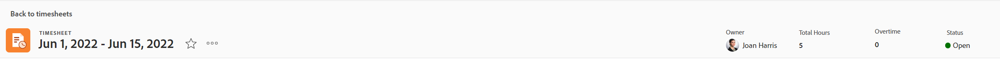

The timesheet header includes the following information:

* The time frame of the timesheet.
* The Actions area that includes the following:
    * A star icon to add the timesheets to your list of Favorites.
    * The More icon with a Delete option that allows you to delete the timesheet.
* The name of the timesheet's owner.
* The Total Hours number for hours logged for items displayed in the timesheet.
* The number of overtime hours. This is a manual entry and it is visible only when the **Overtime** setting is enabled on a timesheet. For more information, see [Edit timesheet information](../create-and-manage-timesheets/edit-timesheets.md).

>[!TIP]
>
>You cannot log a larger number of overtime hours than the current total hours on the timesheet. For example, if you logged 7 hours on the timesheet so far, you cannot log 8 hours of overtime.

* The timesheet status.

## The left panel

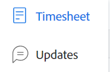

You can access the following sections in the left panel:

* **Timesheet**: Displays the actual timesheet.
* **Updates**: Displays comments and system updates for the timesheet. For more information, see the [Updates area in the left panel](#updates-area-in-the-left-panel) section in this article.

## Work items

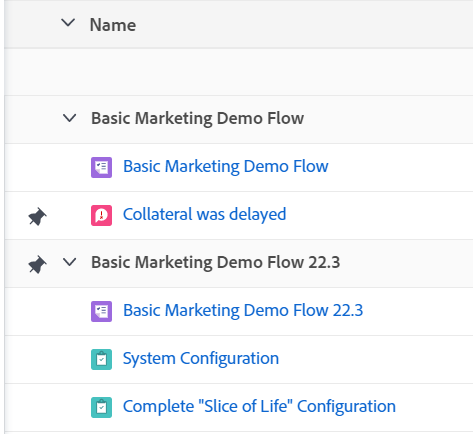

The work items are the projects, tasks and issues that you want to log time for. Clicking the downward-pointing arrow in the header row collapses the projects and the tasks and issues listed underneath. Clicking the downward-pointing arrow next to a project's name collapses the work items for that project.

Tasks, issues, and projects where time is recorded outside the timesheet or items planned during the timeframe of the timesheet appear here automatically.

## Toolbar

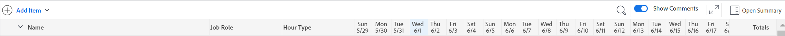

The toolbar includes the following options:

* The **Add item** button that allows you to add projects, tasks, or issues.
* The quick filter icon to search for tasks or issues in the timesheet.
* The **Show Comments** setting that allows you to view or hide hour comments that are logged for project, task, or issue hour entries.
* The full screen icon to display the timesheet in full-screen mode.
* The **Open Summary** (or **Close Summary**) button to open or close the Summary panel to see additional information for tasks or issues. This button is not available for projects.

For more information, see [Log time](../create-and-manage-timesheets/log-time.md).

## Timesheet footer

You can click the **Submit for Approval**, **Close**, **Approve**, and **Reject** buttons in this area to close or reject a timesheet approval.

This area also contains information about when the timesheet was last saved. All changes you make to information in the timesheet are automatically saved.

## Job Role

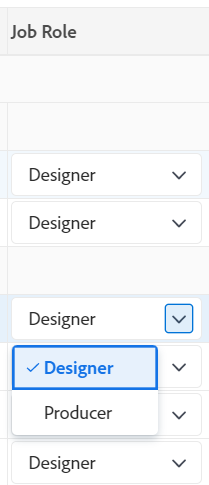

You can select a different job role to associate with the hour entries. Your Workfront administrator must enable the **Assign job roles to hour entries** setting manually. The job role specified for you when you are assigned to the task or the issue displays by default. If you are not assigned a job role on the task or the issue, your Primary Role displays as the default. For more information, see [Configure timesheet and hour preferences](../../administration-and-setup/set-up-workfront/configure-timesheets-schedules/timesheet-and-hour-preferences.md).

You can log multiple hour entries for the same work item for different roles. For more information, see [Log time](../create-and-manage-timesheets/log-time.md).

## Hour Type

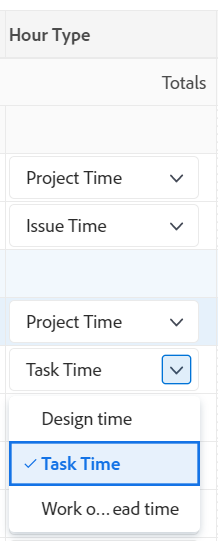

You can select different hour types to associate with your hour entries on each item. This field displays only when the Workfront administrator enables it for your environment. For information, see [Configure timesheet and hour preferences](../../administration-and-setup/set-up-workfront/configure-timesheets-schedules/timesheet-and-hour-preferences.md).

You can log multiple hour entries for the same work item for different hour types. For more information, see [Log time](../create-and-manage-timesheets/log-time.md).

## Updates area in the left panel

Example in the Preview environment:
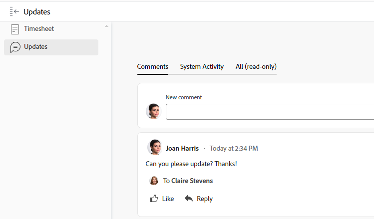

Example in the Production environment:
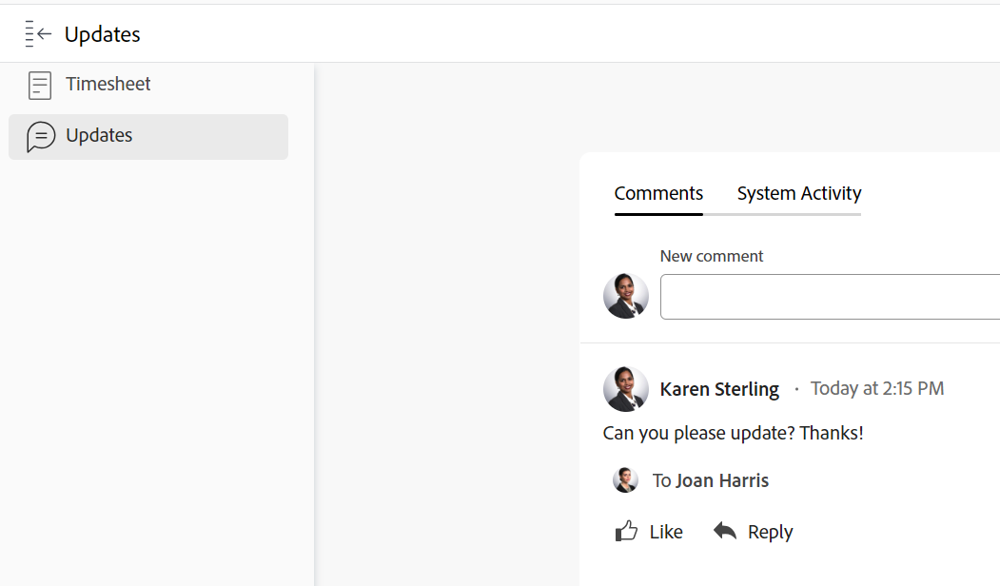

You can make comments on a timesheet to communicate with your timesheet approvers or other users in the Updates section in the left panel of the timesheet.

Any comments made on the timesheet display in this area.

## Summary panel

Example in the Preview environment:
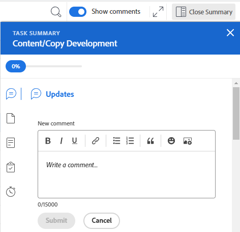

Example in the Production environment:
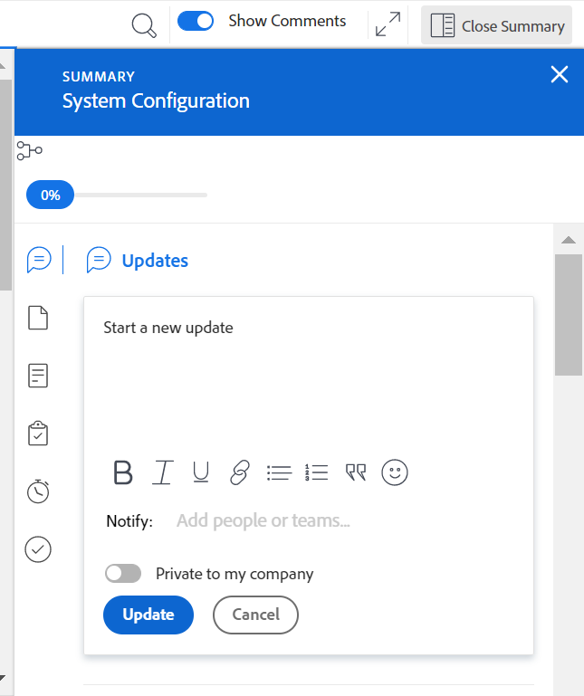

You can access the Summary panel for tasks or issues displayed in a timesheet. From here, you can comment on tasks and issues, or update their information. For more information, see [Summary overview](../../workfront-basics/the-new-workfront-experience/summary-overview.md).

The comments you enter for work items in the timesheet Summary panel display in the Updates area of the task or the issue. The Summary panel is not available for projects.

## Time frame and hour-entry area

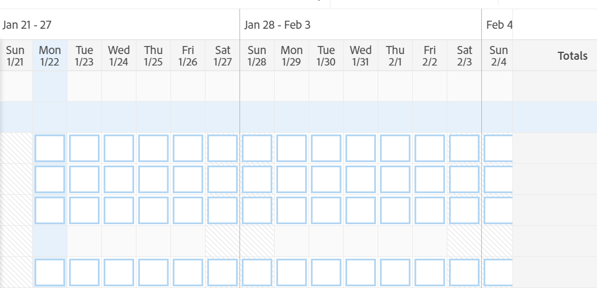

The time frame of the timesheet displays to the right of the work items. 

You can create timesheets for one, two, or four weeks. 
 
The time frame displays in full-week increments. Days outside of the specified timesheet time frame are dimmed. You cannot log time for days that are outside of the timesheet's time frame. 

For information, see [Create a single-use timesheet](../create-and-manage-timesheets/create-tmshts.md) or [Create, edit, and assign timesheet profiles](../create-and-manage-timesheets/create-timesheet-profiles.md). 

<!--drafted for the resize columns in timesheets story - make this blurb a TIP when the story is released: 
You can resize the columns that display different weeks, the time frame, or the work item areas by dragging and dropping the vertical lines that separate them.-->

## Hour entry comments

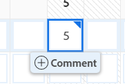

You can add a comment for every hour entry that you add to your timesheet.

The comments you enter in the hour entry comment box display in the timesheet, under each work item where you logged the time when the **Show Comments** setting is enabled in the toolbar.

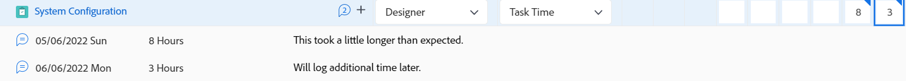

## Hours

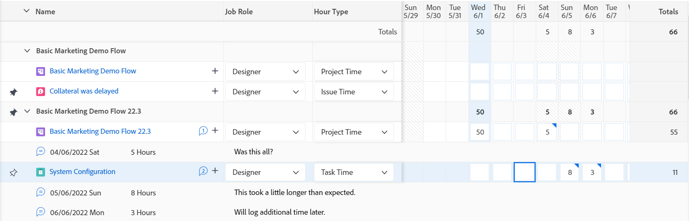

The timesheet provides input fields for each work item and day of the timesheet range to record time spent working on the item. As you are logging time, the item that you log time for highlights in light blue and the hour box is outlined in dark blue.

## Totals

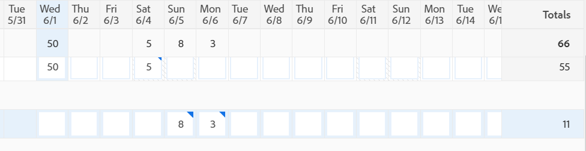

Review the sum of all hours entered on the timesheet, summarized by day (in the header of the timesheet) as well as by object (in the last column).
