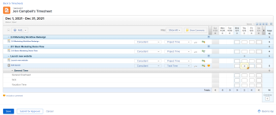
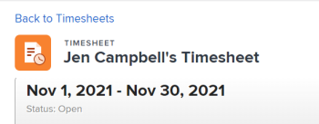
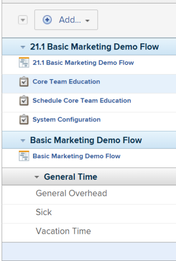
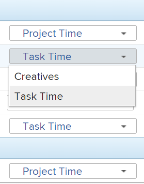
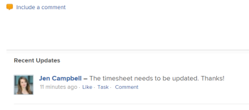
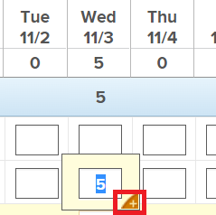
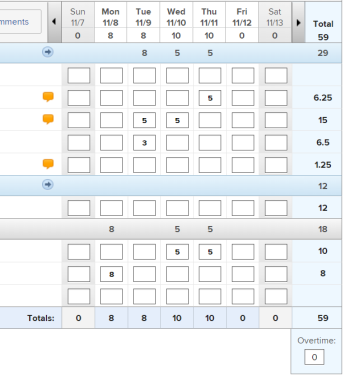
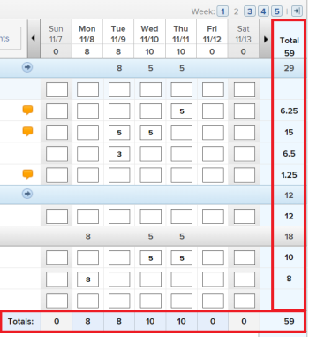

# Understand the Timesheet layout

The highlighted information on this page refers to functionality not yet generally available. It is available only in the Preview Sandbox environment.

This article describes the layout of timesheets in Adobe Workfront, allowing you to better understand how to customize and utilize timesheets to record time.&nbsp;

Timesheet and Hour Preferences control what appears on a timesheet. This provides an overview of all available options.&nbsp;For information, see [Configure timesheet and hour preferences](../../administration-and-setup/set-up-workfront/configure-timesheets-schedules/timesheet-and-hour-preferences.md).

For information about how to log time on a time sheet, see [Log time](../../timesheets/create-and-manage-timesheets/log-time.md).

<!--
<span style="color: #ff1493;" data-mc-conditions="QuicksilverOrClassic.Draft mode"> ***first shot - make it classic only at release and draft it; the changes of the new UI affect both classic and NWE; delete the first shot after a while ****the second shot stays yellow for now and always NWE</span>
-->



## Title

<!--
<p style="color: #ff1493;" data-mc-conditions="QuicksilverOrClassic.Draft mode">Above - make the second shot NWE only and keep yellow; make the first one classic only</p>
-->



Identifies the start and end dates of the timesheet and includes the status of the timesheet.&nbsp;

## Work items



The work items are the projects, tasks and issues that you want to log time for. Clicking the blue header row collapses the projects and the tasks and issues listed underneath.

Tasks, issues, and projects where time is recorded outside the timesheet or items planned during the timeframe of the timesheet appear here automatically.

## Toolbar


Using the toolbar you can add work items to the timesheet, filter, the timesheet, and show hour entry comments. You can also navigate between weeks within the timesheet, if it contains more than one week.

For more information, see the [Timesheet](../../timesheets/create-and-manage-timesheets/log-time.md#timesheet) section in [Log time](../../timesheets/create-and-manage-timesheets/log-time.md).

## Footer


You can use the Save, Save + Close, Submit for Approval, Cancel and Back to top buttons in this area to either save, recall, reopen the timesheet, or to navigate back to the top of the timesheet. This area remains sticky as you scroll vertically within the timesheet. For more information, see the [Timesheet](../../timesheets/create-and-manage-timesheets/log-time.md#timesheet) section in [Log time](../../timesheets/create-and-manage-timesheets/log-time.md).

## Job&nbsp;Roles


You can select a different job role to associate with the hour entries. Your Workfront administrator must enable the **Assign job roles to hour entries manually** setting. The job role specified for you when you are assigned to the task or the issue displays by default. If you are not assigned a job role on the task or the issue, your Primary Role displays as the default. For more information, see the article [Configure timesheet and hour preferences](../../administration-and-setup/set-up-workfront/configure-timesheets-schedules/timesheet-and-hour-preferences.md).

You can log multiple hour entries for the same work item for different roles.&nbsp;For more information, see [Log time](../../timesheets/create-and-manage-timesheets/log-time.md).

## Hour Type



You can select different hour types to associate with your hour entries on each item. This field displays only when the Workfront administrator enables it for your environment. For information, see [Configure timesheet and hour preferences](../../administration-and-setup/set-up-workfront/configure-timesheets-schedules/timesheet-and-hour-preferences.md).

You can log multiple hour entries for the same work item for different hour types.&nbsp;For more information, see [Log time](../../timesheets/create-and-manage-timesheets/log-time.md).

## Expenses


You can add expenses to tasks from the timesheet. Your Workfront administrator must enable the Add expenses from a timesheet setting in the Timesheets and Hours Preferences area.&nbsp;For information, see [Configure timesheet and hour preferences](../../administration-and-setup/set-up-workfront/configure-timesheets-schedules/timesheet-and-hour-preferences.md).

## Timesheet comments

You can make comments on a timesheet to communicate with your timesheet approvers or other users.



Any comments made on the timesheet display in this area, at the bottom of the timesheet. ```This area displays under the timesheet and above the timesheet's footer.``` For more information, see [View and manage comments on a timesheet](../../timesheets/create-and-manage-timesheets/view-and-manage-comments-timesheets.md).

## Work item comments


You can comment on individual tasks or issues displayed in a timesheet. You cannot comment on projects.

The comments you enter in the timesheet display in the Updates area of the task or the issue.

You cannot comment on projects or General Time hour entries.

For more information, see [View and manage comments on a timesheet](../../timesheets/create-and-manage-timesheets/view-and-manage-comments-timesheets.md).

## Hour entry comments



You can add a comment for every hour entry that you add to your timesheet.

The comments you enter in the hour entry comment box display in the timesheet, under each work item where you logged the time.


You must click Show Comments in the toolbar to display hour entry comments under work items.

## Hours



The timesheet provides input fields for each task item and day of the timesheet range to record time spent working on the item.&nbsp;You can also input any overtime hours or general hours in this area.

>[!NOTE]
>
>The creator of the timesheet or of the timesheet profile associated with you must disable the Hide overtime setting for the Overtime field to display in the timesheet.&nbsp;For more information, see the following articles:
>
>* [Create a single-use timesheet](../../timesheets/create-and-manage-timesheets/create-tmshts.md) 
>* [Create, edit, and assign timesheet profiles](../../timesheets/create-and-manage-timesheets/create-timesheet-profiles.md) 
>

## Totals



Review the sum of all hours entered on the timesheet, summarized by day as well as by object.
