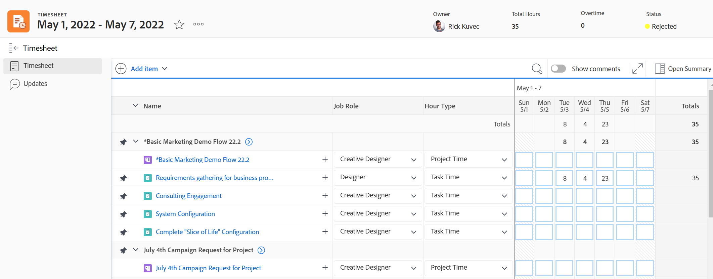

# Timesheets overview

You can use timesheets to track the time that you spend on work in Adobe Workfront.

As a Workfront or group administrator, you can create timesheets and associate them with your users. For information about creating timesheets, see [Create and manage timesheets](../create-and-manage-timesheets/create-and-manage-timesheets.md). 

A timesheet is a grid-like table that displays work items and a calendar area. You can log time for items and associate it with the day in which the work was preformed. This tracks your actual work time in Workfront. There is also an area in the timesheet where you can log time for non-work-related items, like meetings, training, or time away from the office. 

For information about the timesheet layout in Adobe Workfront, see [Understand the Timesheet layout](../../timesheets/timesheets/timesheet-layout.md).

You can log time in Workfront in a variety of ways, usually at the level of the project, task, or issue where the work is performed. The time logged against tasks, issues, and projects also displays in your timesheet.

You can also log time for non-project work, under General Hours. General hour time can be recorded only in your timesheet.

For more information about where you can log time in Workfront, see [Log time](../../timesheets/create-and-manage-timesheets/log-time.md).

>[!TIP]
>
>The Workfront mobile app also allows you to post updates, change logged time, enter comments, and close your timesheet.

## Access requirements

You must have the following to perform the steps in this article:

<table style="table-layout:auto"> 
 <col> 
 <col> 
 <tbody> 
  <tr> 
   <td role="rowheader">Adobe Workfront plan</td> 
   <td> 
Any
 </td> 
  </tr> 
  <tr> 
   <td role="rowheader">Adobe Workfront license</td> 
   <td> 
Plan 
 </td> 
  </tr> 
  <tr> 
   <td role="rowheader">Access level configurations*</td> 
   <td> 
You must have administrative access to Timesheets. 
 
For more information, see <a href="../../administration-and-setup/add-users/configure-and-grant-access/grant-users-admin-access-certain-areas.md" class="MCXref xref">Grant users administrative access to certain areas</a>.
 
<b>NOTE</b>
   
   If you still don't have access, ask your Workfront administrator if they set additional restrictions in your access level. For information on how a Workfront administrator can modify your access level, see <a href="../../administration-and-setup/add-users/configure-and-grant-access/create-modify-access-levels.md" class="MCXref xref">Create or modify custom access levels</a>.
 </td> 
  </tr> 
 </tbody> 
</table>

&#42;To find out what plan, license type, or access you have, contact your Workfront administrator.

## Understand project time vs non-project time

Timesheets provide users with a simple way to track time for both project and non-project work:

* **Project Time:** Directly from the task or project where you want to track the time.

  Hours recorded toward tasks, issues, and projects through a timesheet become associated with the respective work items to provide an accurate representation of effort spent on projects and tasks. Without accurate time entry, your data might  not be accurate  if intended for billing purposes.

  Additionally, when a resource records hours directly on tasks, issues and projects automatically appear when the user accesses the timesheet. This is assuming the timesheet date range spans the dates the hours were recorded.

* **Non-Project Time:** Directly on the user timesheet. For more information about how to track time in Workfront, see   [Log time](../../timesheets/create-and-manage-timesheets/log-time.md).

  On a timesheet, a resource can record vacation hours, sick hours, hours spent in transit, hours spent repairing or maintaining equipment, or whatever general overhead hour types you wish to create.

## Access timesheets in the Timesheets area

For information about all areas of Workfront where you can log time, see [Log time](../../timesheets/create-and-manage-timesheets/log-time.md).

To access a timesheet: 

1. Click the **Main Menu** icon  in the upper-right corner, or the **Main Menu** icon  in the upper-left corner of Workfront, if available, then click Timesheets. 

    The Timesheets area displays and all timesheets that belong to you or you have access to view display, by default. 

    

1. Click one of the following options in the upper-right corner to display a limited number of timesheets: 

    * **My Timesheets** to display only your timesheets. 

    

    * **My Timesheet Approvals** to display only timesheets you approve. 

      

    A filtered list of timesheets displays.

1. (Optional) Update the view, filter, and grouping at the top of the list of timesheets. For more information, see [Reporting elements: filters, views, and groupings](../../reports-and-dashboards/reports/reporting-elements/reporting-elements-overview.md). 

1. Click the **Date Range** of a timesheet to open it. 
  
    Each timesheet displays all tasks, issues, and projects that you have logged time for. A timesheet also displays  up to 45 tasks, issues, or projects that are assigned to you with dates within the timesheet's time frame, but for which you might not have logged time yet.
    
    For more information, see [Configure timesheet and hour preferences](../../administration-and-setup/set-up-workfront/configure-timesheets-schedules/timesheet-and-hour-preferences.md). 

  
