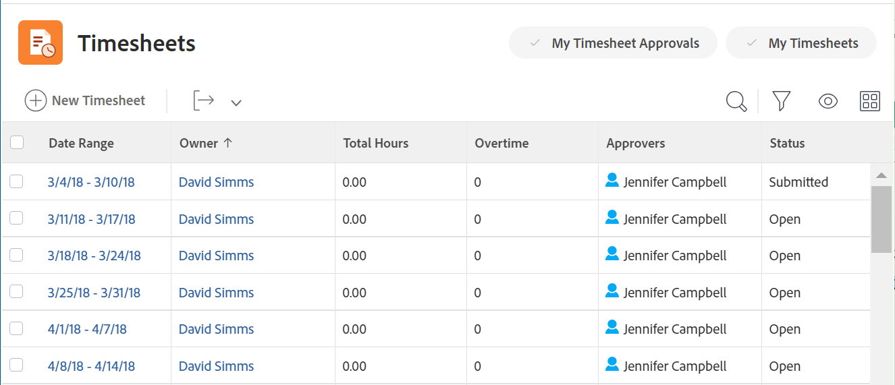
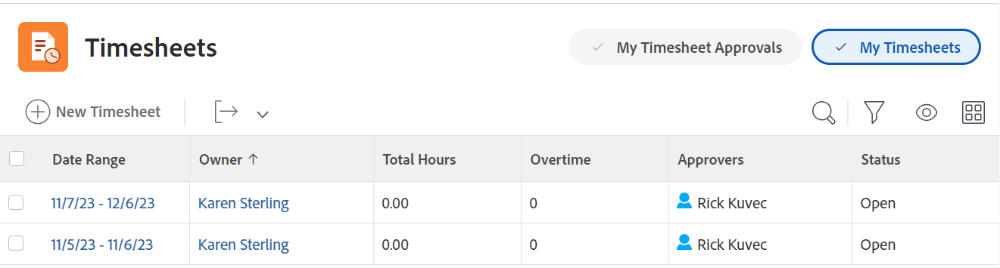
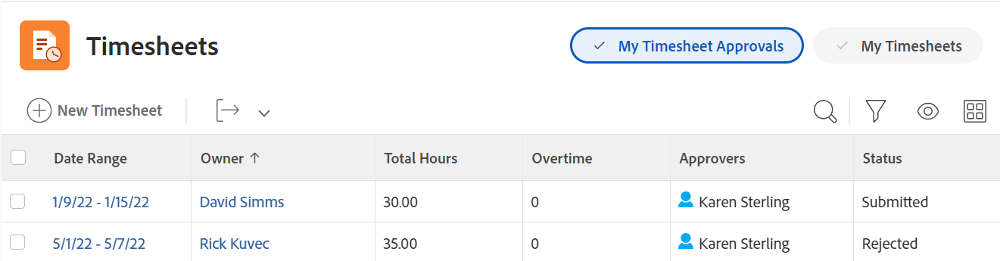

# Timesheets overview

You can use timesheets to track the time that you spend on work, both inside and outside, of Adobe Workfront.

You can log project time on work items, such as projects, tasks, and issues. Time logged on tasks, issues, and projects automatically displays in your timesheet.

You can also log non-project time for non-work related items like meetings, trainings, or time away from the office directly on your timesheet under General Hours.

For more detailed information about how to log time in Workfront, see [Log time](../../timesheets/create-and-manage-timesheets/log-time.md).

>[!TIP]
>
>If you are a Workfront or group administrator, you can create timesheets and associate them with your users. For information about creating timesheets, see [Create and manage timesheets: article index](../create-and-manage-timesheets/create-and-manage-timesheets.md). 

## Understand project time vs non-project time

Timesheets provide users with a simple way to track time for both project and non-project work:

* **Project Time:** Directly from the task or project where you want to track the time.

  Hours recorded toward tasks, issues, and projects through a timesheet become associated with the respective work items to provide an accurate representation of effort spent on projects and tasks. Without accurate time entry, your data might not be accurate  if intended for billing purposes.

  Additionally, when a resource records hours directly on tasks, issues and projects automatically appear when the user accesses the timesheet. This is assuming the timesheet date range spans the dates the hours were recorded.

* **Non-Project Time:** Directly on the user timesheet. For more information about how to track time in Workfront, see   [Log time](../../timesheets/create-and-manage-timesheets/log-time.md).

  On a timesheet, you can record vacation hours, sick hours, hours spent in transit, hours spent repairing or maintaining equipment, or whatever general overhead hour types you wish to create.

## Access timesheets in the Timesheets area

The timesheets area is available by default to all users. Workfront administrators can change this in the layout template as needed. For more information, see [Customize the Main Menu using a layout template](/help/quicksilver/administration-and-setup/customize-workfront/use-layout-templates/customize-main-menu.md).

To access a timesheet: 

{{step1-to-timesheets}}

  All of your timesheets as well as timesheets you have access to display by default. For information about the timesheet layout in Adobe Workfront, see [Timesheet layout overview](../../timesheets/timesheets/timesheet-layout.md).

  

1. Click one of the following options in the upper-right corner to display your timesheets: 

    * **My Timesheets** to display only your timesheets. 

    

    * **My Timesheet Approvals** to display only timesheets you approve. 

      

1. (Optional) Update the view, filter, and grouping at the top of the list of timesheets. For more information, see [Reporting elements: filters, views, and groupings](../../reports-and-dashboards/reports/reporting-elements/reporting-elements-overview.md). 

1. Click the **Date Range** of a timesheet to open it. 
  
    Each timesheet displays all tasks, issues, and projects that you have logged time for. A timesheet also displays  up to 45 tasks, issues, or projects that are assigned to you with dates within the timesheet's time frame, but for which you might not have logged time yet.
    
    For more information, see [Configure timesheet and hour preferences](../../administration-and-setup/set-up-workfront/configure-timesheets-schedules/timesheet-and-hour-preferences.md). 
