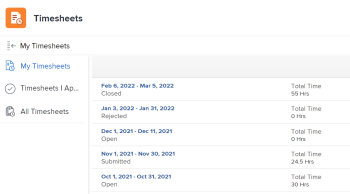
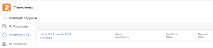
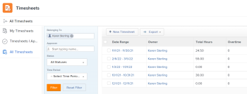
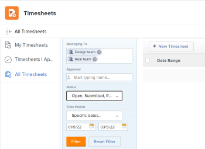

# Timesheets overview

The highlighted information on this page refers to functionality not yet generally available. It is available only in the Preview Sandbox environment.

You can use timesheets to track the time that you spend on work.

You can log&nbsp;time in Adobe Workfront in a variety of ways, usually at the level of the project, task, or issue where the work is performed. The time logged against tasks, issues, and projects also displays in your timesheet.

You can also log time for non-project work, under General Hours. General hour time can be recorded only in your timesheet.

For more information about logging time in Workfront, see [Log time](../../timesheets/create-and-manage-timesheets/log-time.md).

>[!NOTE]
>
>The Workfront mobile app also allows you to post updates, change logged time, enter comments, and close your timesheet.

## Understand project time vs non-project time

Timesheets provide users with a simple way to track time for both project and non-project work:

* **Project Time:** Directly from the task or project where you want to track the time.

  Hours recorded toward tasks, issues, and projects through a timesheet become associated with the respective work items to provide an accurate representation of effort spent on projects and tasks. Without accurate time entry, your data might&nbsp;not be accurate&nbsp;if intended for billing purposes.

  Additionally, when a resource records hours directly on tasks, issues and projects automatically appear when the user accesses the timesheet. This is assuming the timesheet date range spans the dates the hours were recorded.

* **Non-Project Time:** Directly on the user timesheet. For more information about how to track time in Workfront, see&nbsp; [Log time](../../timesheets/create-and-manage-timesheets/log-time.md).

  On a timesheet, a resource can record vacation hours, sick hours, hours spent in transit, hours spent repairing or maintaining equipment, or whatever general overhead hour types you wish to create.

## Understand where you can log time

The Timesheets area provides access to three different timesheet management&nbsp;areas. Each timesheet&nbsp;displays all tasks,&nbsp;issues, and projects that you have logged time for. A timesheet also displays&nbsp;up to 45 tasks, issues, or projects that are assigned to you with dates within the timesheet's time frame, but for which you might not have logged time yet.

You can track time in Workfront by accessing timesheets from the following locations:

* The My Timesheets section in the Timesheets area

  &nbsp;

    

  <!--
  <p>Depending on where you access timesheets from:</p>
  <ul>
  <li> <p>In the Production environment, in the My Timesheets section: </p> <p>  </p> </li>
  </ul>
  -->

    <!--  
    <p>In the Preview environment, when selecting the My&nbsp;Timesheets filter: </p>  
    <p>  </p>  
    -->

* The Timesheets I Approve section in the Timesheets area

    

  <!--
  <p>Depending on where you access timesheets from:</p>
  <ul>
  <li> <p>In the Production environment, in the Timesheets I Approve section: </p> <p>  </p> </li>
  </ul>
  -->

    <!--  
    <p>In the Preview environment, when selecting the My&nbsp;Timesheet Approvals filter: </p>  
    <p>  </p>  
    -->

* The All&nbsp;Timesheets section in the Timesheets area

    

  <!--
  <p>Depending on where you access timesheets from:</p>
  <ul>
  <li> <p>In the Production environment, in the Timesheets I Approve section: </p> <p>  </p> </li>
  </ul>
  -->

    <!--  
    <p>In the Preview environment, when selecting the My&nbsp;Timesheet Approvals filter: </p>  
    <p>  </p>  
    -->

``` ```**Tip: **`````` By default, timesheets in the **All Timesheets** tab are not displayed. However, the filter area on the left side of the page is&nbsp;pre-populated&nbsp;to display all timesheets associated with the teams that you are part of. Do one of the following to display timesheets:

* Click **Filter**&nbsp;to display all timesheets assigned to people in your teams.
* Modify any filter options, then click **Filter.**
* Click **Reset Filter,**&nbsp;then manually specify any filter options, then click&nbsp;**Filter**.

  

