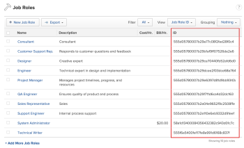

# Access Project Allocation Information via the API

You can use a URL call to access the&nbsp;allocation information for a project that is available when scheduling resources in Adobe Workfront. (For more information about user allocations, see [Manage user allocations in the Scheduling areas](../../resource-mgmt/resource-scheduling/manage-allocations-scheduling-areas.md).)

Accessing&nbsp;allocation information in this way enables you to get information about the number of hours planned over a time period based on a specific&nbsp;user, role, or team. This information is helpful when budgeting for a project or validating forecasted&nbsp;revenue.

>[!NOTE]
>
>Allocation information is not currently available in the API layer; rather, this information is accessible as an API call via the browser URL. In a future release, allocation information will be accessible via the API layer.

## Requesting Information

The information returned in your request depends upon the criteria you specify in the request. Some criteria is required.

Before requesting information as described in the following sections, you must first log in to the Workfront site&nbsp;via your browser.&nbsp;

### Required Criteria

You must include&nbsp;the following criteria in your request:

`Protocol and Workfront IP Address:` Specify the protocol (http://) followed by&nbsp;the IP address of your Workfront instance.&nbsp;

For example:
<pre>https://<em>domain</em>.my.workfront.com/contourData</pre>`Project (Required):`&nbsp;Specify a specific project for which you want to receive information.

In the following example URL, the project information is bolded&nbsp;and the URL is segmented for easier&nbsp;readability:
<pre>https://<em>domain</em>.my.workfront.com/contourData? projectID=594befbd00003bb93e21c2556cc538d1& rangeStartDate=2017-06-21T00:00:00-06:00& rangeEndDate=2017-07-06T23:59:59-06:00& userID=5935957b00003ad144e2a60c7fa89e65</pre>`Date range (Required):`&nbsp;Specify a date range that represents the time period for which you want information to include.

In the following example URL, the date&nbsp;range is bolded&nbsp;and the URL is segmented for easier&nbsp;readability::
<pre>https://<em>domain</em>.my.workfront.com/contourData? projectID=594befbd00003bb93e21c2556cc538d1& rangeStartDate=2017-06-21T00:00:00-06:00& rangeEndDate=2017-07-06T23:59:59-06:00& userID=5935957b00003ad144e2a60c7fa89e65</pre>

### Optional Criteria

You can choose to refine your request by specifying&nbsp;either a user, role, or team. You can choose only one of the following options. If you choose not to refine your search by any of the following options, the request returns a summary for the entire project within the specified date range.

`User (Optional):`&nbsp;Specify the User ID for&nbsp;the user whose allocation information you want returned. Allocation information is returned only for tasks that the user that you specify is assigned to.

In the following example URL, the user&nbsp;information is bolded&nbsp;and the URL is segmented for easier&nbsp;readability:
<pre>https://<em>domain</em>.my.workfront.com/contourData? projectID=594befbd00003bb93e21c2556cc538d1& rangeStartDate=2017-06-21T00:00:00-06:00& rangeEndDate=2017-07-06T23:59:59-06:00& userID=5935957b00003ad144e2a60c7fa89e65</pre>To access a user's User ID:

1. Go to the profile page of the user whose ID you want to access.   
   The User ID is located as the last portion&nbsp;of the URL.

`Role (Optional)`: Specify the specific role for which you want allocation information to be returned. Allocation information is returned only for tasks assigned to the role that you specify.  
Only those tasks that are assigned only to a role are returned in the request. Tasks that are assigned to a role and to a user are not returned.

In the following example URL, the role&nbsp;information is bolded&nbsp;and the URL is segmented for easier&nbsp;readability:
<pre>https://<em>domain</em>.my.workfront.com/contourData? projectID=594befbd00003bb93e21c2556cc538d1& rangeStartDate=2017-06-21T00:00:00-06:00& rangeEndDate=2017-07-06T23:59:59-06:00& roleID=555d05780007b29a77c08f2fad28f0c4</pre>To access the Role ID:

1. Go to the Job Roles page in the Setup area.
1. Create a custom view that includes the Role ID field.
1. On the Job Roles page, select the new custom view from the `Views` drop-down menu.  
   The Role ID of each job role is displayed in the Role ID column.  
   

`Team (Optional):`&nbsp;Specify the specific team&nbsp;for which you want allocation information to be returned. Allocation information is returned only for the team&nbsp;you specify.&nbsp;&nbsp;

In the following example URL, the team&nbsp;information is bolded&nbsp;and the URL is segmented for easier&nbsp;readability:
<pre>https://<em>domain</em>.my.workfront.com/contourData? projectID=594befbd00003bb93e21c2556cc538d1& rangeStartDate=2017-06-21T00:00:00-06:00& rangeEndDate=2017-07-06T23:59:59-06:00& teamID=55a7caa4000659cf9d56ed9464b9ca91</pre>To access the Team ID:

1. In the People area, click the Team tab, then select the team whose ID you want to access from the drop-down menu.  
   The Team&nbsp;ID is located as the last portion&nbsp;of the URL.&nbsp;

### Example Request

<pre>https://<em>domain</em>.my.workfront.com/contourData?projectID=594befbd00003bb93e21c2556cc538d1&rangeStartDate=2017-06-21T00:00:00-06:00&rangeEndDate=2017-07-06T23:59:59-06:00&userID=5935957b00003ad144e2a60c7fa89e65</pre>

## Understanding What Information Is Returned

When you request allocation information for a project, the following information is returned:

`Total Cost:` The total cost returned based on the criteria of the request

`Total Hours:` The total hours returned based on the criteria of the request.

For example:
<pre>{"data":{"totalHours":43.0,"totalCost":641.00}}</pre>&nbsp;

&nbsp;&nbsp;
