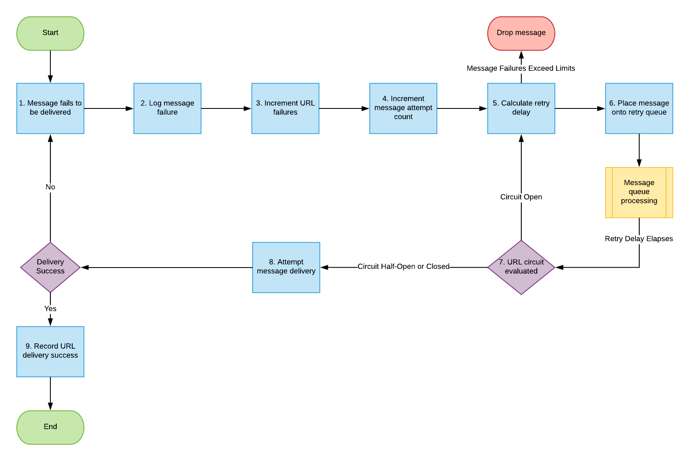

# Event subscription retries

When implementing a message delivery system there are a few caveats that must be addressed in order to ensure stability, consistency, and good user experience. One of the shortcomings of a message delivery system is ensuring messages reach their destination successfully and knowing what to do when messages fail to arrive.

Some integrations can accept failure of delivery, and then drop the message and move to the next message.  In other integrations, failure to deliver a message cannot be ignored. For example, a financial integration might attempt to deliver a message, but instead receives an HTTP status code of 404, which indicates the server could not find the endpoint to which the message was to be delivered. In such cases, a missing message could mean someone not being paid for their time or an organization going over budget on contracted resources.

## Adobe Workfront Strategy for Event Subscription Retries

Because customers leverage the Workfront platform as a core piece of their daily knowledge work, the Workfront Event Subscription framework provides a mechanism to ensure that the delivery of each message is attempted to the fullest extent possible.

Event-triggered outbound messages that fail to be delivered to customer endpoints are resent until delivery is successful for up to a period of 48 hours. During this time, retries occur at an incrementally increased frequency until delivery is successful or until 11 attempts have been made.

The formula for these retry attempts is:

 `((2^attempt) - 1) * 84800ms`

The first retry occurs after 1.5 minutes, second at almost 5 minutes, and 11th is at about 48 hours.

Customers need to ensure that any endpoints consuming outbound messages from Workfront Event Subscriptions are set up to return a 200-level response message back to Workfront when delivery is successful.

## Disabled and frozen subscription rules

* A subscription URL is **disabled** if it has a failure rate over 70% with over 100 attempts OR if it has 2,000 consecutive failures
* A subscription URL is **frozen** if it has over 2,000 consecutive failures and the last success was over 72 hours ago OR if it has 50,000 consecutive failures in any timeframe.
* A **disabled** subscription URL will continue to attempt delivery every 10 minutes and become re-enabled with a successful delivery.
* A **frozen** subscription URL will never attempt delivery unless it is manually enabled by making an API request.

<!--

## Handling Failed Event-Triggered Outbound Messages

The following flowchart shows the strategy for reattempting message deliveries with Workfront Event Subscriptions:

The following explanations correspond with the steps depicted in the flowchart:

1. Message fails to be delivered. 
1. Message delivery failure information is logged.

   All failed attempts to deliver a message are logged so that debugging may be performed to determine the root cause of a given failure or series of failures. 

1. URL failures incremented. 
1. Message attempt count is incremented. 
1. Calculate the delay until this message's delivery will be attempted again. 
1. Message is placed onto the message retry queue.

   As shown in the preceding flowchart, the message queue used for processing message delivery retries is a separate queue from the one that processes the initial delivery attempt for each message. This allows the near real-time flow of messages to continue unimpeded by the failure of any subset of messages. 

1. URL circuit status is evaluated. One of the following occurs:

   * If the circuit is open and not allowing deliveries at this time, restart the process at step 5.
   * If the circuit is half-open, this implies that our circuit is currently open, but enough time has passed to allow testing of the URL to see if the problem with delivering to it has been resolved.
   * If the message delivery attempt limits have been reached (48 hours of retrying) then the message is dropped

1. If the URL circuit is closed and allowing deliveries, attempt to deliver the message. If this delivery fails, the message will restart at step 1 

1. If the URL circuit is closed and allowing deliveries, attempt to deliver the message. If this delivery fails, the message will restart at step 1.
   -->
