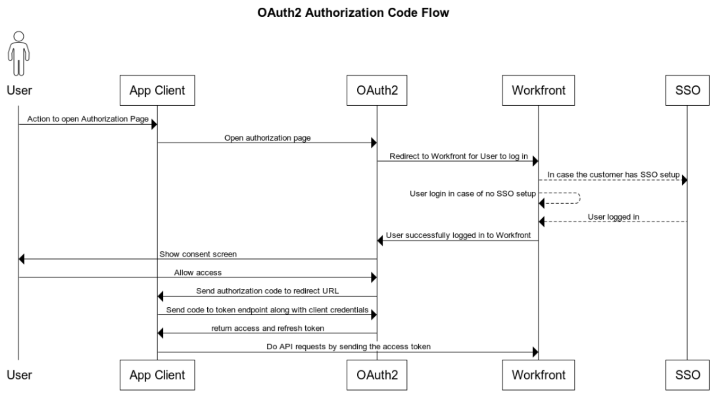
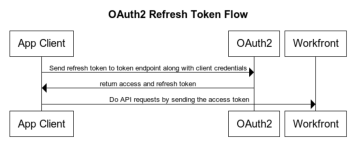

# Configure and use your organization's custom OAuth 2 applications using authorization code flow

In order to integrate with Workfront and allow your client app to communicate with Workfront on behalf of the user, you must:

* Create an OAuth2 application
* Configure the third-party application
* Link to the Authorize page for your users
* Set up Authorization Code Flow: Users log in to the Workfront instance and consent that they allow the Client application to connect to Workfront on their behalf. As a result, you get an authorization code which you will exchange with access and refresh tokens.
* Set up Refresh Token Flow: In this flow you use the refresh token to get a new access token when the old one is expired.

## Create an OAuth2 Application

For instructions on creating the OAuth2 application, see [Create an OAuth2 application using user credentials (Authorization code flow)](../../administration-and-setup/configure-integrations/create-oauth-application.md#create3) in [Create OAuth2 applications for Workfront integrations](../../administration-and-setup/configure-integrations/create-oauth-application.md)

>[!NOTE]
>
>You can have up to a total of ten OAuth2 Applications at one time.

## Link to the Authorize page for your users

Your users need to log in to authorize this integration in their own account. The page for them to authorize has a specifiic format, described here. Use this information to determine the address of the authorization page for the app, and provide your users with this address or a link to it.

* The full URL of your organization's domain. Example: 

  ```
  https://myorganization.my.workfront.com
  ```


* `client_id`: This is the client ID&nbsp;generated when you created the OAuth2 app in Workfront.

* `redirect_uri`: This is the redirect URL that you entered when creating the app. Your users will be directed to this page after they authorize the app for their account.
  
* `response_type`: This must have the value `code`.

The URL for the authorization page is therefore: 

```
https://<URL of your organization's domain>/integrations/oauth2/authorize?client_id=<Your ClientID>&redirect_uri=<Your redirect URL>&response_type=code
```

>[!NOTE]
>
>We recommend creating a button or other link that your users can click to be directed to this page.

## Configure the third-party application

The third-party application may require configuration. The following table contains information about fields that may be required when you are configuring the third-party application.

<table style="table-layout:auto"> 
 <col> 
 <col> 
 <tbody> 
  <tr> 
   <td role="rowheader">Authorization URI</td> 
   <td> <p><code>https://&lt;the full URL of your organization's domain&gt;/integrations/oauth2/authorize</code> </p> <p class="example" data-mc-autonum="<b>Example: </b>"><span class="autonumber"><span><b>Example: </b></span></span><code> https://myorganization.my.workfront.com/integrations/oauth2/authorize</code> </p> </td> 
  </tr> 
  <tr> 
   <td role="rowheader">Token URL</td> 
   <td> <p><code>https://&lt;the full URL of your organization's domain&gt;/integrations/oauth2/api/v1/token</code> </p> <p class="example" data-mc-autonum="<b>Example: </b>"><span class="autonumber"><span><b>Example: </b></span></span><code>https://myorganization.my.workfront.com/integrations/oauth2/api/v1/token</code> </p> </td> 
  </tr> 
  <tr> 
   <td role="rowheader">Scopes</td> 
   <td>You do not need to specify scopes. </td> 
  </tr> 
 </tbody> 
</table>

## Set up Authorization Code Flow



To log your users in with OAuth2, use the following process:

1. When the user opens the authorization page, it redirects to the Workfront login page, so the user can log in to Workfront. If the user has an SSO configuration, the identity provider login page will open.

   If user is already logged in to Workfront on that same browser, or the user successfully logs into Workfront, the user is redirected to the consent screen:

   

1. If the user Allows the access, the page is redirected to the `redirect_url`. The redirect must include the following query parameters:

* `code`: The authorization code which is required for getting the access/refresh token.
* `domain`: Your organization's domain. Example: in `myorganization.my.workfront.com`, the domain is `myorganization`.
* `lane`: the lane of the request. Example: in `myorganization.preview.workfront.com`, the lane is `preview`.

   >[!IMPORTANT]
   >
   >The `code` is only valid for 2 minutes. Therefore, you must get the refresh and access tokens within that time.

1. When you have a code, you can request refresh and access tokens by sending the code along with client app credentials to the `/integrations/oauth2/api/v1/token` endpoint.

   The full token request URL is 

   ```
   https://<URL of your organization's domain></span>/integrations/oauth2/api/v1/token
   ```
  
   **Examples:**  Example of CURL call to token endpoint: 

   Example 1

   ```
      curl --location --request POST '**<workfront host>**/integrations/oauth2/api/v1/token' \
      --header 'Authorization: Basic **<base64(client_id:client_secret)>**' \
      --header 'Content-Type: application/json' \
      --data-raw '{
      "code": "**<code>**",
      "grant_type": "**authorization_code**",
      "redirect_uri": "**<redirect_url>**"
      }'
   ```
   
   Example 2

   ```
      curl --location --request POST '**<workfront host>**/integrations/oauth2/api/v1/token' \
      --header 'Content-Type: application/x-www-form-urlencoded' \
      --data-urlencode 'grant_type=**authorization_code**' \
      --data-urlencode 'redirect_uri=**<redirect_url>**' \
      --data-urlencode 'code=**<code>**' \
      --data-urlencode 'client_id=**<client_id>**' \
      --data-urlencode 'client_secret=**<client_secret>**'  
   ```


   >[!IMPORTANT]
   >
   > The Client secret was generated when registering the app in Workfront. You should store it in a secure place, because it cannot be recovered if it is lost.

   When all passed parameters are correct the token endpoint returns the following payload:

   ```
   {
      "token_type": "sessionID",
      "access_token": "string", // the value of sessionID
      "refresh_token": "string",
      "expires_in": 0,
      "wid": "string"
   }
   ```
   
   The access token is the same as ```sessionID```, and it expires the same way as regular ```sessionID```

   >[!IMPORTANT]
   >
   > Store the refresh token in a secure place. You will need it to get a new refresh token when the old one is expired. Workfront does not store your refresh token.

1. Now when you have an access token you can make API calls to Workfront

   ```
   curl --request GET 'https://<workfront host>/attask/api/v14.0/proj/search \
   --header 'sessionID: <access_token>'
   ```

## Set Up Refresh Access Token



To refresh the access_token we again need to do a 'POST' call to the token endpoint. This time we send a different form data as follows:

```
curl --location --request POST '<workfront host>/integrations/oauth2/api/v1/token' \
--header 'Authorization: Basic <base64(client_id:client_secret)>' \
--header 'Content-Type: application/json' \
--data-raw '{
   "grant_type": "refresh_token",
   "refresh_token": "<refresh_token>"
}'

###### OR

curl --location --request POST '<workfront host>/integrations/oauth2/api/v1/token' \
--header 'Content-Type: application/x-www-form-urlencoded' \
--data-urlencode 'grant_type=refresh_token' \
--data-urlencode 'redirect_uri=<redirect_url>' \
--data-urlencode 'refresh_token=<refresh_token>' \
--data-urlencode 'client_id=<client_id>' \
--data-urlencode 'client_secret=<client_secret>'
```

It will return the following result:

```
{
  "token_type": "sessionID",
  "access_token": "string", // the value of sessionID
  "refresh_token": "string",
  "expires_in": 0,
  "wid": "string"
}
```

And again the access token is the `sessionID` which can be used to make an API request to Workfront.
