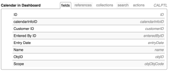

# Using the API Explorer

When using the Adobe Workfront Core API, the API Explorer is a legacy reference tool that catalogs the relationships between supported resources, parameters, and variables.

## Access the API Explorer:

1. Use a web browser to navigate to the [API Explorer](https://developer.adobe.com/workfront/api-explorer/)   
   

1. In the upper right of the API Explorer, select the desiredWorkfront **API Version**, by default the most current version is automatically selected
1. The **Filter** field, can be used to filter the objects listed by name and will truncate the list of objects displayed accordingly:

   

   * **Fields**: Available fields within the specified object.
   * **References**: Available reference variables for the specified object. A reference is an alias for a variable. Once initialized, a reference can be used interchangeably with the variable name. A reference uses initialized memory.
   * **Collections**: Available collections for the object. Collections are variables that represent a one-to-many relationship between the object and the resource.
   * **Search**: Available search resources for the object. The results of a search are based on the query parameters specified by the search resource in the API request.
   * **Actions**: Supported actions for the object. Actions can be simple or complex procedures that execute against a resource or set of resources. A given action may also affect related resources.

1. Open a tab, then click the Object ID to view applicable variables.  
     
   Depending on the object selected, the following variables may apply:  

   | Variable |Definition |
   |---|---|
   | Field Name |The name of a field used in an operation within the Workfront API. |
   | Field Type |The kind of values that can be entered into a specific field in a data table. Possible field type values include string, double, int, dateTime. |
   | Enumerated Type |The kind of values that can be used to identify a data type. |
   | Possible Values |Acceptable values for the object. |
   | Attribute Type ObjCode |Attributes that can be used to modify the object class. |
   | URL |The entry path that allows your app to communicate with the Workfront API. |
   | Arguments |The object's variables that can be passed between your application and Workfront. |
   | Result Type |Allowable data types that can be returned from a method. |
