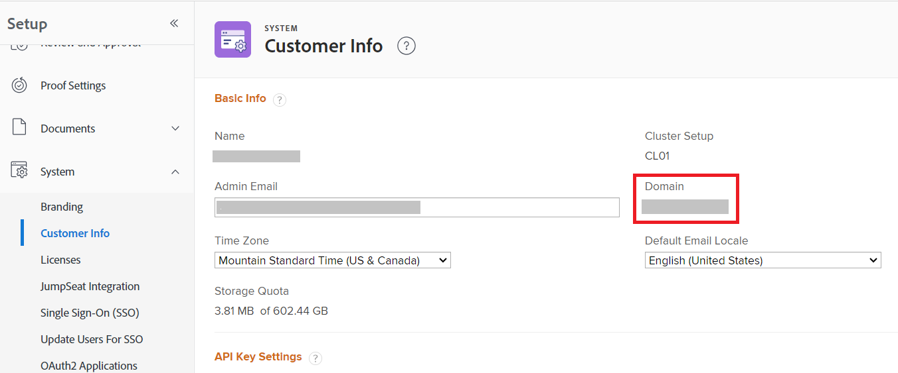

# Domain format for Adobe Workfront API calls

When you make an API call to the Workfront API, you use your organization's domain in the call. The format for this domain URL differs based on whether your organization has been onboarded to the Adobe Unified Shell.

To know whether your organization is on the Adobe Unified Shell, examine the URL that displays when you are viewing a Workfront page.

| Workfront URL begins with: | URL for API calls: |
|---|---|
|`<yourdomain>.my.workfront.com`|`<yourdomain>.my.workfront.com`|
|`experience.adobe.com`|`<yourdomain>.my.workfront.adobe.com`|

To locate your domain: 

1. Click the **[!UICONTROL Main Menu]** icon  in the upper-right corner of Adobe Workfront, or (if available), click the **[!UICONTROL Main Menu]** icon  in the upper-left corner, then click **[!UICONTROL Setup]** .
1. Select **System**, then select **Customer Info**.
   
   Your domain is listed on the right of the screen.

   