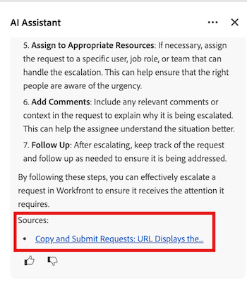

# AI Assistant prompts best practices

Workfront's AI Assistant is a powerful tool that can help you accomplish your work more effectively by offering useful information about your account data and specific object types. 

In this article, you'll learn about the current best practices for AI Assistant, including how to write clear prompts, which object types you can ask for information on, and how to access additional resources to verify information when needed.

For more information on AI Assistant, see [AI Assistant Overview](/help/quicksilver/workfront-basics/ai-assistant/ai-assistant-overview.md).

>[!NOTE]
>
>As AI Assistant's capabilities evolves, the type of requests and questions you can ask it will expand. We recommend revisiting this article as new AI Assistant capabilities are released to learn more about available prompts that you can use. 

## Object types available for AI Assistant

AI assistant can provide data for the following object types:

* Portfolios
* Programs
* Projects
* Tasks
* Issues
* Custom forms
* Users
* Workfront Planning records

>[!NOTE]
>
>You must have the necessary permission in your access level for an object before you can request its data from AI Assistant.  

## Best practices 

### Enter clear prompts

To access the most useful information from AI Assistant, it's important to create prompts that give you the response you're looking for. The following list contains principles that can help you best formulate the appropriate prompts:

* **Do use clear and specific language**: Avoiding vague and general prompts will help guide AI Assistant to the data you are trying to receive. 
* **Do include timeframes**: Giving AI Assistant specific timeframes for an object will help narrow down the data it needs to process and will result in more targeted information in its response. 
* **Do ask for only one thing at a time**: When multiple, unrelated requests are included in a single prompt, AI Assistant won't be able to provide the right information.

For information about recommended prompts, see the following section in this article: [Prompt examples](#prompt-examples).

### Verify AI Assistant responses

At this stage in AI Assistant's development, it's recommended to verify the information it provides when asking for information about Workfront processes. You can do so by clicking the article link provided in the Sources section in the prompt response.

  

 For more information on prompts for Workfront processes, see [Prompts to learn about Workfront actions](#prompts-to-learn-about-workfront-actions) in this article.

## Prompt examples

The tables below contain examples of prompts you can use to generate information about your work and learn more about specific Workfront processes or actions you'd like to do.

### Prompts to find information about your work

   <table>
    <tr>
        <td><b>Object type</b></td>
        <td><b>Prompt</b></td>
    </tr>
        <tr>
        <td>Projects</td>
        <td><em>What is the due date for [PROJECT NAME]?</em>
        </td>
    </tr>
    <tr>
        <td>Projects</td>
        <td><em>What is the status of [PROJECT NAME]?</em>
        </td>
    </tr>
    <tr>
        <td>Projects </td>
        <td><em>Who is the project owner for [PROJECT NAME]?</em></td>
    </tr>
    <tr>
        <td>Tasks</td>
        <td><em>Which tasks are assigned to me this week?</em></td>
    </tr>
       <tr>
        <td>Issues </td>
        <td><em>Which open issues are assigned to my team?</em></td>
           <tr>
        <td>Users</td>
        <td><em>Who is on the creative team for [PROJECT NAME]?</em></td>
    </tr>
           <tr>
        <td>Users </td>
        <td><em>How many tasks are assigned to [USER]?</em></td>
    </tr>
   </table>

### Prompts to learn about Workfront actions

   <table>
    <tr>
        <td><b>Object type</b></td>
        <td><b>Prompt</b></td>
    </tr>
    <tr>
        <td>Projects</td>
        <td><em>How do I create a new project from a template?</em>
        </td>
    </tr>
    <tr>
        <td>Projects </td>
        <td><em>What is the difference between a project and a program?</em></td>
    </tr>
    <tr>
        <td>Tasks</td>
        <td><em>How do I assign a task to multiple users?</em></td>
    </tr>
       <tr>
        <td>Tasks</td>
        <td><em>What does the Ready to Start status mean?</em></td>
    </tr>
       <tr>
        <td>Issues </td>
        <td><em>How do I convert a request into a task?</em></td>
    </tr>
           <tr>
        <td>Issues </td>
        <td><em>What is the lifecycle of an issue in Workfront?</em></td>
    </tr>
        </tr>
           <tr>
        <td>Issues </td>
        <td><em>How do I escalate a request?</em></td>
    </tr>
           <tr>
        <td>Documents</td>
        <td><em>How do I upload a new version of a document?</em></td>
    </tr>
           <tr>
        <td>Documents </td>
        <td><em>Can I set document approval workflows?</em></td>
    </tr>
   </table>

## Current AI Assistant limitations

AI Assistant is a powerful tool, but there are certain types of questions and requests it can't provide data for at this current stage of development. The table below contains examples of prompts that AI Assistant can't display data for. 

 <table>
    <tr>
        <td><b>Prompt type</b></td>
        <td><b>Example</b></td>
    </tr>
    <tr>
        <td>Questions about customized configurations</td>
        <td><em>What custom integration logic is running in our Workfront instance?</em>
        </td>
    </tr>
    <tr>
        <td>Questions about data outside of Workfront </td>
        <td><em>Can you show me my Outlook calendar for today?</em></td>
    </tr>
             <tr>
        <td>Questions about non-integrated Adobe products </td>
        <td><em>How do I edit a PDF in Acrobat from here?</em></td>
         <tr>
        <td>Questions that require human judgment</td>
        <td><em>Should this project be put on hold?</em></td>
    </tr>
    </tr>
       <tr>
        <td>Requests for bulk updates</td>
        <td><em>Reassign all overdue tasks for [USER].</em></td>
    </tr>
       <tr>
        <td>Requests for predictive analytics</td>
        <td><em>Suggest a new project plan based on our historical data.</em></td>
    </tr>
           <tr>
        <td>Requests for information above your access level</td>
        <td><em>List all billing rates in the account.</em></td>
    </tr>
           <tr>
        <td>Requests that contain vague information </td>
        <td><em>Fix my project.</em></td>
    </tr>
   </table>