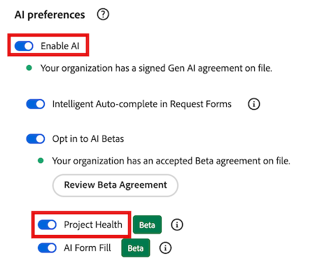
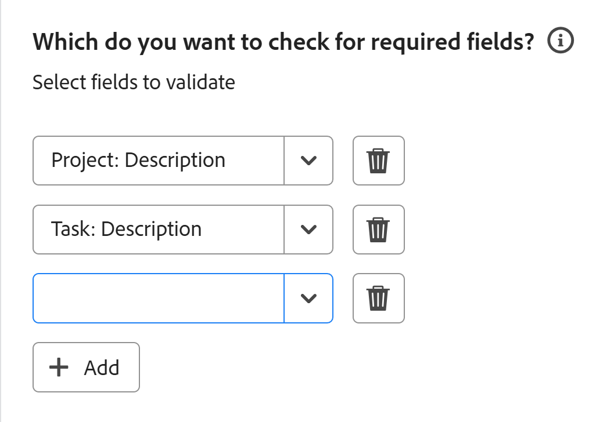
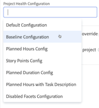
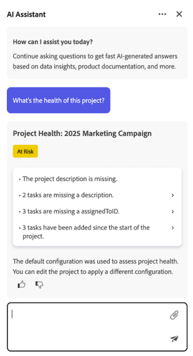
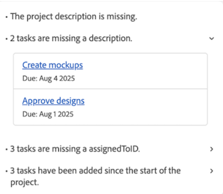
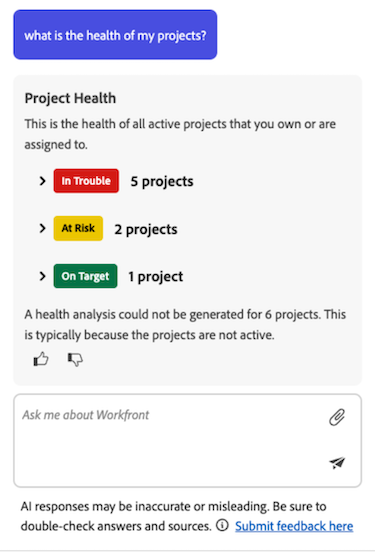

# Project Health overview

>[!IMPORTANT]
>
>The Project Health feature is currently only available for users participating in the beta stage.

Adobe Workfront's Project Health feature utilizes the power of AI Assistant to instantly give you an assessment of how your projects are performing, what areas need your attention, and how to avoid issues that can cost you time and money.  

AI Assistant can generate a Project Health assessment for the following objects: 

* A single project 
* A single program 
* Multiple projects  

For more information about AI Assistant, see [AI Assistant overview](/help/quicksilver/workfront-basics/ai-assistant/ai-assistant-overview.md).

+++ Expand to view access requirements for the functionality in this article.

 <table style="table-layout:auto"> 
<col> 
</col> 
<col> 
</col> 
<tbody> 
<tr> 
   <td role="rowheader">
Adobe Workfront package
</td> 
   <td> 

Select or higher 
 

Workflow Select or higher

   </td> 
<tr> 
 <tr> 
   <td role="rowheader">
Adobe Workfront license
</td> 
   <td> 

Standard
 
   </td> 
   </tr> 
  </tr> 
  <tr> 
   <td role="rowheader">
Access level configurations
</td> 
   <td>
You must be a System administrator to manage Project Health configurations 

   
Edit access to projects to apply Project Health configurations 

     
View access to projects to view Project Health configurations 

  </td> 
  </tr>  
    </tr>  
</tbody> 
</table> 

For more detail about the information in this table, see [Access requirements in Workfront documentation](/help/quicksilver/administration-and-setup/add-users/access-levels-and-object-permissions/access-level-requirements-in-documentation.md).
+++

## Enroll in the Project Health beta 

In order to utilize Project Health, your organization must have AI Assistant enabled.  

To enable AI Assistant and Project Health for your organization, all of the following must apply: 

* Your organization must have migrated to Adobe IMS (Identity Management System). 
* Your organization must have a Select, Prime, or Ultimate Workfront plan
* The Adobe Unified Experience must be enabled. 
* Adobe must have a signed Adobe Gen AI agreement on file.
* The Workfront administrator must enable AI Assistant for users in your organization. AI Assistant is enabled through access levels. 
* Both the Enable AI and Project Health options must be selected in the AI preferences section at Setup > System > Preferences.

    

For more information, see [AI Assistant overview](/help/quicksilver/workfront-basics/ai-assistant/ai-assistant-overview.md) and [Configure system preferences](/help/quicksilver/administration-and-setup/manage-workfront/security/configure-security-preferences.md).

## How Project Health is calculated 

AI Assistant gives you a quick assessment of a project's overall condition by assigning it one of the available Project Health states:

* On Target
* At Risk 
* In Trouble

This state is calculated using the project and program components, such as project progress, underestimated work, and more. For a full list of the components that are used to measure Project Health, see the [Project and program states list](#project-and-program-states-list) section. 

Each project component is assigned a numerical risk score that goes from (0-100), which is then averaged to create the overall Project Health state: 

* On Target (75 or higher): Project performance is within expected thresholds. 
* At Risk (50-74):  Emerging issues are detected that may impact project performance. 
* In Trouble (49 or less): Project performance is below acceptable thresholds and requires immediate attention. 

>[!NOTE]
>
>* AI Assistant currently evaluates only the selected project's data. 
>* Cross-project or historical analysis is not yet included in the Project Health calculation. 

### Examples of calculating Project Health for a project

In the first example, 4 project components are evaluated and their individual risk scores are calculated as the following: 

* 2 On Target (90 risk score) 
* 1 At Risk (45 risk score) 
* 1 In Trouble (20 risk score) 

When you average out these scores, the result is 61. Using the Project Health state criteria listed above, this puts this project in the At Risk state. 
 
In the next example, a schedule change of 1 day has occurred early in the project's timeline. In this scenario, AI Assistant evaluates both the timing and impact of the change relative to the project's overall duration: 

* A 1-day schedule shift early in a 60-day project timeline is minor and typically scored as On Target. 
* A 1-day schedule shift near a project's completion date is more disruptive and may be scored At Risk or In Trouble. 

Since the change was minor and occurred early in the project timeline, this puts the project in the On Target state. 

If multiple schedule changes occur within a project's timeline, these changes are scored and then averaged before they're applied toward the Project Health calculation. 

## Understanding the difference between project conditions and Project Health 

Project conditions and Project Health are similar concepts in Workfront and have the same default names to describe the project condition or state (On Target, At Risk, and In Trouble), but they serve different purposes.   
 
Project conditions give a basic snapshot on how a project is currently performing based only on the planned, projected, and estimated dates. It can be set manually by the project owner or automatically by Workfront based on the project's tasks. Alternatively, Project Health is more comprehensive and assesses additional factors, giving you a higher-level understanding of how it's performing.

For more on Project conditions, see [Custom conditions](/help/quicksilver/administration-and-setup/customize-workfront/create-manage-custom-conditions/custom-conditions.md). 

## Project and program states list 

The table below contains a breakdown of the available states AI Assistant will assign your project or program when generating a Project Health assessment. 

   <table>
    <tr>
        <td><b>Project State</b></td>
        <td><b>Definition</b></td>
        <td><b>Factors</b></td>
    </tr>
    <tr>
        <td>On Target</td>
        <td>This is assigned when the average risk level for the following factors falls within the healthy threshold.
        </td>
        <td> 
        <ul><li>Scope creep</li>
        <li>Missing fields</li>
        <li>Schedule changes</li>
        <li>Underestimated work</li>
        <li>Project progress</li>
        <li>Overdue tasks</li>
        <li>Budget</li>
        </ul></td>
    </tr>
    <tr>
        <td>At Risk</td>
        <td>This is assigned when the average risk level for the following factors falls just below the healthy threshold.</td>
        <td>
        <ul><li>Scope creep</li>
        <li>Missing fields</li>
        <li>Schedule changes</li>
        <li>Underestimated work</li>
        <li>Project progress</li>
        <li>Overdue tasks</li>
        <li>Budget</li>
        </ul></td>
    </tr>
    <tr>
        <td>In Trouble</td>
        <td>This is assigned when the average risk level for the following factors falls below the healthy threshold.</td>
        <td>
        <ul><li>Scope creep</li>
        <li>Missing fields</li>
        <li>Schedule changes</li>
        <li>Underestimated work</li>
        <li>Project progress</li>
        <li>Overdue tasks</li>
        <li>Budget</li>
        </ul></td>
    </tr>
    </tr>
   </table>

## AI Assistant prompts list 

Below is a list of prompts you can use to ask AI Assessment to generate a Project Health assessment for a project, program, or all projects in your account.  

   <table>
    <tr>
        <td><b>Location</b></td>
        <td><b>Prompt</b></td>
    </tr>
    <tr>
        <td>A specific project details page</td>
        <td><em>What's the health of this project?</em></td>
    </tr>
    <tr>
        <td>Any page in Workfront </td>
        <td><em>What's the health of project [PROJECT NAME]?</em></td>
    </tr>
    <tr>
        <td>Any page in Workfront </td>
        <td><em>What's the health of my projects?</em></td>
    </tr>
       <tr>
        <td>A specific program details page</td>
        <td><em>What's the health of this program?</em></td>
    </tr>
       <tr>
        <td>Any page in Workfront </td>
        <td><em>What's the health of program [PROGRAM NAME]?</em></td>
    </tr>
   </table>

## Manage Project Health configurations 

A project health configuration contains specific criteria that determines how your project health is calculated. After a configuration is created, you can then apply it to a project.  

>[!NOTE]
>
>You must be a System Administrator to manage Project Health configurations.  

{{step-1-to-setup}}

1. Click **Project Preferences** in the left panel, then select **Project Health** in the drop-down that appears.  

1. In the upper-right corner of the page, select **New Configuration**. 

1. (Optional) On the configurations details page, replace *Untitled Configuration* with a new configuration **Name**. 

1. In the **What factors would you like to include in project health** section, deselect any factor you don't want included when determining your project health criteria: 
    * **Scope creep**: How much the project scope has expanded since it started. 

    * **Required fields**: If any required fields are missing (e.g. project description). These required fields determine project completeness and are specified in the **Which fields do you want to check for completeness?** configuration section below.

    * **Schedule changes**: How many schedule changes have occurred since the project started. 

    * **Task estimation**: How accurately the task work has been estimated (e.g. no overdue tasks currently in the project).  

    * **Task burndown**: How the project work is progressing compared to the project timeline.  

    * **Overdue tasks**: How many tasks are currently past their due date.  

    * **Cost**: If the project is currently over budget.  

1. In the **When does your project officially start?** section, select the event that signals the beginning of your project from the drop-down. 

1. In the **How do you estimate the scope of work on a project?** section, select which project factor will increase as the project scope increases. 

1. In the **Which fields do you want to check for completeness?** section, select one or more fields that will be checked to determine project completeness. 

      

1. Click **Save** in the upper-right corner.

## Apply Project Health configurations 

Once an administrator has created a Project Health configuration, users with Edit access can apply it to a project.  

{{step1-to-projects}} 

1. On the **Projects** page, select a project.  

1. Click the **More** icon  to the right of the project name, then select **Edit**. The **Edit Project** side panel opens. 

1. In the left panel, select **Project Settings**.  

1. In the **Project Health Configuration** field, select the configuration you want to apply to this project. 

    

1. Click **Save** in the lower-left corner of the panel.

## Generate a Project Health assessment for a project or program

If you have View access for a project or program, you can generate its Project Health assessment using AI assistant.  

If you're generating an assessment for a project, this can be done either from the project page, or by referencing the project name when you ask the assistant how the project is performing.  

If you're generating an assessment for a program, you can do so from the program details page.  

>[!NOTE]
>
>A Project Health assessment can't be generated for a project until the project has started. You can configure which event triggers a project to begin in project settings.  

For more information, see the following section in this article: [Manage project health configurations](#manage-project-health-configurations).

1. Navigate to the project or program you want to generate a Project Health assessment for. 

1. On the project/program details page, click the **AI Assistant** icon  in the upper-right corner of the screen. AI Assistant opens.  

1. Type the following in the **Ask me about Workfront** field: *What's the health of this project?*  
 
    Or 

    Type the following in the **Ask me about Workfront** field: *What's the health of this program?*
    
    >[!NOTE]
    >
    >If you're accessing AI Assistant from a different page in Workfront, you can type *What's the health of project [PROJECT NAME]?* or *What's the health of program [PROGRAM NAME]?*  
    >For a full list of the current prompts you can enter, see the following section in this article: [AI Assistant prompts list](#ai-assistant-prompts-list). 

1. Click the **Send** icon . The Project Health assessment generates and appears in the panel. A badge appears at the top of each Project Health assessment, which reflects the project's current condition.  

    

    If you're generating an assessment for a portfolio, multiple badges will be listed showing the condition of each project in the program. For more information on the badge labels, see the following section in this article: [Project and program states list](#project-and-program-states-list). 

1. (Optional) Click one of the assessment points to expand its details. 

1. (Optional) In the expanded details mode, click the task link to open the task details. 

    
  
1. After reviewing the project health details, click the **Close** icon  in the upper-right corner of AI Assistant.  

## Generate a Project Health assessment for multiple projects

You can generate a combined Project Health assessment for all the projects you currently have View access (or higher) for. 

A project will only be included in the combined Project Health assessment if the project has started. You can configure which event triggers a project to begin in project settings. For more information, see the following section in this article: [Manage project health configurations](#manage-project-health-configurations). 
 
1. Click the **AI Assistant** icon  in the upper-right corner of the screen. AI Assistant opens.  

1. Type the following in the **Ask me about Workfront field**: *What's the health of my projects?* 

    For a full list of the current prompts you can enter, see the following section in this article: [AI Assistant prompts list](#ai-assistant-prompts-list). 

1. Click the **Send** icon . The Project Health assessment generates and appears in the panel. 

    

    When generating an assessment for multiple projects, AI Assistant groups the results based on how the projects are currently performing. 
 
1. (Optional) Click one of the project health condition badges to expand the project list, and then select a link for a specific project to go to that project's details page. 

1. After reviewing the projects' health details, click the **Close** icon  in the upper-right corner of AI Assistant to close it. 

<!--

## Build a Project Health table report in a Canvas Dashboard

>[!IMPORTANT]
>
>The Canvas Dashboards feature is currently only available for users participating in the beta stage. For more information, see [Canvas Dashboards beta information](/help/quicksilver/product-announcements/betas/canvas-dashboards-beta/canvas-dashboards-beta-information.md). 

You can add a table report to a Canvas Dashboard in order to easily visualize your Project Health data in a table format.  

### Prerequisites 

You must create a dashboard before you can build a table report. 

For more, see [Create a Canvas Dashboard](/help/quicksilver/reports-and-dashboards/canvas-dashboards/create-dashboards/create-dashboards.md).

### Build a Project Health table report 

There are many configuration options available for building a Project Health table report. In this section, we'll walk you through the process of creating one that displays the following columns: 

* **Name**: Contains the project name. 
* **Project Health Analysis**: Contains a summary of the Project Health assessment. 
* **Project Health Created At**: Contains the date/time when the Project Health assessment was last generated. 
* **Project Health Label**: Contains the project's label (e.g. On Target, At Risk, or In Trouble).

{{step1-to-dashboards}}

1. In the left panel, click **Canvas Dashboards**. 
1. In the upper-right corner, click **New Dashboard**. 
1. In the **Create dashboard** box, enter the dashboard's **Name** and **Description**. 
1. Click **Create**. 
1. In the **Add report** box, select **Create report**. 
1. On the left side, select **Table**. 
1. In the upper-right corner, click **Create report**. 
1. (Optional) Follow the steps below to configure the **Details**  section: 
    1. Enter a report **Name**. 
    1. Enter a report **Description**. 
1. Follow the steps below to configure the **Build table**  section: 
    1. In the left panel, click the **Table columns** icon. 
    1. Click **Add column**, then select **Project** > **Name**. 
    1. Click **Add column**, then select **Project** > **Project Health** > **Health Analysis**. 
    1. Click **Add column**, then select **Project** > **Project Health** > **Created At**. 
    1. Click **Add column**, then select **Project** > **Project Health** > **Health Label**. 

1. Follow the steps below to configure the **Filter**  section: 
    1. In the left panel, click the **Filter** icon. 
    1. Select **Edit filter**. 
    1. Click **Add condition** and then specify the field you want to filter by and the modifier that defines what kind of condition the field must meet. The column appears in the preview section on the right.
    1. (Optional) Click **Add filter group** to add another set of filtering criteria. The default operator between the sets is AND. Click the operator to change it to OR. 

1. Follow the steps below to configure the **Drilldown Group Settings**  section: 
    1. In the left panel, click the **Group Settings** icon. 
    1. Click the **Add grouping** button and then select the field you want to create as a grouping. The grouping column appears in the preview section on the right. 

1. Click **Save** to create the report.

-->
