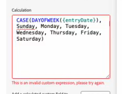

# Revise calculated field formulas with AI Assistant

You can use AI Assistant to resolve errors in your invalid custom expressions in calculated fields.

When you are creating the calculated field in the custom form builder, an error message appears under the field if the formula is invalid.

AI Assistant can help you revise your formula into a valid calculated field expression.

## Revise a calculated field expression

To revise an invalid calculated field expression:

1. Click the **AI Assistant** icon  near the upper-right corner of the screen.
1. in the prompt area near the bottom of the AI Assistant panel, enter a prompt such as:
`Rewrite this formula to remove the invalid expression error`
1. Copy the invalid expression from the custom form builder, and paste it into the prompt area.
1. Press **Enter**.

   AI Assistant may take a few moments to generate the revised formula, depending on how large or complex the formula is.
1. View the revised formula in the AI Assistant panel.
1. (Optional) Copy the revised formula from the AI Assistant panel, and paste it into the calculated field in the custom form builder.

>[!NOTE]
>
>We recommend testing the calculated field to ensure that it retrieves the expected result.

For more information on calculated fields in Workfront, see [Add calculated data to a custom form with the legacy form builder](/help/quicksilver/administration-and-setup/customize-workfront/create-manage-custom-forms/add-calculated-data-to-custom-form.md).

