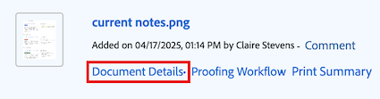
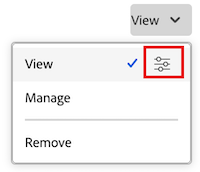
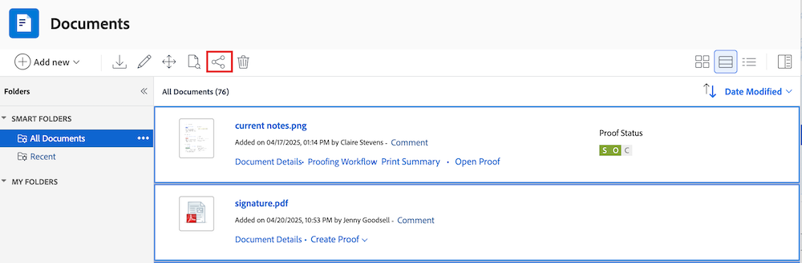

# Share a document

The Workfront administrator controls who can view or edit documents in the Access Levels area in Setup. For more information, see [Grant access to documents](../../administration-and-setup/add-users/configure-and-grant-access/grant-access-documents.md).

Users can also share documents they've uploaded or have access to, giving others permission to view or manage them.

* Permissions apply to individual items and define what actions someone can take.
* The person who uploads a document automatically gets full control (Manage permissions).
* To share an entire folder, see [Share a document folder](../../workfront-basics/grant-and-request-access-to-objects/share-a-document-folder.md).

>[!NOTE]
>
>If your Workfront instance uses Adobe Enterprise Storage, you cannot share individual documents. Instead, you grand access at the project level. Keep in mind that sharing the project can grants access to sensitive project information like finanicals depeding on the level of permission chosen. 

## Access requirements

+++ Expand to view access requirements for the functionality in this article. 

You must have the following to share objects:

<table style="table-layout:auto"> 
 <col> 
 <col> 
 <tbody> 
  <tr> 
   <td role="rowheader">Adobe Workfront plan</td> 
   <td> 
Any 
 </td> 
  </tr> 
  <tr> 
   <td role="rowheader">Adobe Workfront license</td> 
   <td> 
New: Standard
 
   Or
   
Current: Work or higher

   </td> 
  </tr> 
  <tr> 
   <td role="rowheader">Access level configurations</td> 
   <td> 
View access or higher to the objects you want to share
 </td> 
  </tr> 
  <tr> 
   <td role="rowheader">Object permissions</td> 
   <td> 
View permissions or higher to the objects you want to share
</td> 
  </tr> 
 </tbody> 
</table>

For more information, see [Access requirements in Workfront documentation](/help/quicksilver/administration-and-setup/add-users/access-levels-and-object-permissions/access-level-requirements-in-documentation.md). 

+++

## Share a document

The user who uploads a document to Workfront has Manage permissions to it, by default.

{{step1-to-documents}}

1. On the **Documents** page, hover over the document you want to share and click the **Document Details** link that appears. The **Document details** page opens.

    

1. Click the **More** icon  to the right of the document name, then click **Share**. The **Share [Document Name]** dialog box opens.

   

1. In the **Grant document access to** field, begin typing the name of the user, team, role, group, or company you want to share the document with, then click the name when it appears in the drop-down list.

   >[!TIP]
   >
   >You can only share a document with active users, teams, roles, or companies.

1. (Optional) Select the **Who has access** drop-down and select the document's access level:

   * **Only invited people can access:** Only users who are invited to the document can access it (Default).
   * **Everyone in the system can view**: All users in the system can view the document without an invitation.

1. (Optional) To make the document public, click the gear icon , then click the box in-line with **Make this public to external users**. The **Copy public link** button appears at the bottom of the dialog box.

1. Click the drop-down to the right of the user's name and select their permission level for this document:

   * **View**: User can review and share the document. 
   * **Manage**: User has full access to the document without administrative rights, which are granted at the access level (also includes all View permissions).

1. (Optional) Click the advanced options icon next to the permission level you've granted to configure specific permissions on the document.

    

1. (Optional) To turn off inherited permissions for the document's children objects, click **Turn off** inline with **Inherited permissions**. 

1. (Conditional) To copy the public link that allows you to share the document with external users, click **Copy public link**.

   >[!CAUTION]
   >
   >We recommend you use caution when sharing a document containing confidential information with external users. This allows them to view information without being a Workfront user or part of your organization.

1. Click **Save**.

## Share documents in bulk

{{step1-to-documents}}

1. In the **All Documents** tab on the **Documents** page, hold down **Command** (Mac) or **Ctrl** (Windows) on your keyboard, then click on each document you want to share. 

1. At the top of the page, click the **Share** icon . The share modal opens.

      

1. In the **Grant document access to** field, begin typing the name of the user, team, role, group, or company you want to share the documents with, then click the name when it appears in the drop-down list.

   >[!TIP]
   >
   >You can only share documents with active users, teams, roles, or companies.

1. (Optional) Select the **Who has access** drop-down and select the documents' access level:

   * **Only invited people can access:** Only users who are invited to the documents can access it (Default).
   * **Everyone in the system can view**: All users in the system can view the documents without an invitation.

1. Click the drop-down to the right of the user's name and select their permission level for the documents:

   * **View**: User can review and share the documents. 
   * **Manage**: User has full access to the documents without administrative rights, which are granted at the access level (also includes all View permissions).

1. (Optional) Click the advanced options icon next to the permission level you've granted to configure specific permissions on the documents.

    

1. Click **Save**.

## Document Sharing with Adobe enterprise storage

Workfront is transitioning to the Adobe enterprise storage solution in order to provide greater connectivity with Adobe Creative Cloud products. Existing customers will be moved to the new model in phases. For more information about the benefits of Adobe enterprise storage, visit [Adobe enterprise storage overview](/help/quicksilver/review-and-approve-work/esm-overview.md).

If your Workfront instance uses Adobe enterprise storage, you cannot share individual documents directly. Instead, you must grant access at the project level.

>[!IMPORTANT]
>
>Sharing a project may also give users access to sensitive project information, such as financials, depending on the permission level you choose.
>
>Be sure to review permission settings carefully before sharing.

## Document permissions

Permissions are specific to one item in Workfront and define what actions one can take on that item. For information about object permissions, see [Overview of sharing permissions on objects](../../workfront-basics/grant-and-request-access-to-objects/sharing-permissions-on-objects-overview.md).

The following table displays what permissions you can grant users when allowing them to view or manage documents:

<table border="2" cellspacing="15" cellpadding="1"> 
 <col> 
 <col> 
 <col> 
 <thead> 
  <tr> 
   <th> 
<strong>Action</strong> 
 </th> 
   <th> 
<strong>Manage</strong> 
 </th> 
   <th> 
<strong>View</strong> 
 </th> 
  </tr> 
 </thead> 
 <tbody> 
  <tr> 
   <td scope="row">Create</td> 
   <td>✓</td> 
   <td> </td> 
  </tr> 
  <tr> 
   <td scope="row">Edit Document Details</td> 
   <td>✓</td> 
   <td> </td> 
  </tr> 
  <tr> 
   <td scope="row">Delete*</td> 
   <td>✓</td> 
   <td> </td> 
  </tr> 
  <tr> 
   <td scope="row">Download</td> 
   <td>✓</td> 
   <td>✓</td> 
  </tr> 
  <tr> 
   <td scope="row">Checkout</td> 
   <td>✓</td> 
   <td> </td> 
  </tr> 
  <tr> 
   <td scope="row">Add Approvers</td> 
   <td>✓</td> 
   <td> </td> 
  </tr> 
  <tr> 
   <td scope="row">Approve Document</td> 
   <td>✓</td> 
   <td>✓</td> 
  </tr> 
  <tr> 
   <td scope="row">Attach Custom Form</td> 
   <td>✓</td> 
   <td> </td> 
  </tr> 
  <tr> 
   <td scope="row">Edit Custom Fields</td> 
   <td>✓</td> 
   <td> </td> 
  </tr> 
  <tr> 
   <td scope="row">Move to (object)</td> 
   <td>✓</td> 
   <td> </td> 
  </tr> 
  <tr> 
   <td scope="row">Send To (integration)</td> 
   <td>✓</td> 
   <td> </td> 
  </tr> 
  <tr> 
   <td scope="row">Updates/ Comments</td> 
   <td>✓</td> 
   <td>✓</td> 
  </tr> 
  <tr> 
   <td scope="row">Upload new version</td> 
   <td>✓</td> 
   <td> </td> 
  </tr> 
  <tr> 
   <td scope="row">Delete Version</td> 
   <td>✓</td> 
   <td> </td> 
  </tr> 
  <tr> 
   <td scope="row">View Document(s)</td> 
   <td>✓</td> 
   <td>✓</td> 
  </tr> 
  <tr> 
   <td scope="row">Preview</td> 
   <td>✓</td> 
   <td>✓</td> 
  </tr> 
  <tr> 
   <td scope="row">Proof**</td> 
   <td>✓</td> 
   <td>✓</td> 
  </tr> 
  <tr> 
   <td scope="row">Generate Proof**</td> 
   <td>✓</td> 
   <td> </td> 
  </tr> 
  <tr> 
   <td scope="row">Remove Proof**</td> 
   <td>✓</td> 
   <td> </td> 
  </tr> 
  <tr> 
   <td scope="row">Share*</td> 
   <td>✓</td> 
   <td>✓</td> 
  </tr> 
  <tr> 
   <td scope="row">Share System-wide*</td> 
   <td>✓</td> 
   <td> </td> 
  </tr> 
  <tr> 
   <td scope="row">Share Documents Publicly*</td> 
   <td>✓</td> 
   <td> </td> 
  </tr> 
  <tr> 
   <td scope="row">Share with an external email address</td> 
   <td> </td> 
   <td>✓</td> 
  </tr> 
  <tr> 
   <td scope="row">Add/ Remove</td> 
   <td>✓</td> 
   <td>✓</td> 
  </tr> 
  <tr> 
   <td scope="row">Rename</td> 
   <td>✓</td> 
   <td> </td> 
  </tr> 
  <tr> 
   <td scope="row">Link (with integration)</td> 
   <td>✓</td> 
   <td>✓</td> 
  </tr> 
  <tr> 
   <td scope="row">Unlink (with integration)</td> 
   <td>✓</td> 
   <td> </td> 
  </tr> 
 </tbody> 
</table>

&#42; Action is shared by both Documents and Document Folders.

&#42;&#42; You must have a separate proofing license associated with your Workfront account to be able to proof documents. Contact your account manager about acquiring a proofing license. For more information about proofing in Workfront, see [Proofing](../../review-and-approve-work/proofing/proofing.md).

## Considerations about sharing documents

In addition to the considerations below, also see [Overview of sharing permissions on objects](../../workfront-basics/grant-and-request-access-to-objects/sharing-permissions-on-objects-overview.md).

>[!NOTE]
>
>A Workfront administrator can add or remove permissions to any items in the system, for all users, without being the owner of those items.

* Sharing a document is similar to sharing any other object in Workfront. For information about how to share documents in Workfront, see [Share an object](../../workfront-basics/grant-and-request-access-to-objects/share-an-object.md).
* You can grant the following permissions to documents:

   * View
   * Manage

* You can also share a document publicly or system-wide.

  >[!CAUTION]
  >
  >We recommend that you use caution when sharing an object containing confidential information with external users. This allows them to view information without being a Workfront user or part of your organization.

* You can share a document with someone who does not have a Workfront account, by adding their email address in the Give document access to field.
* When you share a document, users have the same access to all the document versions and all the document proofs.  
  For more information about proofing in Workfront, see the [Proofing](../../review-and-approve-work/proofing/proofing.md) section.

* You can inherit permissions to documents from the objects they are associated with. Your Workfront administrator can restrict the inheritance of permissions for documents in your access level.

  For more information about restricting inherited permissions on documents, see [Create or modify custom access levels](../../administration-and-setup/add-users/configure-and-grant-access/create-modify-access-levels.md).

  You can manually remove inherited permissions on documents. For more information, see [Remove permissions from objects](../../workfront-basics/grant-and-request-access-to-objects/remove-permissions-from-objects.md)

* An attached document inherits permissions only from the object where it was attached. If you create a folder on the object and move the document into the folder, it inherits the folder's permissions. But, if you create a folder on a parent or grandparent object and move the document into that folder, it does not inherit that folder's permissions.