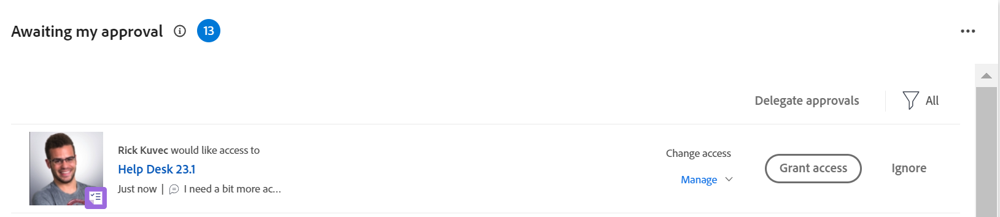

# Grant access to objects in the Home area

<!--Audited: 10/2024-->

Users can request access to objects within Adobe Workfront. 

For more information about requesting access, see  [Request access to objects](../../workfront-basics/grant-and-request-access-to-objects/request-access.md).

If you are the owner of an object, you can grant or deny access to items from your Home area.

## Access requirements

+++ Expand to view access requirements for the functionality in this article. 

<table style="table-layout:auto"> 
 <col> 
 <col> 
 <tbody> 
  <tr> 
   <td role="rowheader">Adobe Workfront package</td> 
   <td> 
Any 
 </td> 
  </tr> 
  <tr> 
   <td role="rowheader">Adobe Workfront license</td> 
   <td> 
Standard
 
   
Work or higher

   </td> 
  </tr> 
  <tr> 
   <td role="rowheader">Access level configurations</td> 
   <td> 
View access or higher to projects, tasks, issues, or documents
 </td> 
  </tr> 
  <tr> 
   <td role="rowheader">Object permissions</td> 
   <td> 
View permissions or higher to projects, tasks, issues, or documents
 </td> 
  </tr> 
 </tbody> 
</table>

For more detail about the information in this table, see [Access requirements in Workfront documentation](/help/quicksilver/administration-and-setup/add-users/access-levels-and-object-permissions/access-level-requirements-in-documentation.md).

+++

## Grant access to objects in the Home area

1. Click the **Main menu**  in the upper-right corner of the screen, or the **Main menu**  in the upper-left corner, if available, then click **Home**
Or 
Click the **Home** icon  in the upper-left corner of Adobe Workfront.

   >[!NOTE]
   >
   >Your Workfront administrator might make the following changes to the Home icon in your environment:
   >
   >* Replace it with an image customized to illustrate your organization. In this case, the icon will look different that shown in this article. 
   >* Replace the page linked to it with a different page. In this case, click the **Main Menu**  in the upper-right corner of the page, then click **Home**.

1. Do the following:

   1. Go to the **My Approvals** widget and find the request for more access, then click **Grant access**. 

      

   1. (Optional) To grant a different level of access than requested, click the drop-down menu to the left of Grant access button and select the new access, then click **Grant access**.  

      The access request is granted and it disappears from the list of approval requests. 
   
1. (Optional) Click **Ignore** to deny access. The access request is not granted and the request disappears from the list of approval requests.  

## Configure Email Notifications for access requests

You can configure whether you receive email notifications for access requests. Your Workfront administrator can disable this functionality (as described in [Configure event notifications for everyone in the system](../../administration-and-setup/manage-workfront/emails/configure-event-notifications-for-everyone-in-the-system.md)).

1. Go to your user profile by doing one of the following:

   * Click the **Main menu**  in the upper-right corner of the screen, then click your name. 
   * Click the Adobe **Main menu**  in the upper-right corner, if available, then click **Workfront Profile**. 

1. Click the **More** menu  to the right of your name in the header, then click **Edit**.
1. Click **Notifications**, and select or deselect **Someone requests access from me** in the **Action Needed** section, depending on whether you want to receive email notifications when another user requests access from you or not.

   You can enable a daily or instant notification.

1. Click **Save Changes**.
