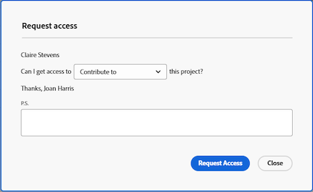
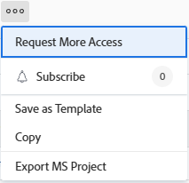

# Request access to objects

<!-- Audited: 4/2025 -->

Your visibility to objects in Adobe Workfront depends on your access to that type of object as well as your permissions on an individual object.

>[!NOTE]
>
>This article describes how you can request permissions to all objects except for the following:
>
>* Scenario Planner plans in the Adobe Workfront Scenario Planner. For more information, see [Request access to a plan in the Scenario Planner](../../scenario-planner/request-access-to-plan.md). This requires an additional license.
>
>* Views and workspaces in Workfront Planning. For more information, see [Overview of sharing permissions in Adobe Workfront Planning](/help/quicksilver/planning/access/sharing-permissions-overview.md). This requires an additional license. 

Your Workfront administrator configures your access to a type of object in your access level. For more information, see [How access levels and permissions work together](../../administration-and-setup/add-users/access-levels-and-object-permissions/how-access-levels-permissions-work-together.md).

If you need permissions to specific objects within Workfront, you can request access to them. Rather than sending an email to the Workfront administrator or object owner to explain your needs, you can request additional access (or permissions) within Workfront.

You can request initial access to objects if someone shares a link to the object with you, or you can request additional access to objects you already have View permissions for. For example, you might have View permissions to a project, but you need to add tasks to it. In this case, you can request Contribute permissions to the project.

## Access requirements

+++ Expand to view access requirements for the functionality in this article. 

You must have the following to share objects:

<table style="table-layout:auto"> 
 <col> 
 <col> 
 <tbody> 
  <tr> 
   <td role="rowheader">Adobe Workfront plan</td> 
   <td> 
Any 
 </td> 
  </tr> 
  <tr> 
   <td role="rowheader">Adobe Workfront license</td> 
   <td> 
New: Standard
 
   
Or

   
Current: Work or higher
 
   </td> 
  </tr> 
  <tr> 
   <td role="rowheader">Access level configurations</td> 
   <td> 
View access or higher to the objects you request permissions to
 </td> 
  </tr> 
 </tbody> 
</table>

For more details about the information in this table, see [Access requirements in Workfront documentation](/help/quicksilver/administration-and-setup/add-users/access-levels-and-object-permissions/access-level-requirements-in-documentation.md). 

+++

## Understand standard sharing rules

The following standard sharing rules are default options in your Workfront system and take effect automatically:

* Users assigned to a task or an issue have Contribute access on it. 
* Project, Portfolio, and Program managers have Manage access on the objects they own.
* Users included in a conversation have View access on the object where the conversation happens.
* Users assigned as approvers have View access on the object waiting to be approved.
* When sharing a dashboard, all reports on the dashboard are also shared with the same access to the same users. 
* Object owners are unable to extend access to an object beyond their access on that object as defined by the administrator.

## Request access

You can request initial access to objects that you do not currently have access to, or you can request additional access to objects that you have only limited access to.

* [Request initial access](#request-initial-access) 
* [Request additional access](#request-additional-access)

### Request initial access  {#request-initial-access}

If you do not already have access to an object and you navigate to that object from a link, a screen displays informing you that you do not have access to view the information.  

To request initial access to an object:

1. Click **Request Access**. The **Request access** dialog box displays.

1. (Conditional) If more than one user has the appropriate access to grant you additional access, a drop-down arrow displays next to the name of the user. Select the user who will receive your access request from the drop-down list.
   
   Only 10 users are displayed in the drop-down list, which is sorted alphabetically. For more information on the order of the users listed in this drop-down menu, see  [Hierarchy of the "Request Access" and "Request More Access" drop-down menus](#hierarchy-of-the-request-access-and-request-more-access-drop-down-menus).

1. From the drop-down list, select the type of access that you are requesting.
1. (Optional) In the **P.S.** field, enter a note regarding why you need additional access.

   

1. Click **Request Access**.

<!--
If you do not have access level rights to an object and you try to access that object from a link, a screen is displayed informing you to contact the Workfront administrator.

For example, if you do not have portfolio access, but you were given a link to a portfolio, you would see the following message:  

-->

### Request additional access {#request-additional-access}

To request additional access to an object that you already have limited access to:

1. Go to the object you want to request additional access to.

1. Click the **More** menu to the right of the project name, then click **Request More Access**.  

   

1. (Conditional) If more than one user has the appropriate access to grant you additional access, a drop-down arrow displays next to the name of the user. Select the user who will receive your access request from the drop-down list.

   Only 10 users are displayed in the drop-down list, which is sorted alphabetically. For more information on the order of the users listed in this drop-down menu, see  [Hierarchy of the "Request Access" and "Request More Access" drop-down menus](#hierarchy-of-the-request-access-and-request-more-access-drop-down-menus).

1. From the drop-down list, select the level of access that you are requesting.
1. (Optional) In the **P.S.** field, enter a note regarding why you need additional access.

   

## Hierarchy of the Request Access and Request More Access drop-down menus {#hierarchy-of-the-request-access-and-request-more-access-drop-down-menus}

* [Understand the hierarchy of users listed in the Request Access and Request More Access drop-down menus](#understand-the-hierarchy-of-users-listed-in-the-request-access-and-request-more-access-drop-down-menus) 
* [Understand the owner of an object](#understand-the-owner-of-an-object)

### Understand the hierarchy of users listed in the Request Access and Request More Access drop-down menus {#understand-the-hierarchy-of-users-listed-in-the-request-access-and-request-more-access-drop-down-menus}

When populating the Request Access or Request More Access lists on objects, Workfront selects a list of up to 10 users that fulfill various roles that can grant object access to the user requesting it. The resulting list is then sorted by their name in ascending alphabetical order.   

The order of the users in the Request Access or Request More Access drop-downs is dictated by the following rules: 

* The first user in the list is the object "owner", as described in [Understand the owner of an object](#understand-the-owner-of-an-object). 
* The list is then populated with users with whom the object is shared individually. They are listed in alphabetical order.
* The list is then further populated with users who get the required access through sharing with their teams, groups, or companies. They are listed in alphabetical order.
* If the list is empty, the Workfront administrators are added so that there is always someone to request access from. They are listed in alphabetical order. 
* Each of the users in the list must have the requested access to the object and access to share the object. 

### Understand the owner of an object {#understand-the-owner-of-an-object}

The owner of an object is defined as follows: 

<table style="table-layout:auto"> 
 <col> 
 <col> 
 <thead> 
  <tr> 
   <th><strong>Object</strong> </th> 
   <th><strong>Definition of the Owner of the Object</strong> </th> 
  </tr> 
 </thead> 
 <tbody> 
  <tr> 
   <td>Projects</td> 
   <td>The owner is the Project Owner or, if it is missing or they don't have the necessary access, the owner of the parent portfolio. 
They might not be the same person as the project creator. 
</td> 
  </tr> 
  <tr> 
   <td>Tasks</td> 
   <td>The owner is the Primary Assignee or, if it is missing or they don't have the necessary access, the owner of project on which the task resides, as defined above. 
They might not be the same person as the task creator. 
</td> 
  </tr> 
  <tr> 
   <td>Issues</td> 
   <td> 
The owner is the Primary Contact of the issue or, if it is missing or they don't have necessary access, the owner of the project on which the issue resides, as defined above. 
 
They might not be the same person as the issue creator. 
 </td> 
  </tr> 
  <tr> 
   <td>Portfolios</td> 
   <td>The owner is the Portfolio Owner. 
They might not be the same person as the portfolio creator. 
</td> 
  </tr> 
  <tr> 
   <td>Documents</td> 
   <td>The owner is the Owner of the document (the user who uploaded the document) or, if it is missing or they don't have necessary access, the owner of the object on which the document resides.</td> 
  </tr> 
  <tr> 
   <td>Reports and dashboards</td> 
   <td>The owner is the creator of the report or dashboard. </td> 
  </tr> 
  <tr> 
   <td>Calendars</td> 
   <td>The owner is the creator of the calendar. All users have a calendar assigned to them by default. They are considered the owner of that calendar. </td> 
  </tr> 
  <tr> 
   <td>Filters, views, and groupings</td> 
   <td>The owner of a filter, view, or grouping is the creator. </td> 
  </tr> 
  <tr data-mc-conditions="QuicksilverOrClassic.Quicksilver"> 
   <td>Plans </td> 
   <td> 
The owner is the creator of the plan. 
 
This requires an additional license. 
 
For information about the Workfront Scenario Planner, see <a href="../../scenario-planner/scenario-planner-overview.md" class="MCXref xref">The Scenario Planner overview</a>.
 </td> 
  </tr> 
  <tr data-mc-conditions="QuicksilverOrClassic.Quicksilver"> 
   <td>Goals</td> 
   <td> 
The owner is the user designated as the Owner. They might not be the same person as the goal creator. 
 
This requires an additional license. 
 
For information about Workfront Goals, see <a href="../../workfront-goals/goal-management/wf-goals-overview.md" class="MCXref xref">Adobe Workfront Goals overview</a>. 
 </td> 
  </tr> 
 </tbody> 
</table>

 
