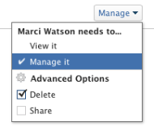

# Share a portfolio

Your Adobe Workfront administrator can grant you access to view or edit portfolios when assigning your access level. You must have a Plan license to have access to edit a portfolio. For more information, see [Grant access to portfolios](../../administration-and-setup/add-users/configure-and-grant-access/grant-access-portfolios.md).

Along with the access level that you are granted, you can also receive permissions to view or manage specific portfolios from users who can share them with you. For more information about access levels and permissions, see [How access levels and permissions work together](../../administration-and-setup/add-users/access-levels-and-object-permissions/how-access-levels-permissions-work-together.md).

Permissions are specific to one item in Workfront and define which actions users can take on that item.

## Considerations about sharing portfolios

In addition to the considerations below, also see [Overview of sharing permissions on objects](../../workfront-basics/grant-and-request-access-to-objects/sharing-permissions-on-objects-overview.md).

>[!NOTE]
>
>A Workfront administrator can add or remove permissions to any items in the system, for all users, without being the owner of those items.

* The creator of a portfolio has Manage permissions to it, by default.
* You can share a portfolio individually or you can share several portfolios at the same time. Sharing a portfolio is identical to sharing other objects in Workfront. For information, see [Share an object](../../workfront-basics/grant-and-request-access-to-objects/share-an-object.md).

* You can only grant View or Manage permissions on Portfolios.

  &nbsp; &nbsp; 

* When you share a portfolio, users inherit the same permissions to all the children objects associated with the portfolio, by default.

  For more information about the hierarchy of objects in Workfront, see [Understand objects in Adobe Workfront](../../workfront-basics/navigate-workfront/workfront-navigation/understand-objects.md).

* You can remove inherited permissions from the Portfolio. For more information about removing permissions from objects, see [Remove permissions from objects](../../workfront-basics/grant-and-request-access-to-objects/remove-permissions-from-objects.md).

## Portfolio permissions

The following table displays what permissions you can grant users when allowing them to view or manage a Portfolio:

| **Actions** |**Manage** |**View** |
|---|---|---|
| Edit Portfolio details |✓ |&nbsp; |
| View a Portfolio |✓ |✓ |
| Delete a Portfolio |✓ |&nbsp; |
| Attach a Custom Form |✓ |&nbsp; |
| Edit a custom field |✓ |&nbsp; |
| Add or remove a program&#42; |✓ |&nbsp; |
| Add or remove a project&#42; |✓ |&nbsp; |
| Approve a project |✓ |&nbsp; |
| Portfolio optimization&#42; |✓ |&nbsp; |
| Add a document folder&#42; |✓ |✓ |
| Add a document |✓ |✓ |
| Updates/ comments |✓ |✓ |
| Share |✓ |✓ |
| Share system-wide |&nbsp; |✓ |

*These permissions are controlled by the access level and permissions on other objects, like projects, programs, documents.
