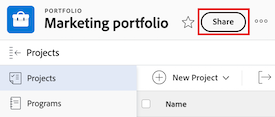
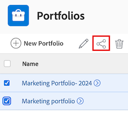

# Share a portfolio

Your Adobe Workfront administrator can grant you access to view or edit portfolios when assigning your access level. You must have a Plan license to have access to edit a portfolio. For more information, see [Grant access to portfolios](../../administration-and-setup/add-users/configure-and-grant-access/grant-access-portfolios.md).

Along with the access level that you are granted, you can also receive permissions to view or manage specific portfolios from users who can share them with you. For more information about access levels and permissions, see [How access levels and permissions work together](../../administration-and-setup/add-users/access-levels-and-object-permissions/how-access-levels-permissions-work-together.md).

Permissions are specific to one item in Workfront and define which actions users can take on that item.

## Access requirements

+++ Expand to view access requirements for the functionality in this article. 

<table style="table-layout:auto"> 
 <col> 
 <col> 
 <tbody> 
  <tr> 
   <td role="rowheader">Adobe Workfront package</td> 
   <td> 
Any
 </td> 
  </tr> 
  <tr> 
   <td role="rowheader">Adobe Workfront license</td> 
   <td> 
Standard
 
   
Work or higher
 
   </td> 
  </tr> 
  <tr> 
   <td role="rowheader">Access level configurations</td> 
   <td> 
View access or higher to the objects you want to share
 </td> 
  </tr> 
  <tr> 
   <td role="rowheader">Object permissions</td> 
   <td> 
View permissions or higher to the objects you want to share
</td> 
  </tr> 
 </tbody> 
</table>

For more detail about the information in this table, see [Access requirements in Workfront documentation](/help/quicksilver/administration-and-setup/add-users/access-levels-and-object-permissions/access-level-requirements-in-documentation.md).

+++

## Considerations about sharing portfolios

In addition to the considerations below, also see [Overview of sharing permissions on objects](../../workfront-basics/grant-and-request-access-to-objects/sharing-permissions-on-objects-overview.md).

>[!NOTE]
>
>A Workfront administrator can add or remove permissions to any items in the system, for all users, without being the owner of those items.

* The creator of a portfolio has Manage permissions to it by default.
* You can share a portfolio individually or you can share several portfolios at the same time. Sharing a portfolio is identical to sharing other objects in Workfront. For information, see [Share an object](../../workfront-basics/grant-and-request-access-to-objects/share-an-object.md).

* You can only grant View or Manage permissions on Portfolios.

* When you share a portfolio, users inherit the same permissions to all the children objects associated with the portfolio by default.

  For more information about the hierarchy of objects in Workfront, see [Understand objects in Adobe Workfront](../../workfront-basics/navigate-workfront/workfront-navigation/understand-objects.md).

* You can remove inherited permissions from the Portfolio. For more information about removing permissions from objects, see [Remove permissions from objects](../../workfront-basics/grant-and-request-access-to-objects/remove-permissions-from-objects.md).

## Share a portfolio

{{step1-to-portfolios}}

1. On the **Portfolios** page, select the portfolio you want to share. The portfolio page opens.

1. To the right of the portfolio name, click **Share**. The **Share [Portfolio Name]** dialog box opens.

    

1. In the **Grant portfolio access to** field, begin typing the name of the user, team, role, group, or company you want to share the portfolio with, then click the name when it appears in the drop-down list.

   >[!TIP]
   >
   >You can only share a portfolio with active users, teams, roles, or companies.

1. (Optional) Select the **Who has access** drop-down and select the portfolio's access level:

   * **Only invited people can access:** Only users who are invited to the portfolio can access it (Default).
   * **Everyone in the system can view**: All users in the system can view the portfolio without an invitation.

1. Click the drop-down to the right of the user's name and select their permission level for this portfolio:

   * **View**: User can review and share the portfolio. 
   * **Manage**: User has full access to the portfolio without administrative rights, which are granted at the access level (also includes all View permissions).

1. (Optional) Click the advanced options icon next to the permission level you've granted to configure specific permissions on the portfolio.

    

1. (Optional) To quickly share the portfolio using a link, click **Copy link** and then forward it to the recipient.

1. Click **Save**.

## Share portfolios in bulk

{{step1-to-portfolios}}

1. On the **Portfolios** page, select the box to the left of each portfolio you want to share, then click the **Share** icon  at the top of the page. The share modal opens.

    

1. In the **Grant portfolio access to** field, begin typing the name of the user, team, role, group, or company you want to share the portfolios with, then click the name when it appears in the drop-down list.

   >[!TIP]
   >
   >You can only share portfolios with active users, teams, roles, or companies.

1. (Optional) Select the **Who has access** drop-down and select the portfolios' access level:

   * **Only invited people can access:** Only users who are invited to the portfolios can access them (Default).
   * **Everyone in the system can view**: All users in the system can view the portfolios without an invitation.

1. Click the drop-down to the right of the user's name and select their permission level for the portfolios:

   * **View**: User can review and share the portfolios. 
   * **Manage**: User has full access to the portfolios without administrative rights, which are granted at the access level (also includes all View permissions).

1. (Optional) Click the advanced options icon next to the permission level you've granted to configure specific permissions on the portfolios.

     

1. Click **Save**.

## Portfolio permissions

The following table displays what permissions you can grant users when allowing them to view or manage a Portfolio:

| **Actions** |**Manage** |**View** |
|---|---|---|
| Edit Portfolio details |✓ |&nbsp; |
| View a Portfolio |✓ |✓ |
| Delete a Portfolio |✓ |&nbsp; |
| Attach a Custom Form |✓ |&nbsp; |
| Edit a custom field |✓ |&nbsp; |
| Add or remove a program&#42; |✓ |&nbsp; |
| Add or remove a project&#42; |✓ |&nbsp; |
| Approve a project |✓ |&nbsp; |
| Portfolio optimization&#42; |✓ |&nbsp; |
| Add a document folder&#42; |✓ |✓ |
| Add a document |✓ |✓ |
| Updates/ comments |✓ |✓ |
| Share |✓ |✓ |
| Share system-wide |&nbsp; |✓ |

*These permissions are controlled by the access level and permissions on other objects, like projects, programs, documents.
