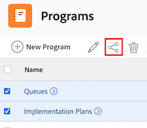

# Share a program

Your Adobe Workfront administrator can grant you access to view or edit programs when assigning your access level. You must have a Plan license to have access to edit a program. For more information, see [Grant access to programs](../../administration-and-setup/add-users/configure-and-grant-access/grant-access-programs.md).

Along with the access level that you are granted, you can also receive permissions to view or manage specific programs from users who can share them with you. For more information about access levels and permissions, see [How access levels and permissions work together](../../administration-and-setup/add-users/access-levels-and-object-permissions/how-access-levels-permissions-work-together.md).

Permissions are specific to each item in Workfront and define which actions users can take on that item.

## Access requirements

+++ Expand to view access requirements for the functionality in this article. 

You must have the following to share objects:

<table style="table-layout:auto"> 
 <col> 
 <col> 
 <tbody> 
  <tr> 
   <td role="rowheader">Adobe Workfront plan</td> 
   <td> 
Any 
 </td> 
  </tr> 
  <tr> 
   <td role="rowheader">Adobe Workfront license</td> 
   <td> 
New: Standard
 
   Or
   
Current: Work or higher

   </td> 
  </tr> 
  <tr> 
   <td role="rowheader">Access level configurations</td> 
   <td> 
View access or higher to the objects you want to share
 </td> 
  </tr> 
  <tr> 
   <td role="rowheader">Object permissions</td> 
   <td> 
View permissions or higher to the objects you want to share
</td> 
  </tr> 
 </tbody> 
</table>

For more information, see [Access requirements in Workfront documentation](/help/quicksilver/administration-and-setup/add-users/access-levels-and-object-permissions/access-level-requirements-in-documentation.md). 

+++

## Considerations about sharing a program

In addition to the considerations below, also see [Overview of sharing permissions on objects](../../workfront-basics/grant-and-request-access-to-objects/sharing-permissions-on-objects-overview.md).

>[!NOTE]
>
>A Workfront administrator can add or remove permissions to any items in the system, for all users, without being the owner of those items.

* The creator of a program has Manage permissions to it, by default.

* You can share programs individually, or you can share several of them at a time.

  For more information about sharing items in Workfront, see [Share an object](../../workfront-basics/grant-and-request-access-to-objects/share-an-object.md).

* You can only grant View or Manage permissions on programs:

* When you share a program, users inherit the same permissions to all the children objects associated with the program, by default.

  For more information about the hierarchy of objects in Workfront, see [Understand objects in Adobe Workfront](../../workfront-basics/navigate-workfront/workfront-navigation/understand-objects.md).

* You can remove inherited permissions from the program. For more information about removing permissions from objects, see&nbsp; [Remove permissions from objects](../../workfront-basics/grant-and-request-access-to-objects/remove-permissions-from-objects.md).

## Share a program

{{step1-to-programs}}

1. On the **Programs** page, select the program you want to share. The program page opens.

1. To the right of the program name, click **Share**. The **Share [Program Name]** dialog box opens.

    

1. In the **Grant program access to** field, begin typing the name of the user, team, role, group, or company you want to share the program with, then click the name when it appears in the drop-down list.

   >[!TIP]
   >
   >You can only share a program with active users, teams, roles, or companies.

1. (Optional) Select the **Who has access** drop-down and select the program's access level:

   * **Only invited people can access:** Only users who are invited to the program can access it (Default).
   * **Everyone in the system can view**: All users in the system can view the program without an invitation.

1. Click the drop-down to the right of the user's name and select their permission level for this program:

   * **View**: User can review and share the program. 
   * **Manage**: User has full access to the program without administrative rights, which are granted at the access level (also includes all View permissions).

1. (Optional) Click the advanced options icon next to the permission level you've granted to configure specific permissions on the program.

    

1. (Optional) To turn off inherited permissions for the program's children objects, click **Turn off** inline with **Inherited permissions**. 

1. (Optional) To quickly share the program using a link, click **Copy link** and then forward it to the recipient.

1. Click **Save**.

## Share programs in bulk

{{step1-to-programs}}

1. On the **Programs** page, select the box to the left of each program you want to share, then click the **Share** icon  at the top of the page. The share modal opens.

    

1. In the **Grant program access to** field, begin typing the name of the user, team, role, group, or company you want to share the programs with, then click the name when it appears in the drop-down list.

   >[!TIP]
   >
   >You can only share programs with active users, teams, roles, or companies.

1. (Optional) Select the **Who has access** drop-down and select the programs' access level:

   * **Only invited people can access:** Only users who are invited to the programs can access them (Default).
   * **Everyone in the system can view**: All users in the system can view the programs without an invitation.

1. Click the drop-down to the right of the user's name and select their permission level for the programs:

   * **View**: User can review and share the programs. 
   * **Manage**: User has full access to the programs without administrative rights, which are granted at the access level (also includes all View permissions).

1. (Optional) Click the advanced options icon next to the permission level you've granted to configure specific permissions on the programs.

     

1. Click **Save**.

## Program permissions

The following table displays what permissions you can grant users when allowing them to view or manage a program:

| **Actions** |**Manage** |**View** |
|---|---|---|
| Edit program details |✓ |&nbsp; |
| View a program |✓ |✓ |
| Delete a program |✓ |&nbsp; |
| Attach a Custom Form |✓ |&nbsp; |
| Edit a custom field |✓ |&nbsp; |
| Add or remove a project&#42; |✓ |&nbsp; |
| Approve a project |✓ |&nbsp; |
| Add a document folder&#42; |✓ |✓ |
| Add a document |✓ |✓ |
| Add updates/ comments |✓ |✓ |
| Share |✓ |✓ |
| Share system-wide |&nbsp; |✓ |

*These permissions are controlled by the access level and permissions on other objects, like projects.

